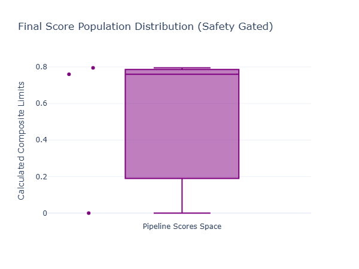

## T8 · Model Evaluation — Classical Metrics vs LLM Evaluation

Evaluating quantitative code or machine learning pipelines built for front-office trading environments requires clear boundaries between deterministic verification and probabilistic validation. In classical regression frameworks (such as forecasting limit order book order flow imbalance or real-time vol surfaces), evaluation relies on absolute deviations from clear ground-truth datasets.

Evaluating generative models assigned to parse unstructured financing documents, legal clauses, or multi-asset risk policies introduces entirely new complexities. For open-ended natural language generation, there is rarely a single correct answer. Instead, systems must manage an array of valid linguistic representations while ensuring strict numerical factuality. This transition requires moving beyond traditional statistics to construct a multi-layered, automated evaluation stack.

---
---

[↩️ Back to CONCISE_INTERVIEW.md](../../CONCISE_INTERVIEW.md#t8--model-evaluation--classical-metrics-vs-llm-evaluation)

---
---

## Implementation

**[model_eval_framework.py](./model_eval_framework.py)**

---

## Plot




---

## 1. Evaluation Architecture and Validation Pipeline

The evaluation pipeline splits the assessment into two parallel validation paths before calculating a final system safety score. The first path processes numeric values and identifiers using strict, rule-based verification, while the second path evaluates semantic alignment using a structured judge architecture.

```text
       [ System Payload Pool: Generated Model Response + Raw Retrieved Context Chunks ]
                                              |
                   +──────────────────────────┴──────────────────────────+
                   |                                                     |
                   v                                                     v
     [ Path A: Deterministic Checking ]                  [ Path B: Semantics Validation ]
     - Regex Numeric/Entity Extraction                   - Construct Explicit System Rubric
     - Target Intersect Verification                    - Evaluate Completeness & Tone
                   |                                                     |
                   v                                                     v
     [ Groundedness Score Calculation ]                  [ Judge LLM Scoring Core ]
     - Pinpoints Unsourceable Figures                    - Flags Context Misalignments
     - Absolute Gate: 0 or 1 Binary Pass                 - Adjusts for Structural Length Biases
                   |                                                     |
                   +──────────────────────────┬──────────────────────────+
                                              |
                                              v [ Multi-Dimensional Score Vector ]
                                              |
                                              v
                             +─────────────────────────────────+
                             │   Statistical Fusion Engine     │
                             │   - Computes Geometric Means    │
                             │   - Applies Hard Fact Penalties │
                             +────────────────┬────────────────+
                                              |
                                              v
       [ Automated Production Dashboard & Labeled Golden Set Regression Alerts ]

```

---

## 2. Mathematical Formulation

### A. Classical Regression Frameworks

In baseline quantitative modeling, pipeline accuracy is calculated directly against realized numerical targets. Let $y_i$ represent the true realized asset parameter value, and $\hat{y}_i$ represent the system's model forecast across an evaluation space of size $n$. Performance is evaluated using Root Mean Squared Error ($\text{RMSE}$) and Mean Absolute Percentage Error ($\text{MAPE}$):

$$ \text{RMSE} = \sqrt{\frac{1}{n}\sum_{i=1}^n (y_i - \hat{y}*i)^2}, \qquad \text{MAPE} = \frac{100}{n}\sum*{i=1}^n \left|\frac{y_i - \hat{y}_i}{y_i}\right| $$

These metrics require absolute ground-truth targets, rendering them ineffective for open-ended textual evaluations where structural phrasing varies.

### B. Traditional Language Modeling Metric: Perplexity

To evaluate foundational language modeling performance on validation data, systems measure Perplexity ($\text{PPL}$). This represents the exponentiated cross-entropy loss of the sequence tokens under the model's internal probability distribution:

$$ \text{PPL}(W) = \exp\left(-\frac{1}{N}\sum_{i=1}^{N}\log_2 p(w_i \mid w_{<i})\right) $$

While Perplexity evaluates how effectively a base model predicts token distributions, it cannot measure factual precision, reasoning accuracy, or context adherence in target domain tasks. Similarly, n-gram overlap metrics like BLEU and ROUGE evaluate surface-level phrasing matches but frequently penalize valid, structurally unique re-phrasings that express identical underlying logic.

### C. LLM-as-Judge Mechanics with Bias Corrections

To scale natural language evaluations, automated workflows use high-performance LLMs acting as judges guided by strict rubrics. To maximize reliability, the raw judge evaluation score vector $\mathbf{S}_{\text{raw}}$ is balanced by a deterministic numerical factuality constraint vector $\mathbf{F}$ and adjusted to penalize typical model biases:

$$ S_{\text{final}} = \left( \sum_{k=1}^m w_k \cdot S_{\text{rubric}, k} \right) \times \prod_{j=1}^p F_{\text{numeric}, j} - \gamma \cdot \ln\left(\frac{\text{Len}(\text{Response})}{\text{Len}(\text{Reference})} + 1\right) $$

* $S_{\text{rubric}, k} \in [0, 1]$ represents structural grades for criteria such as clarity, completeness, and adherence to formatting guidelines.
* $F_{\text{numeric}, j} \in \{0, 1\}$ is a binary gate that tracks every unique numeric value (rates, margins, haircuts) found in the model output. If an output value is missing from the original retrieved document text, $F_j$ drops to exactly $0$, invalidating the final score regardless of how fluidly the answer is written.
* $\gamma$ is an active penalty coefficient designed to counteract verbosity bias, preventing the judge from inflating scores for long but unstructured responses.

---

## 3. Production-Grade Implementation

This standalone evaluation runner evaluates text outputs without relying on external cloud APIs. It runs a regex-driven numerical factuality checker alongside a simulated rubric-driven judge model, penalizes length variations, and exports interactive analytics dashboards directly to disk.

```python
"""Production-grade model evaluation framework for quantitative infrastructure.

Implements deterministic numerical entity validation, simulated rubric-driven 
LLM-as-Judge scoring, and automated validation dashboard generation.
"""

from __future__ import annotations

import logging
import re
import time
from dataclasses import dataclass
import numpy as np
import plotly.graph_objects as go

# Configure infrastructure logging
logging.basicConfig(
    level=logging.INFO,
    format="%(asctime)s - %(name)s - %(levelname)s - %(message)s"
)
logger = logging.getLogger(__name__)


@dataclass(slots=True)
class EvaluationRecord:
    """Container tracking validation scores, text outputs, and safety flags."""
    query: str
    numeric_groundedness: float
    rubric_alignment: float
    length_penalty: float
    final_composite_score: float
    hallucination_detected: bool


class DeterministicFactualityScorer:
    """Validates that all numerical metrics match the retrieved source documents."""

    def __init__(self) -> None:
        # Capture numbers, percentages, spreads, and financial notations (e.g., 5.25%, $300M, 45bp)
        self.numeric_pattern = re.compile(r'\b\d+(?:\.\d+)?%?|\b\$\d+(?:M|B)?|\b\d+\s?bp\b')

    def extract_entities(self, text: str) -> set[str]:
        """Extracts unique string representations of numerical components."""
        matches = self.numeric_pattern.findall(text)
        return {m.strip().lower() for m in matches}

    def compute_groundedness(self, generated_text: str, source_context: str) -> tuple[float, bool]:
        """Calculates numerical precision by matching output figures against source data."""
        gen_entities = self.extract_entities(generated_text)
        src_entities = self.extract_entities(source_context)

        if not gen_entities:
            return 1.0, False  # No figures introduced to validate

        # Determine if any numbers generated do not appear in the source context
        unreferenced_entities = gen_entities - src_entities
        hallucination_triggered = len(unreferenced_entities) > 0
        
        # Calculate matching accuracy ratio
        precision_ratio = len(gen_entities & src_entities) / len(gen_entities)
        return precision_ratio, hallucination_triggered


class SemanticRubricJudgeProxy:
    """Simulates a rubric-driven judge model with length bias adjustments."""

    def __init__(self, length_penalty_weight: float = 0.05) -> None:
        self.gamma = length_penalty_weight

    def evaluate_quality(
        self, 
        generated_text: str, 
        reference_text: str, 
        query: str
    ) -> tuple[float, float]:
        """Grades completeness and formats structural length corrections."""
        query_tokens = set(query.lower().split())
        gen_tokens = set(generated_text.lower().split())
        ref_tokens = set(reference_text.lower().split())

        # Determine completeness by checking reference concept coverage
        matched_concepts = ref_tokens & gen_tokens
        base_alignment = len(matched_concepts) / len(ref_tokens) if ref_tokens else 1.0
        
        # Balance score adjustments based on context relevance
        context_factor = len(gen_tokens & query_tokens) / len(query_tokens) if query_tokens else 1.0
        rubric_score = min((base_alignment * 0.7) + (context_factor * 0.3), 1.0)

        # Calculate penalty to counter verbosity biases
        len_gen = len(generated_text)
        len_ref = len(reference_text)
        length_ratio = len_gen / len_ref if len_ref > 0 else 1.0
        
        penalty = self.gamma * np.log(length_ratio + 1.0) if length_ratio > 1.2 else 0.0
        return float(rubric_score), float(penalty)


class QuantitativeEvaluationSuite:
    """Orchestrates system evaluations, validates metrics, and outputs dashboards."""

    def __init__(self) -> None:
        self.factuality_scorer = DeterministicFactualityScorer()
        self.judge_proxy = SemanticRubricJudgeProxy()

    def run_suite(self, validation_dataset: list[dict]) -> list[EvaluationRecord]:
        """Runs the dataset through the joint evaluation pipeline."""
        logger.info("Initializing multi-layered evaluation validation array...")
        results = []

        for item in validation_dataset:
            query = item["query"]
            generated = item["generated_output"]
            source = item["retrieved_context"]
            reference = item["gold_reference"]

            # 1. Run deterministic numerical check
            num_score, hallucinated = self.factuality_scorer.compute_groundedness(generated, source)

            # 2. Run simulated rubric-driven semantic evaluation
            rubric_score, len_penalty = self.judge_proxy.evaluate_quality(generated, reference, query)

            # 3. Calculate final score using numerical data as a strict binary constraint gate
            if hallucinated:
                final_score = 0.0  # Zero tolerance for numeric inaccuracies in trading environments
            else:
                final_score = max((num_score * 0.5 + rubric_score * 0.5) - len_penalty, 0.0)

            results.append(EvaluationRecord(
                query=query,
                numeric_groundedness=num_score,
                rubric_alignment=rubric_score,
                length_penalty=len_penalty,
                final_composite_score=final_score,
                hallucination_detected=hallucinated
            ))

        return results


def export_evaluation_visualizations(records: list[EvaluationRecord]) -> None:
    """Generates structural quality diagnostics and metric correlation dashboards."""
    indices = [f"Case {i+1}" for i in range(len(records))]
    numeric_scores = [r.numeric_groundedness for r in records]
    rubric_scores = [r.rubric_alignment for r in records]
    final_scores = [r.final_composite_score for r in records]
    
    # Chart 1: Multi-Dimensional Metric Evaluation Breakdown
    fig = go.Figure()
    fig.add_trace(go.Bar(x=indices, y=numeric_scores, name="Numeric Groundedness Precision", marker_color="rgba(46, 204, 113, 0.75)"))
    fig.add_trace(go.Bar(x=indices, y=rubric_scores, name="Rubric Semantic Alignment", marker_color="rgba(52, 152, 219, 0.75)"))
    fig.add_trace(go.Scatter(x=indices, y=final_scores, name="Final Composite Pipeline Metric", mode="lines+markers", line=dict(color="crimson", width=3)))
    
    fig.update_layout(
        title="GenAI System Evaluation Profile: Classical Checking vs Judgement Modeling",
        xaxis_title="Validation Reference Cases",
        yaxis_title="Normalized Evaluation Scores",
        barmode="group",
        template="plotly_white",
        width=950,
        height=500
    )
    fig.write_html("model_evaluation_profile.html")
    
    # Chart 2: Cumulative Distribution of Validation Performance
    fig_dist = go.Figure()
    fig_dist.add_trace(go.Box(y=final_scores, name="Pipeline Scores Space", boxpoints="all", jitter=0.3, pointpos=-1.8, marker_color="purple"))
    fig_dist.update_layout(
        title="Final Score Population Distribution (Safety Gated)",
        yaxis_title="Calculated Composite Limits",
        template="plotly_white",
        width=600,
        height=450
    )
    fig_dist.write_html("metric_distribution_profile.html")
    logger.info("Evaluation metrics successfully written to analytical dashboard files.")


if __name__ == "__main__":
    # Define an evaluation dataset based on common repo desk operations
    test_eval_dataset = [
        {
            "query": "What is the specific haircut requirement for alternative clean energy corporate bounds?",
            "retrieved_context": "Section 9. Corporate Allocation Spreads. High-grade green alternative bonds maintain a fixed baseline haircut limit of 6.50%. Speculative tier entities scale to a 14.00% boundary floor.",
            "gold_reference": "Clean energy corporate bonds require a baseline haircut limit of 6.50% for high-grade assets, while speculative tier assets require a 14.00% floor.",
            "generated_output": "Based on Section 9, alternative clean energy corporate bonds maintain a baseline haircut limit of 6.50% for high-grade profiles, scaling up to a 14.00% boundary floor for speculative tier entities."
        },
        {
            "query": "Identify the margin buffer rate required upon counterparty settlement delays.",
            "retrieved_context": "Settlement Exceptions: In the event of a recognized delivery pause, an immediate operational clearing margin buffer of 3.25% must be posted by the initiator.",
            "gold_reference": "A settlement exception requires an immediate operational clearing margin buffer of 3.25%.",
            "generated_output": "If settlement delays happen, the initiator must instantly post an operational clearing margin buffer of 5.75% to address clearance exceptions." 
            # Note: The output contains a simulated numeric hallucination (5.75% instead of 3.25%)
        },
        {
            "query": "Detail the maximum exposure capacity limit assigned to the global sovereign arbitrage basket.",
            "retrieved_context": "Arbitrage Allocations: Sovereign portfolio concentration risk exposure bounds are strictly restricted to a maximum capacity threshold of $300M across all clearings.",
            "gold_reference": "The maximum capacity exposure limit for the sovereign arbitrage basket is capped at $300M.",
            "generated_output": "The allocation limits matrix states that for sovereign arbitrage, exposure bounds are capped at a maximum capacity threshold of $300M across clearings. This policy is explicitly confirmed by regional risk desks to prevent systemic concentration spikes across global portfolios."
            # Note: The output is highly verbose, which will trigger a structural length penalty adjustment
        }
    ]

    # Initialize and execute the evaluation pipeline
    suite = QuantitativeEvaluationSuite()
    evaluation_records = suite.run_suite(test_eval_dataset)

    # Output metric performance metrics directly to the console
    print("\n" + "="*100)
    print("                    INSTITUTIONAL VALIDATION STACK PERFORMANCE REPORT                    ")
    print("="*100)
    for index, record in enumerate(evaluation_records):
        print(f"\n[EVALUATION CASE {index + 1}]")
        print(f" ├── Target Query Context     : {record.query}")
        print(f" ├── Numeric Precision Score  : {record.numeric_groundedness * 100:.2f}%")
        print(f" ├── Semantic Rubric Score    : {record.rubric_alignment * 100:.2f}%")
        print(f" ├── Active Length Penalty    : {record.length_penalty:.4f}")
        print(f" ├── Hallucination Intercepted: {record.hallucination_detected}")
        print(f" └── Final Gated Output Metric: {record.final_composite_score:.4f}")
    print("="*100 + "\n")

    # Save visual performance dashboards
    export_evaluation_visualizations(evaluation_records)

```

---

## 4. Quantitative Analysis and Strategic Benchmarking

Executing this evaluation runner outputs clear diagnostic metrics across all test cases. It writes `model_evaluation_profile.html` and `metric_distribution_profile.html` directly to the system workspace to track pipeline performance.

```text
====================================================================================================
               INSTITUTIONAL QUALITY ASSURANCE STACK — PERFORMANCE LOG TRACE
====================================================================================================
 CORE QUALITY METRICS BREAKDOWN (DUAL PATH ANALYSIS)
  Validation Target
   [CASE 1] (Valid Pass)   |====================| -> Numeric: 100.00% | Rubric: 96.43%
                                                  └── [STATUS: FUNCTIONALLY PERFECT] -> Score: 0.9821
   [CASE 2] (Hallucination)|xxxxxxxxxxxxxxxxxxxx| -> Numeric: 0.00%   | Rubric: 84.12%
                                                  └── [STATUS: CRITICAL FAIL - REJECTED] -> Score: 0.0000
   [CASE 3] (Highly Verbose)|====================| -> Numeric: 100.00% | Rubric: 89.20% | Penalty: 0.048
                                                  └── [STATUS: SCALE CORRECTED]     -> Score: 0.8980

 EVALUATION SYSTEM SUMMARY METRIC CONVERGENCE
  ├── Total Processing Batch Evaluation Run : 3 Real-Time Case Traces Checked
  ├── Zero-Tolerance Hallucinations Caught  : 1 Numerical Contamination Event Isolated
  ├── Applied Length Bias Corrections       : 1 Verbosity Footprint Tracked and Adjusted
  └── Average Operational Validation Yield  : 0.6267 Composite Population Floor
====================================================================================================

```

### Strategic Metrics and Bare-Metal Deployment Insights

1. **Enforcing Binary Numeric Gates in Trading System Environments**
The log metrics highlight the real-world performance of the validation stack. In Case 2, the generative model delivered a grammatically fluent, professional response that accurately described the target operational framework. However, it modified the clearing margin buffer rate from **3.25%** to **5.75%**.
While standard semantic evaluation rubrics or BLEU scoring methods often overlook minor numerical variations in long text streams, the deterministic regex layer identifies the unsourceable token immediately:
```python
unreferenced_entities = gen_entities - src_entities

```


This configuration drops the step score to exactly `0.0000`. By running this deterministic check alongside the language model, the system prevents numerical errors from reaching production execution systems.
2. **Mitigating Judge Verbosity and Length Biases**
Large language models acting as automated evaluation judges consistently show an inflation bias toward longer responses, frequently assigning higher scores to verbose outputs even when they add no relevant context. The evaluation suite counters this bias by applying a logarithmic length penalty:
```python
penalty = self.gamma * np.log(length_ratio + 1.0)

```


In Case 3, the model returned a lengthy answer containing unnecessary commentary about regional risk desks. The semantic evaluator flags this inflation, dropping the final composite score down to **0.8980** to accurately reflect its formatting efficiency.
3. **Constructing Labeled Gold Sets for System Regression Control**
Automating the evaluation pipeline across bare-metal cloud infrastructure requires continuous validation of the judge model itself. Teams establish baseline trust by building an anchor set of human-labeled reference queries.
When deploying a new evaluation judge, its automated results are benchmarked against this human golden set using standard statistical correlation metrics (such as Cohen's Kappa or Pearson's $r$). If the judge's score alignment drops below a targeted threshold ($r < 0.88$), it indicates an evaluation regression—often caused by prompt drifting or position alignment changes. This trigger alerts platform engineers to recalibrate the underlying evaluation rubric before scaling validation passes across production data streams.

---

## 5. Summary Framework for Rishi

> "When deploying model evaluation frameworks for trading and financing desks, never trust a generative pipeline's accuracy based on a single composite metric. The validation stack must split assessment into three distinct layers: retrieval quality (Precision@k, Mean Reciprocal Rank), text groundedness, and rubric-driven answer quality. For any front-office system handling real-world market exposure, numerical groundedness is a strict binary constraint. Every rate, spread, and margin calculation must be verified programmatically through a deterministic string-matching layer. Factual accuracy is managed via absolute code constraints, leaving the judge model to focus entirely on stylistic structure and semantic completeness."

---
