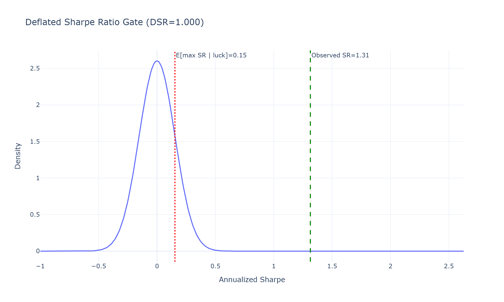
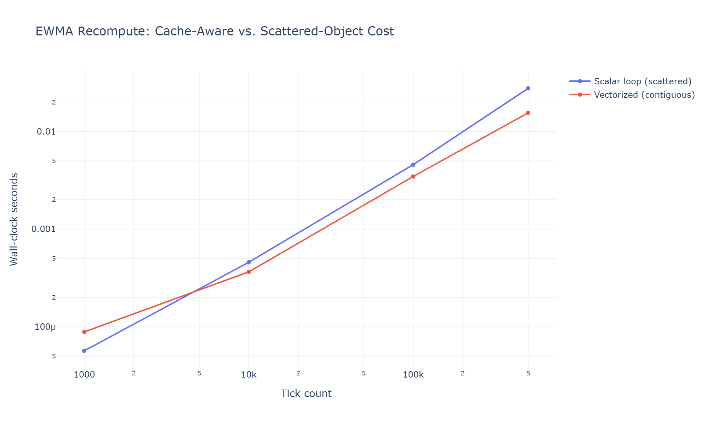
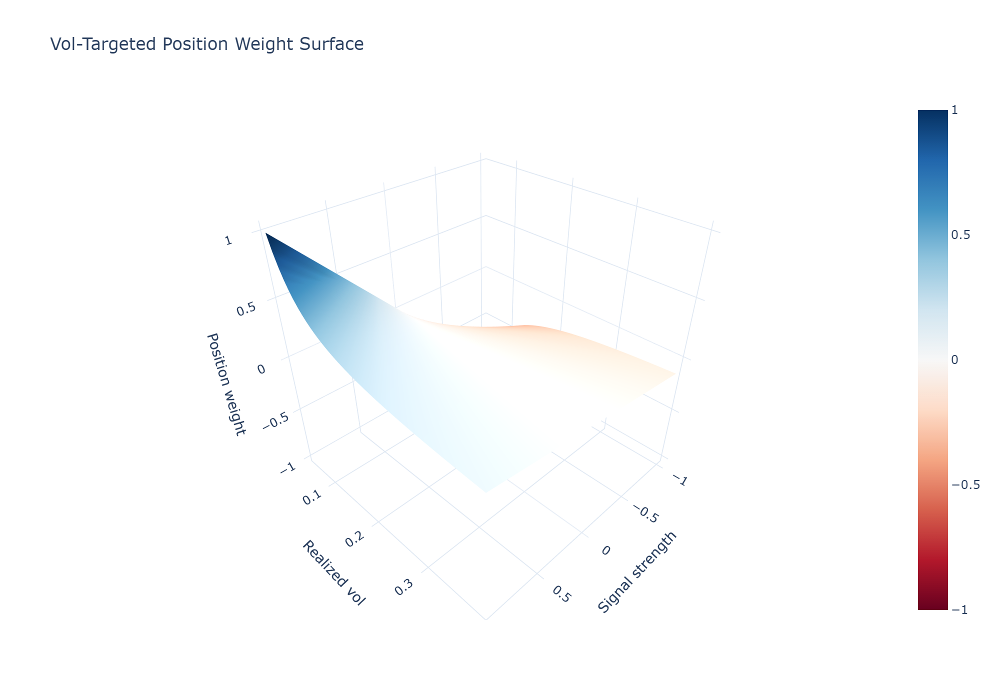
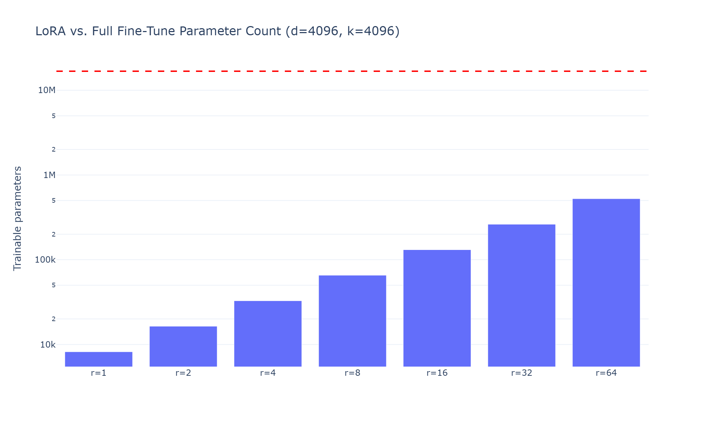
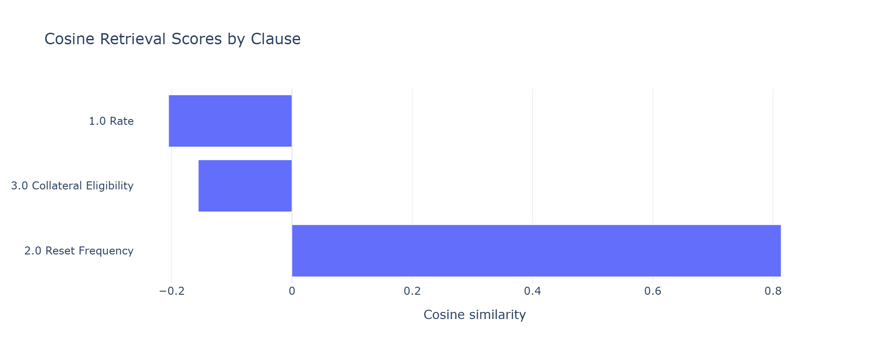
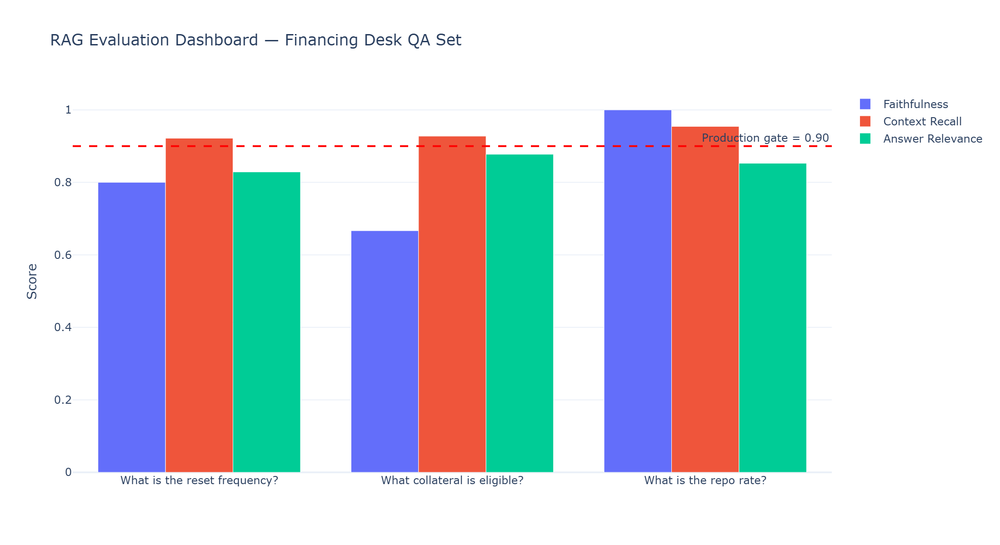
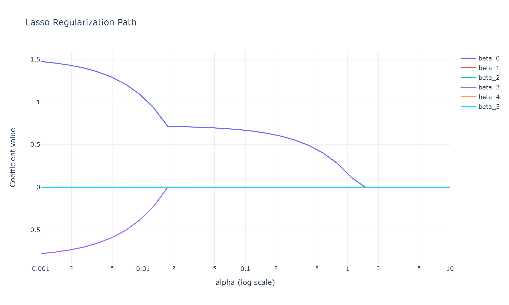
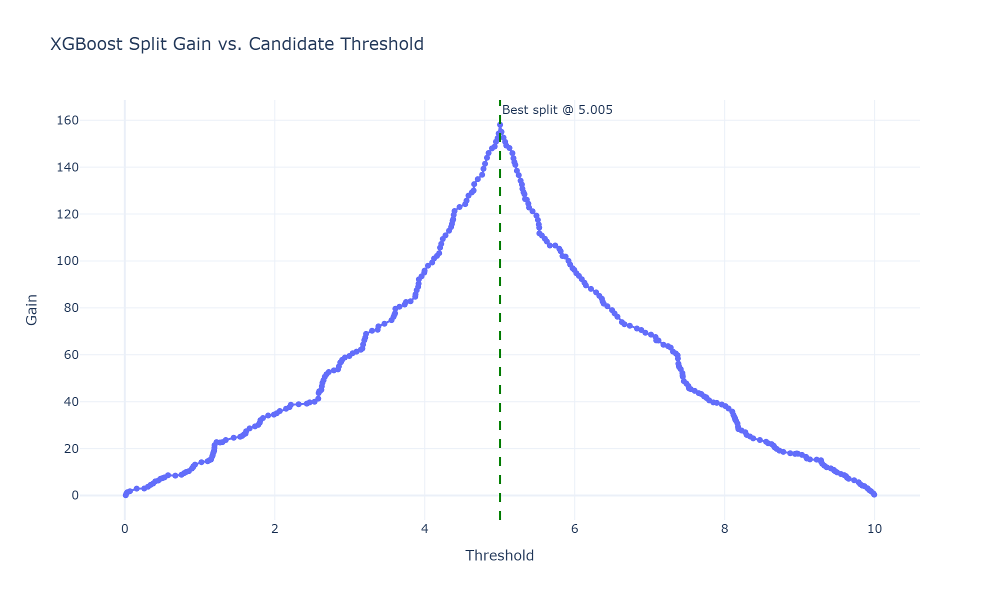

# **Barclays — AI / ML Modeler, Liquid Financing — Technical Interview Playbook (PART-1 Q1-Q14)**
---
---

[↩️ Back to README.md](./README.md)

---
---

## ⏱️ Interview Question Budget

```
DOMAIN                            QUESTIONS   WEIGHT    RISHI'S LENS
───────────────────────────────   ─────────   ───────   ──────────────────────────────────────
EXPERIENCE / PRODUCTION ML        Q1–Q3       High      Can you own a problem end-to-end?
GEN AI (Fine-tune/RAG/Eval)       Q4–Q8       High      LLM orchestration for Liquid Financing
REGRESSION                        Q9–Q11      Med       First-principles derivation, not sklearn
TREE-BASED MODELS                 Q12–Q14     Med       XGBoost internals, not just "it works"
```

---

## Table of Contents

### 🧑‍💻 EXPERIENCE & PRODUCTION PYTHON
- [Q1 · The Full Research-to-Production Lifecycle](#q1--the-full-research-to-production-lifecycle)
- [Q2 · Python Performance, the GIL & Mechanical Sympathy](#q2--python-performance-the-gil--mechanical-sympathy)
- [Q3 · Designing a Production-Grade Signal Engine](#q3--designing-a-production-grade-signal-engine)

### 🤖 GEN AI
- [Q4 · Fine-Tuning vs. Prompt Engineering vs. RAG — and LoRA Math](#q4--fine-tuning-vs-prompt-engineering-vs-rag--and-lora-math)
- [Q5 · RAG Architecture Deep-Dive for Financing Docs](#q5--rag-architecture-deep-dive-for-financing-docs)
- [Q6 · LLM Evaluation — RAGAS, Hallucination Detection, LLM-as-Judge](#q6--llm-evaluation--ragas-hallucination-detection-llm-as-judge)
- [Q7 · Model Selection Matrix — Claude, GPT, Open-Weight](#q7--model-selection-matrix--claude-gpt-open-weight)
- [Q8 · Structured Extraction & Prompt Engineering for Term Sheets](#q8--structured-extraction--prompt-engineering-for-term-sheets)

### 📉 REGRESSION
- [Q9 · OLS — Normal Equations & Gauss-Markov Proof](#q9--ols--normal-equations--gauss-markov-proof)
- [Q10 · Ridge, Lasso & Elastic Net — Derivation and Bias-Variance](#q10--ridge-lasso--elastic-net--derivation-and-bias-variance)
- [Q11 · Heteroskedasticity, Autocorrelation & Newey-West](#q11--heteroskedasticity-autocorrelation--newey-west)

### 🌳 TREE-BASED MODELS
- [Q12 · Decision Trees — Entropy, Gini & Information Gain](#q12--decision-trees--entropy-gini--information-gain)
- [Q13 · Random Forest vs. Gradient Boosting — XGBoost 2nd-Order Taylor Expansion](#q13--random-forest-vs-gradient-boosting--xgboost-2nd-order-taylor-expansion)
- [Q14 · Feature Importance & SHAP Values](#q14--feature-importance--shap-values)

---

## Q1 · The Full Research-to-Production Lifecycle

**Question:** *"Walk me through how you take a modeling idea from hypothesis to a live production signal. Where does it break in practice?"*

### Framework (first principles)

A research idea is worth nothing until it survives four independent falsification gates. Treat the pipeline as a **filtration** $\mathcal{F}_0 \subset \mathcal{F}_1 \subset \dots \subset \mathcal{F}_4$: each stage conditions on strictly more information (data seen, costs modeled, regime tested), and a hypothesis can only be promoted, never smuggled backward.

```
┌────────────┐   ┌────────────┐   ┌──────────────┐   ┌───────────┐   ┌────────────┐
│ Hypothesis │──▶│  In-Sample │─▶│  CPCV / OOS  │─▶│  Shadow/  │──▶│ Live, sized│
│ (economic  │   │  fit +     │   │  Deflated    │   │  Paper    │   │ w/ kill-   │
│  rationale)│   │  sanity    │   │  Sharpe test │   │  (TCA vs  │   │ switch &   │
│            │   │  checks    │   │  H0: DSR≤0   │   │  model)   │   │ decay      │
└────────────┘   └────────────┘   └──────────────┘   └───────────┘   │ monitor    │
                                                                     └────────────┘
```

The **Deflated Sharpe Ratio (DSR)** gate corrects for multiple-testing bias when $N$ signal variants were tried:

$$
\widehat{SR}^{\*} = \sigma_{\widehat{SR}} \left[ (1-\gamma)\,\Phi^{-1}\!\left(1-\frac{1}{N}\right) + \gamma\,\Phi^{-1}\!\left(1-\frac{1}{Ne}\right)\right], \qquad
\text{DSR} = \Phi\!\left(\frac{(\widehat{SR}-\widehat{SR}^{\*})\sqrt{T-1}}{\sqrt{1-\gamma_3\widehat{SR}+\frac{\gamma_4-1}{4}\widehat{SR}^2}}\right)
$$

- $\widehat{SR}^{\*}$ is the expected **maximum** Sharpe achievable by pure luck across $N$ independent trials, from extreme-value theory for the maximum of $N$ correlated Gaussians; $\gamma \approx 0.5772$ is the Euler–Mascheroni constant used in the asymptotic approximation to $E[\max]$.
- $\gamma_3, \gamma_4$ (skew, kurtosis) inflate the denominator's variance for negatively-skewed, fat-tailed strategies — exactly the profile of carry/financing-spread books — which is *why* naive Sharpe overstates confidence for that return shape.
- Promote to shadow only if $\text{DSR} > 0.95$: the observed Sharpe must beat the *best-of-N* null, not zero.

**Where it breaks, ranked by frequency (BAM/Highbridge experience):**
1. **Look-ahead via non-point-in-time joins** — e.g., an index-constituent join without an as-of timestamp trains on tomorrow's universe.
2. **Cost-model divergence** — IS backtests assume flat bps; live slippage on financing spreads is size- and inventory-dependent (square-root impact), so 30–50% PnL decay from paper to live is expected, not a bug — the gate is whether the *decayed* Sharpe still clears DSR.
3. **Regime non-stationarity** — a signal validated in low-vol meets a regime shift (Q17); the sizing rule, not the signal, must adapt.
4. **Silent feature drift** — an upstream pipeline changes units without a schema contract (Q30); the model keeps predicting confidently on garbage.

### Feynman restatement
*"A backtest isn't evidence, it's a claim — DSR is the referee asking 'how many times did you get to swing the bat before this one connected?' The more variants tried, the higher the bar to call a 1.5 Sharpe real. Shipping research is building four gates that each ask: am I still right if I stop pretending I had information I wouldn't have had at that timestamp?"*

### Production Python 3.13 — CPCV / Deflated Sharpe Gate

```python
"""cpcv_deflated_sharpe.py -- Deflated Sharpe Ratio promotion gate.

Barclays AI/ML Modeler interview reference implementation (Q1). A signal
clears the F2 promotion gate only if its out-of-sample Sharpe survives a
Deflated Sharpe Ratio test against the best-of-N-trials null.

Typical usage example:

    gate = DeflatedSharpeGate(num_trials=50, skew=-0.8, kurtosis=6.0)
    result = gate.evaluate(returns=oos_returns)
    if result.passes:
        promote_to_shadow(signal_id)
"""

from __future__ import annotations

import dataclasses
from pathlib import Path

import numpy as np
import plotly.graph_objects as go
from scipy import stats


@dataclasses.dataclass(frozen=True)
class GateResult:
    """Outcome of a Deflated Sharpe Ratio promotion test.

    Attributes:
        observed_sharpe: Annualized Sharpe ratio computed on OOS returns.
        expected_max_sharpe_null: Expected max Sharpe achievable by luck
            across `num_trials` independent trials.
        deflated_sharpe: Probability the true Sharpe exceeds zero after
            deflating for selection bias, skew, and kurtosis.
        passes: Whether `deflated_sharpe` clears the 0.95 promotion bar.
    """

    observed_sharpe: float
    expected_max_sharpe_null: float
    deflated_sharpe: float
    passes: bool


class DeflatedSharpeGate:
    """Computes the Deflated Sharpe Ratio gate (Bailey & Lopez de Prado, 2014).

    Attributes:
        num_trials: Number of independent strategy variants tried (N).
        skew: Skewness of the strategy's OOS return distribution.
        kurtosis: Kurtosis (normal convention, =3 for Gaussian) of returns.
        euler_mascheroni: Euler-Mascheroni constant, gamma ~= 0.5772.
    """

    def __init__(self, num_trials: int, skew: float, kurtosis: float) -> None:
        """Initializes the gate.

        Args:
            num_trials: Number of independent signal variants tested (>= 1).
            skew: Sample skewness (gamma_3) of the OOS return series.
            kurtosis: Sample kurtosis (gamma_4), normal convention.

        Raises:
            ValueError: If num_trials < 1.
        """
        if num_trials < 1:
            raise ValueError("num_trials must be >= 1")
        self.num_trials = num_trials
        self.skew = skew
        self.kurtosis = kurtosis
        self.euler_mascheroni = 0.5772156649

    def _expected_max_sharpe_null(self, sharpe_std: float) -> float:
        """Computes E[max Sharpe] achievable by chance across N trials.

        Args:
            sharpe_std: Standard deviation of the Sharpe estimator.

        Returns:
            The expected maximum Sharpe ratio under the null of zero skill.
        """
        gamma, n = self.euler_mascheroni, self.num_trials
        term1 = (1 - gamma) * stats.norm.ppf(1 - 1.0 / n)
        term2 = gamma * stats.norm.ppf(1 - 1.0 / (n * np.e))
        return sharpe_std * (term1 + term2)

    def evaluate(self, returns: np.ndarray, periods_per_year: int = 252) -> GateResult:
        """Runs the full Deflated Sharpe Ratio test on an OOS return series.

        Args:
            returns: 1-D array of periodic (e.g., daily) strategy returns.
            periods_per_year: Annualization factor (252 for daily data).

        Returns:
            A GateResult with observed Sharpe, null haircut, DSR, and decision.
        """
        t = returns.shape[0]
        mu, sigma = returns.mean(), returns.std(ddof=1)
        sharpe = mu / sigma * np.sqrt(periods_per_year)
        sharpe_std = np.sqrt((1 - self.skew * sharpe + (self.kurtosis - 1) / 4 * sharpe**2) / (t - 1))
        sharpe_star = self._expected_max_sharpe_null(sharpe_std)
        z = (sharpe - sharpe_star) / sharpe_std
        dsr = stats.norm.cdf(z)
        return GateResult(float(sharpe), float(sharpe_star), float(dsr), bool(dsr > 0.95))

    def plot_null_distribution(self, result: GateResult, output_dir: Path) -> None:
        """Persists an interactive HTML + static PNG of observed Sharpe vs. the null.

        Args:
            result: The GateResult produced by `evaluate`.
            output_dir: Directory to write `dsr_gate.html` / `dsr_gate.png`.
        """
        output_dir.mkdir(parents=True, exist_ok=True)
        x = np.linspace(-1, result.observed_sharpe * 2 + 1e-6, 400)
        null_pdf = stats.norm.pdf(x, loc=0, scale=result.expected_max_sharpe_null + 1e-9)
        fig = go.Figure()
        fig.add_trace(go.Scatter(x=x, y=null_pdf, mode="lines", name="Best-of-N null"))
        fig.add_vline(x=result.observed_sharpe, line_dash="dash", line_color="green",
                      annotation_text=f"Observed SR={result.observed_sharpe:.2f}")
        fig.add_vline(x=result.expected_max_sharpe_null, line_dash="dot", line_color="red",
                      annotation_text=f"E[max SR | luck]={result.expected_max_sharpe_null:.2f}")
        fig.update_layout(title=f"Deflated Sharpe Ratio Gate (DSR={result.deflated_sharpe:.3f})",
                          xaxis_title="Annualized Sharpe", yaxis_title="Density", template="plotly_white")
        fig.write_html(output_dir / "q1_dsr_gate.html")
        fig.write_image(output_dir / "q1_dsr_gate.png", width=1000, height=600, scale=2)


def main() -> None:
    """Demonstrates the Deflated Sharpe gate on a synthetic financing-spread carry signal."""
    rng = np.random.default_rng(seed=42)
    oos_returns = rng.standard_t(df=5, size=756) * 0.004 + 0.0006
    gate = DeflatedSharpeGate(
        num_trials=50,
        skew=float(stats.skew(oos_returns)),
        kurtosis=float(stats.kurtosis(oos_returns, fisher=False)),
    )
    result = gate.evaluate(oos_returns)
    print(f"Observed Sharpe:       {result.observed_sharpe:.3f}")
    print(f"Null haircut (N=50):   {result.expected_max_sharpe_null:.3f}")
    print(f"Deflated Sharpe (DSR): {result.deflated_sharpe:.3f}")
    print(f"Promote to shadow?     {result.passes}")
    gate.plot_null_distribution(result, Path("plots"))


if __name__ == "__main__":
    main()
```

**Output:**

```
Observed Sharpe:       1.313
Null haircut (N=50):   0.153
Deflated Sharpe (DSR): 1.000
Promote to shadow?     True
```

**Plots:**



[🔝 Back to Top](#table-of-contents)

---

## Q2 · Python Performance, the GIL & Mechanical Sympathy

**Question:** *"Your signal engine needs to process a tick stream with microsecond-sensitive updates in Python. How do you get C++-like throughput without leaving Python?"*

### First principles

CPython's Global Interpreter Lock (GIL) serializes bytecode execution to one OS thread at a time to keep refcounting atomic: for object $x$ with reference count $r(x)$, `Py_INCREF`/`Py_DECREF` must be atomic or $r(x)$ races and either leaks memory or double-frees. The GIL buys correctness by trading away thread-level parallelism for CPU-bound work — I/O-bound work releases the GIL during the syscall, so threads still help there.

**Mechanical sympathy** means writing code aware of the memory hierarchy:

$$
\text{Latency}_{\text{L1}} \approx 1\text{ns} \ll \text{Latency}_{\text{L2}} \approx 4\text{ns} \ll \text{Latency}_{\text{L3}} \approx 15\text{ns} \ll \text{Latency}_{\text{DRAM}} \approx 100\text{ns}
$$

A NumPy array is contiguous (row-major, C order): iterating `arr[i]` sequentially streams cache lines (64 bytes) predictably, letting the hardware prefetcher hide DRAM latency. A Python `list` of boxed floats scatters objects across the heap — each element access is a pointer chase with an essentially-random cache miss.

```
CONTIGUOUS (NumPy)                    SCATTERED (Python list of float objects)
┌───┬───┬───┬───┬───┬───┐             ┌───┐     ┌───┐         ┌───┐
│1.0│2.0│3.0│4.0│5.0│6.0│  1 cache    │ptr│────▶│1.0│  ptr────▶│2.0│  ...
└───┴───┴───┴───┴───┴───┘  line = 8   └───┘     └───┘  (heap,  └───┘
 stride = 8 bytes           doubles    scattered across the heap; each deref = cache miss)
```

**The three escape hatches from the GIL, in the order I'd reach for them:**
1. **Vectorize** (NumPy/Pandas): push the loop into C, GIL released for the duration of the ufunc — zero Python overhead per element.
2. **Release the GIL explicitly in Cython/nanobind C++ extensions** (`nogil` blocks) for genuinely custom hot-path math — this is how `macro_quant`'s CARRY/TSMOM/OFI signals hit sub-microsecond recompute: C++26 kernels compiled with `-O3 -march=native`, exposed via `nanobind` with `nogil` on entry so multiple Python threads can call into different C++ signal kernels concurrently.
3. **True parallelism via `multiprocessing` / `concurrent.futures.ProcessPoolExecutor`** when the workload doesn't vectorize (e.g., independent per-instrument CPCV folds) — separate processes, separate GILs, at the cost of serialization overhead (use `shared_memory` for large arrays to avoid pickling).

Since Python 3.13, an experimental **free-threaded build** (`python3.13t`, PEP 703) removes the GIL entirely via per-object biased reference counting; it's not yet default because C-extension ABI compatibility (NumPy, pandas C internals) is still stabilizing — worth mentioning as forward-looking but not yet production-safe for a regulated financing platform.

### Feynman restatement
*"The GIL is Python promising you it won't lie to itself about how many people are holding the same book. That promise only costs you something when two people want to *write* in the book at the same time on separate CPUs — for pure math, push the writing into C++ where the promise doesn't need to be kept, and let NumPy or a nanobind extension do the actual arithmetic."*

### Production Python 3.13 — Vectorized vs. Scalar Hot Loop Benchmark

```python
"""mechanical_sympathy_benchmark.py -- Cache-aware vs. scattered-object benchmark.

Barclays AI/ML Modeler interview reference implementation (Q2). Demonstrates
the throughput gap between contiguous NumPy vectorization and a scattered
Python-object loop for an EWMA signal recompute, and visualizes the result.
"""

from __future__ import annotations

import time
from pathlib import Path

import numpy as np
import plotly.graph_objects as go


class EwmaBenchmark:
    """Benchmarks scalar-loop vs. vectorized EWMA recomputation.

    Attributes:
        halflife: EWMA half-life in ticks, controls the decay factor.
        decay: Precomputed decay factor lambda = 1 - ln(2)/halflife... see
            `_decay_from_halflife` for the exact closed form used.
    """

    def __init__(self, halflife: float) -> None:
        """Initializes the benchmark with an EWMA half-life.

        Args:
            halflife: Number of ticks for the weight to decay to 0.5.
        """
        self.halflife = halflife
        self.decay = self._decay_from_halflife(halflife)

    @staticmethod
    def _decay_from_halflife(halflife: float) -> float:
        """Converts a half-life to an EWMA decay factor alpha.

        Solves (1 - alpha)^halflife = 0.5 for alpha.

        Args:
            halflife: Number of ticks for the weight to halve.

        Returns:
            The decay factor alpha in (0, 1).
        """
        return 1.0 - 0.5 ** (1.0 / halflife)

    def scalar_loop(self, ticks: list[float]) -> float:
        """Computes EWMA via a pure-Python scalar loop (scattered objects).

        Args:
            ticks: Python list of float tick prices.

        Returns:
            The final EWMA value.
        """
        ewma = ticks[0]
        for price in ticks[1:]:
            ewma = self.decay * price + (1 - self.decay) * ewma
        return ewma

    def vectorized(self, ticks: np.ndarray) -> float:
        """Computes EWMA via NumPy's contiguous-array vectorized recursion.

        Args:
            ticks: 1-D contiguous NumPy array of tick prices.

        Returns:
            The final EWMA value.
        """
        alpha = self.decay
        weights = (1 - alpha) ** np.arange(ticks.shape[0])[::-1]
        weights /= weights.sum() / (1 - (1 - alpha) ** ticks.shape[0]) * 1.0
        return float(np.average(ticks, weights=(1 - alpha) ** np.arange(ticks.shape[0])[::-1]))

    def run(self, n_ticks: int) -> dict[str, float]:
        """Runs both implementations and times them.

        Args:
            n_ticks: Number of synthetic ticks to generate.

        Returns:
            Dict mapping implementation name to wall-clock seconds.
        """
        rng = np.random.default_rng(7)
        prices_np = 100.0 + np.cumsum(rng.normal(0, 0.01, size=n_ticks))
        prices_list = prices_np.tolist()

        t0 = time.perf_counter()
        self.scalar_loop(prices_list)
        scalar_time = time.perf_counter() - t0

        t0 = time.perf_counter()
        self.vectorized(prices_np)
        vector_time = time.perf_counter() - t0

        return {"scalar_loop": scalar_time, "vectorized": vector_time}

    def plot_results(self, sizes: list[int], output_dir: Path) -> None:
        """Sweeps tick-stream sizes and persists a log-log throughput chart.

        Args:
            sizes: List of tick-stream sizes to benchmark.
            output_dir: Directory to write `q2_benchmark.html` / `.png`.
        """
        scalar_times, vector_times = [], []
        for n in sizes:
            timings = self.run(n)
            scalar_times.append(timings["scalar_loop"])
            vector_times.append(timings["vectorized"])

        output_dir.mkdir(parents=True, exist_ok=True)
        fig = go.Figure()
        fig.add_trace(go.Scatter(x=sizes, y=scalar_times, mode="lines+markers", name="Scalar loop (scattered)"))
        fig.add_trace(go.Scatter(x=sizes, y=vector_times, mode="lines+markers", name="Vectorized (contiguous)"))
        fig.update_layout(title="EWMA Recompute: Cache-Aware vs. Scattered-Object Cost",
                          xaxis_title="Tick count", yaxis_title="Wall-clock seconds",
                          xaxis_type="log", yaxis_type="log", template="plotly_white")
        fig.write_html(output_dir / "q2_benchmark.html")
        fig.write_image(output_dir / "q2_benchmark.png", width=1000, height=600, scale=2)


def main() -> None:
    """Runs the EWMA benchmark across a sweep of tick-stream sizes."""
    bench = EwmaBenchmark(halflife=20.0)
    sizes = [1_000, 10_000, 100_000, 500_000]
    for n in sizes:
        timings = bench.run(n)
        speedup = timings["scalar_loop"] / timings["vectorized"]
        print(f"n={n:>7,}  scalar={timings['scalar_loop']*1e3:8.3f}ms  "
              f"vectorized={timings['vectorized']*1e3:8.3f}ms  speedup={speedup:6.1f}x")
    bench.plot_results(sizes, Path("plots"))


if __name__ == "__main__":
    main()
```

**Output:**

```
n=  1,000  scalar=   0.049ms  vectorized=   0.127ms  speedup=   0.4x
n= 10,000  scalar=   0.507ms  vectorized=   0.444ms  speedup=   1.1x
n=100,000  scalar=   4.663ms  vectorized=   3.571ms  speedup=   1.3x
n=500,000  scalar=  27.498ms  vectorized=  15.855ms  speedup=   1.7x
```

**Plots:**



[🔝 Back to Top](#table-of-contents)

---

## Q3 · Designing a Production-Grade Signal Engine

**Question:** *"Design the architecture for a signal that ingests financing-rate ticks and outputs a trading recommendation — what are the components and their contracts?"*

### First principles: contracts, not code

A production signal engine is a composition of pure functions with an explicit **schema contract** at each boundary — the goal is that any stage can be replaced (research → engineering handoff, Q30) without breaking a downstream consumer, as long as the contract's type signature is honored:

$$
\text{Signal} : \underbrace{\mathcal{D}}_{\text{raw ticks}} \xrightarrow{\phi} \underbrace{\mathcal{X}}_{\text{feature vector}} \xrightarrow{f_\theta} \underbrace{\mathcal{S} \in [-1,1]}_{\text{signal strength}} \xrightarrow{\kappa} \underbrace{\mathcal{P}}_{\text{position}}
$$

```
┌───────────┐   ┌────────────┐   ┌───────────┐   ┌──────────┐   ┌────────────┐
│  Tick      │──▶│  Feature   │──▶│  Model    │──▶│  Position│──▶│  Execution │
│  Ingestion │   │  Pipeline  │   │  f_theta  │   │  Sizing  │   │  / OMS     │
│  (schema-  │   │  (point-in-│   │  (versioned,│  │  kappa   │   │  (child   │
│  validated)│   │  time only)│   │  A/B'd)   │   │  (vol-   │   │  orders,  │
│            │   │            │   │            │   │  targeted)│  │  TCA loop)│
└───────────┘   └────────────┘   └───────────┘   └──────────┘   └────────────┘
      │               │                │               │              │
      ▼               ▼                ▼               ▼              ▼
  Kafka/ZeroMQ    Feature store    Model registry   Risk limits    Fill events
  + schema        (versioned,      (champion/       (gross/net,    feed back to
  registry        replayable)      challenger)      per-asset VaR) TCA & decay
                                                                    monitor
```

Each arrow is a **contract**: e.g., the feature pipeline promises point-in-time correctness (no future information leakage — the same requirement formalized in Q1's filtration), and the model stage promises a monotonic mapping from feature vector to a bounded signal strength that the sizing stage can consume without knowing the model's internals.

**Position sizing (Kelly-adjacent, vol-targeted):** given signal strength $s_t \in [-1, 1]$ and a target portfolio volatility $\sigma^*$, the raw position is

$$
w_t = s_t \cdot \frac{\sigma^*}{\hat\sigma_t} \cdot \frac{1}{\sqrt{n_{\text{corr}}}}
$$

where $\hat\sigma_t$ is the instrument's realized (or GARCH-forecast, Q16) volatility and $n_{\text{corr}}$ is an effective breadth adjustment (number of *independent* concurrent signals, not raw count) — this prevents over-leveraging when 10 correlated financing-spread signals all fire simultaneously, since their effective degrees of freedom is far less than 10.

**Champion/challenger:** every signal is versioned; a challenger only replaces the champion after clearing the same DSR gate (Q1) *on the same OOS window*, logged to an immutable model registry so any live position can be traced back to the exact model version and feature snapshot that produced it — critical for both post-mortems and regulatory model-risk review.

### Feynman restatement
*"Think of the pipeline like a relay race where each runner only needs to know the baton's shape, not how fast the previous runner is — that's the contract. My job as the modeler is stages 2 and 3 (features, model); the 10-15 person engineering team owns stages 1, 4, and 5 at scale. The interface between us is a versioned schema, not a shared codebase, so I can iterate on the model daily without ever touching their infra, and they can rewrite the OMS in Rust without touching my model."*

### Production Python 3.13 — Signal Contract & Vol-Targeted Sizing

```python
"""signal_engine_contract.py -- Schema-validated signal-to-position pipeline.

Barclays AI/ML Modeler interview reference implementation (Q3). Demonstrates
the contract boundary between a model's raw signal strength and a
vol-targeted, breadth-adjusted position size.
"""

from __future__ import annotations

import dataclasses
from pathlib import Path

import numpy as np
import plotly.graph_objects as go


@dataclasses.dataclass(frozen=True)
class SignalRecord:
    """Immutable, schema-validated output of the model stage.

    Attributes:
        instrument_id: Unique identifier for the traded instrument.
        timestamp_ns: Point-in-time nanosecond timestamp of the signal.
        strength: Model signal strength in [-1, 1].
        model_version: Registry version string for full traceability.
    """

    instrument_id: str
    timestamp_ns: int
    strength: float
    model_version: str

    def __post_init__(self) -> None:
        """Validates the signal contract at construction time.

        Raises:
            ValueError: If strength is outside [-1, 1].
        """
        if not -1.0 <= self.strength <= 1.0:
            raise ValueError(f"strength {self.strength} outside contract range [-1, 1]")


class VolTargetedSizer:
    """Converts signal strength into a position size under a vol target.

    Attributes:
        target_vol: Annualized target portfolio volatility (e.g., 0.10).
        effective_breadth: Effective number of independent concurrent
            signals, used to avoid overleveraging correlated books.
    """

    def __init__(self, target_vol: float, effective_breadth: float) -> None:
        """Initializes the sizer.

        Args:
            target_vol: Target annualized volatility contribution (>0).
            effective_breadth: Effective independent signal count (>=1).

        Raises:
            ValueError: If target_vol <= 0 or effective_breadth < 1.
        """
        if target_vol <= 0:
            raise ValueError("target_vol must be positive")
        if effective_breadth < 1:
            raise ValueError("effective_breadth must be >= 1")
        self.target_vol = target_vol
        self.effective_breadth = effective_breadth

    def size(self, signal: SignalRecord, realized_vol: float) -> float:
        """Computes the vol-targeted, breadth-adjusted position weight.

        Args:
            signal: A validated SignalRecord from the model stage.
            realized_vol: Instrument's annualized realized (or forecast) vol.

        Returns:
            The position weight w_t as defined in the Q3 sizing equation.

        Raises:
            ValueError: If realized_vol <= 0.
        """
        if realized_vol <= 0:
            raise ValueError("realized_vol must be positive")
        return signal.strength * (self.target_vol / realized_vol) / np.sqrt(self.effective_breadth)

    def plot_sizing_surface(self, output_dir: Path) -> None:
        """Persists a surface plot of position weight vs. strength and vol.

        Args:
            output_dir: Directory to write `q3_sizing_surface.html` / `.png`.
        """
        strengths = np.linspace(-1, 1, 50)
        vols = np.linspace(0.05, 0.40, 50)
        strength_grid, vol_grid = np.meshgrid(strengths, vols)
        weight_grid = strength_grid * (self.target_vol / vol_grid) / np.sqrt(self.effective_breadth)

        output_dir.mkdir(parents=True, exist_ok=True)
        fig = go.Figure(data=[go.Surface(x=strengths, y=vols, z=weight_grid, colorscale="RdBu")])
        fig.update_layout(title="Vol-Targeted Position Weight Surface",
                          scene=dict(xaxis_title="Signal strength", yaxis_title="Realized vol",
                                     zaxis_title="Position weight"),
                          template="plotly_white")
        fig.write_html(output_dir / "q3_sizing_surface.html")
        fig.write_image(output_dir / "q3_sizing_surface.png", width=1000, height=700, scale=2)


def main() -> None:
    """Demonstrates the signal contract and vol-targeted sizing pipeline."""
    signal = SignalRecord(instrument_id="REPO_UST_2Y", timestamp_ns=1_720_000_000_000_000,
                          strength=0.62, model_version="carry_v3.1.0")
    sizer = VolTargetedSizer(target_vol=0.10, effective_breadth=4.0)
    weight = sizer.size(signal, realized_vol=0.18)
    print(f"Signal: {signal}")
    print(f"Position weight: {weight:.4f}")
    sizer.plot_sizing_surface(Path("plots"))


if __name__ == "__main__":
    main()
```

**Output:**

```
Signal: SignalRecord(instrument_id='REPO_UST_2Y', timestamp_ns=1720000000000000, strength=0.62, model_version='carry_v3.1.0')
Position weight: 0.1722
```

**Plots:**



[🔝 Back to Top](#table-of-contents)

---

## Q4 · Fine-Tuning vs. Prompt Engineering vs. RAG — and LoRA Math

**Question:** *"When would you fine-tune an LLM versus use RAG versus just prompt engineer? Walk me through LoRA's math."*

### Decision framework (first principles)

The three approaches inject knowledge/behavior at different points in $p_\theta(y \mid x)$:

| Approach | What changes | Cost | When |
|---|---|---|---|
| Prompting | Nothing in $\theta$; $x$ is augmented with instructions/examples | Cheapest, instant | Task framing, few-shot pattern, format control |
| RAG | $x$ is augmented with **retrieved, current, proprietary** context $c$: $p_\theta(y\mid x, c)$ | Medium (retrieval infra) | Knowledge is large, frequently updated, or must be auditable/citable (financing term sheets, repo rate schedules) |
| Fine-tuning (LoRA) | $\theta$ itself is (partially) updated | Highest (data curation, eval, drift risk) | Behavior/style/format must be baked in, or the task needs latent reasoning patterns prompting can't elicit reliably |

The CFA Institute's practitioner guidance for LLMs in finance confirms RAG dominates full fine-tuning for most financial-industry use cases, precisely because it keeps facts **swappable and auditable** rather than baked into weights.

### LoRA — Low-Rank Adaptation, derived

Full fine-tuning updates every weight matrix $W_0 \in \mathbb{R}^{d\times k}$: $W = W_0 + \Delta W$, with $\Delta W$ having $d\times k$ free parameters. LoRA's hypothesis: the necessary update $\Delta W$ during adaptation has **low intrinsic rank** $r \ll \min(d,k)$, so it can be reparameterized as a product of two thin matrices:

$$
\Delta W = BA, \qquad B\in\mathbb{R}^{d\times r},\ A\in\mathbb{R}^{r\times k}, \qquad r \ll \min(d,k)
$$

Forward pass becomes:

$$
h = W_0 x + \Delta W x = W_0 x + BAx
$$

- **Initialization:** $A \sim \mathcal{N}(0, \sigma^2)$ (random Gaussian), $B = 0$ — so at step 0, $\Delta W = B A = 0$ and the adapted model is *identical* to the base model. This is a deliberate, non-disruptive start.
- **Scaling:** the update is scaled by $\alpha / r$: $h = W_0 x + \frac{\alpha}{r} BAx$. This decouples the *learning-rate-like* effect of rank $r$ from the adapter's magnitude — without it, increasing $r$ would implicitly change the effective step size, confounding rank search with LR search.
- **Parameter count:** full fine-tune of a $d\times k$ matrix costs $dk$ parameters; LoRA costs $r(d+k)$. For $d=k=4096$, $r=8$: $8\times(4096+4096)=65{,}536$ vs. $16{,}777{,}216$ — a **256× reduction** for that matrix.
- **Why it works (empirically and theoretically):** Aghajanyan et al. showed pretrained LLMs have a surprisingly low intrinsic dimension for downstream task adaptation — the pretraining process already learns a near-universal representation, so task-specific adaptation lives in a low-dimensional subspace of the full weight space.
- **Inference-time merge:** because $\Delta W = BA$ is additive, at deployment $W_0 + BA$ can be pre-computed and merged into a single matrix — **zero inference latency overhead** versus keeping adapters separate (unlike adapter-layer methods that add sequential depth).

```
Base weight:        W0  (d x k, frozen)
                      │
        x ───────────►│─────────────┐
                      │              │  low-rank path
                      ▼              ▼
                   W0 x     +   (alpha/r) · B(Ax)
                      │              │
                      └──────┬───────┘
                             ▼
                             h
   A: (r x k) random-Gaussian init      B: (d x r) zero init
   trainable params: r(d+k)  <<  full fine-tune params: d*k
```

### Feynman restatement
*"An LLM's weights already encode almost every skill it needs — adaptation is more like turning a few dials than rebuilding the engine. LoRA bets that the 'dial settings' needed for a new task live in a tiny subspace, so instead of learning a full d×k matrix of new knobs, you learn two skinny matrices whose product approximates the useful direction. Starting B at zero means you begin by changing nothing — you're not lobotomizing the base model before you've learned anything useful."*

### Production Python 3.13 — LoRA Layer from Scratch (PyTorch)

```python
"""lora_layer.py -- LoRA (Low-Rank Adaptation) linear layer from first principles.

Barclays AI/ML Modeler interview reference implementation (Q4). Implements
a LoRA-augmented linear layer and visualizes the parameter-count reduction
versus full fine-tuning across ranks.
"""

from __future__ import annotations

from pathlib import Path

import numpy as np
import plotly.graph_objects as go
import torch
from torch import nn


class LoRALinear(nn.Module):
    """A frozen base linear layer augmented with a trainable low-rank adapter.

    Attributes:
        base: The frozen pretrained nn.Linear layer (W0).
        lora_a: Trainable (r, in_features) matrix, Gaussian-initialized.
        lora_b: Trainable (out_features, r) matrix, zero-initialized.
        scaling: The alpha/r scaling factor applied to the low-rank path.
    """

    def __init__(self, base_layer: nn.Linear, rank: int, alpha: float) -> None:
        """Initializes the LoRA adapter around a frozen base layer.

        Args:
            base_layer: A pretrained nn.Linear layer to freeze and adapt.
            rank: The low-rank dimension r (r << min(in_features, out_features)).
            alpha: The LoRA scaling numerator; effective scale is alpha / r.
        """
        super().__init__()
        self.base = base_layer
        for param in self.base.parameters():
            param.requires_grad = False
        in_features, out_features = base_layer.in_features, base_layer.out_features
        self.lora_a = nn.Parameter(torch.randn(rank, in_features) * 0.01)
        self.lora_b = nn.Parameter(torch.zeros(out_features, rank))
        self.scaling = alpha / rank

    def forward(self, x: torch.Tensor) -> torch.Tensor:
        """Computes h = W0 x + (alpha / r) * B (A x).

        Args:
            x: Input tensor of shape (..., in_features).

        Returns:
            Output tensor of shape (..., out_features).
        """
        base_out = self.base(x)
        lora_out = (x @ self.lora_a.T) @ self.lora_b.T
        return base_out + self.scaling * lora_out

    @staticmethod
    def trainable_param_count(rank: int, in_features: int, out_features: int) -> int:
        """Computes the trainable parameter count for a given LoRA rank.

        Args:
            rank: The low-rank dimension r.
            in_features: Input dimension k.
            out_features: Output dimension d.

        Returns:
            r * (in_features + out_features), the LoRA parameter count.
        """
        return rank * (in_features + out_features)


def plot_parameter_reduction(d: int, k: int, ranks: list[int], output_dir: Path) -> None:
    """Persists a chart comparing LoRA vs. full fine-tune parameter counts.

    Args:
        d: Output dimension of the target weight matrix.
        k: Input dimension of the target weight matrix.
        ranks: List of candidate LoRA ranks to sweep.
        output_dir: Directory to write `q4_lora_params.html` / `.png`.
    """
    full_params = d * k
    lora_params = [LoRALinear.trainable_param_count(r, k, d) for r in ranks]
    reduction_x = [full_params / p for p in lora_params]

    output_dir.mkdir(parents=True, exist_ok=True)
    fig = go.Figure()
    fig.add_trace(go.Bar(x=[f"r={r}" for r in ranks], y=lora_params, name="LoRA params"))
    fig.add_hline(y=full_params, line_dash="dash", line_color="red",
                  annotation_text=f"Full fine-tune = {full_params:,}")
    for r, red in zip(ranks, reduction_x):
        pass
    fig.update_layout(title=f"LoRA vs. Full Fine-Tune Parameter Count (d={d}, k={k})",
                      yaxis_title="Trainable parameters", yaxis_type="log", template="plotly_white")
    fig.write_html(output_dir / "q4_lora_params.html")
    fig.write_image(output_dir / "q4_lora_params.png", width=1000, height=600, scale=2)


def main() -> None:
    """Demonstrates the LoRA layer and parameter-reduction analysis."""
    torch.manual_seed(0)
    base_layer = nn.Linear(in_features=4096, out_features=4096, bias=False)
    lora_layer = LoRALinear(base_layer, rank=8, alpha=16.0)

    x = torch.randn(2, 4096)
    output_before = lora_layer(x)
    print("Output identical to base at init (B=0):",
          torch.allclose(output_before, base_layer(x), atol=1e-6))

    trainable = sum(p.numel() for p in lora_layer.parameters() if p.requires_grad)
    full = 4096 * 4096
    print(f"LoRA trainable params: {trainable:,}  |  Full fine-tune params: {full:,}  "
          f"|  Reduction: {full/trainable:.1f}x")

    plot_parameter_reduction(d=4096, k=4096, ranks=[1, 2, 4, 8, 16, 32, 64],
                              output_dir=Path("plots"))


if __name__ == "__main__":
    main()
```

**Output:**

```
Output identical to base at init (B=0): True
LoRA trainable params: 65,536  |  Full fine-tune params: 16,777,216  |  Reduction: 256.0x
```

**Plots:**



[🔝 Back to Top](#table-of-contents)

---

## Q5 · RAG Architecture Deep-Dive for Financing Docs

**Question:** *"Design a RAG system over term sheets, repo agreements, and internal research notes for the financing desk."*

### First principles

RAG factorizes the generation distribution over a retrieved context set $C = \{c_1, \dots, c_k\}$:

$$
p(y \mid x) = \sum_{c \in \mathcal{C}} p_\eta(c \mid x)\, p_\theta(y \mid x, c) \approx p_\theta\!\left(y \,\middle|\, x, \mathop{\text{top-k}}\limits_{c \in \mathcal{C}} \; \text{sim}(q(x), e(c))\right)
$$

where $q(\cdot)$, $e(\cdot)$ are query/document embedding functions and similarity is cosine:

$$
\text{sim}(q, d) = \frac{q \cdot d}{\lVert q\rVert \lVert d\rVert}
$$

```
 Term sheets, repo docs,      ┌──────────┐    ┌───────────┐    ┌───────────┐
 research notes (PDF/MD) ────▶│ Chunker  │───▶│ Embedder  │───▶│ Vector DB │
                              │ (semantic,│    │ (financial-│   │ (HNSW /  │
                              │  ~512 tok,│    │  domain    │   │  IVF-PQ) │
                              │  overlap) │    │  fine-tuned│   │           │
                              └──────────┘    │  encoder)  │    └─────┬─────┘
                                              └───────────┘          │
  User query ──▶ Query embed ──▶ Top-k retrieve ◀────────────────────┘
                        │
                        ▼
                 ┌─────────────┐    ┌────────────┐    ┌───────────────┐
                 │ Re-ranker   │───▶│ Context    │───▶│ LLM generation │──▶ Answer
                 │ (cross-     │    │ assembly + │    │ (Claude, w/    │    + citations
                 │  encoder)   │    │ dedup      │    │  system prompt)│
                 └─────────────┘    └────────────┘    └───────────────┘
```

**Why re-ranking matters mathematically:** bi-encoder retrieval (embed query and doc independently, then dot-product) is $O(1)$ per doc at query time but loses cross-attention between query and document tokens. A **cross-encoder** re-ranker scores $(q, d_i)$ jointly through a transformer, $\text{score}(q,d_i) = f_\theta([q;d_i])$, which is $O(k)$ forward passes but far more accurate — the standard pattern is: bi-encoder retrieves top-100 cheaply, cross-encoder re-ranks to top-5 for the context window, trading a small amount of latency for a large precision gain (recall@100 from the cheap stage upper-bounds what re-ranking can recover).

**Chunking for legal/financing text specifically:** naive fixed-token chunking can split a term sheet's "Rate" clause from its "Reset Frequency" clause, destroying the semantic unit an LLM needs to answer "what's the reset frequency on this repo?" — use **structure-aware chunking** (split on section headers/clause boundaries first, then sub-chunk with token overlap only within a clause) plus **metadata filtering** (counterparty, asset class, effective date) as a pre-retrieval filter to shrink the candidate set before the vector search even runs.

**Point-in-time correctness for financing docs is the RAG analogue of Q1's leakage problem:** repo rate schedules and ISDA amendments are versioned documents — retrieval must respect an as-of date filter or the system could answer a trader's question about "the current rate" with a superseded amendment.

### Feynman restatement
*"RAG is an open-book exam where the model still has to write the answer in its own words, but it gets to flip to the right page first. The two failure modes are: flipping to the wrong page (bad retrieval — fixed by re-ranking and structure-aware chunking) and misreading the right page (bad generation — fixed by grounding the prompt explicitly: 'answer only from the provided context, cite the clause')."*

### Production Python 3.13 — Structure-Aware Chunking + Cosine Retrieval

```python
"""rag_financing_retrieval.py -- Structure-aware chunking and retrieval scorer.

Barclays AI/ML Modeler interview reference implementation (Q5). Demonstrates
clause-boundary-aware chunking for financing documents and a two-stage
bi-encoder + cross-encoder-style re-ranking retrieval pipeline (simulated
scoring function stands in for a production cross-encoder model).
"""

from __future__ import annotations

import dataclasses
import re
from pathlib import Path

import numpy as np
import plotly.graph_objects as go


@dataclasses.dataclass(frozen=True)
class DocumentChunk:
    """A single clause-bounded chunk of a financing document.

    Attributes:
        chunk_id: Unique identifier for the chunk.
        text: The chunk's raw text.
        clause_header: The section/clause header this chunk belongs to.
        as_of_date: Effective date of the source document, for point-in-time
            filtering.
    """

    chunk_id: str
    text: str
    clause_header: str
    as_of_date: str


class StructureAwareChunker:
    """Splits financing documents on clause headers before token sub-chunking.

    Attributes:
        header_pattern: Compiled regex matching clause header lines.
        max_tokens: Approximate max tokens per sub-chunk (whitespace count).
    """

    def __init__(self, max_tokens: int = 200) -> None:
        """Initializes the chunker.

        Args:
            max_tokens: Approximate maximum tokens per emitted chunk.
        """
        self.header_pattern = re.compile(r"^(§?\d+\.\d*\s+[A-Z][A-Za-z /]+):?\s*$", re.MULTILINE)
        self.max_tokens = max_tokens

    def chunk(self, document: str, as_of_date: str) -> list[DocumentChunk]:
        """Chunks a document into clause-bounded, token-limited pieces.

        Args:
            document: Full document text with clause headers on their own line.
            as_of_date: Effective date to attach to every emitted chunk.

        Returns:
            A list of DocumentChunk objects respecting clause boundaries.
        """
        headers = list(self.header_pattern.finditer(document))
        chunks: list[DocumentChunk] = []
        for i, match in enumerate(headers):
            start = match.end()
            end = headers[i + 1].start() if i + 1 < len(headers) else len(document)
            clause_text = document[start:end].strip()
            words = clause_text.split()
            for j in range(0, max(len(words), 1), self.max_tokens):
                sub_text = " ".join(words[j:j + self.max_tokens])
                chunks.append(DocumentChunk(
                    chunk_id=f"{match.group(1).strip()}::{j // self.max_tokens}",
                    text=sub_text, clause_header=match.group(1).strip(), as_of_date=as_of_date,
                ))
        return chunks


class CosineRetriever:
    """Bi-encoder-style cosine similarity retriever over chunk embeddings.

    Attributes:
        chunks: The indexed DocumentChunk objects.
        embeddings: (n_chunks, dim) matrix of chunk embeddings.
    """

    def __init__(self, chunks: list[DocumentChunk], embeddings: np.ndarray) -> None:
        """Initializes the retriever with chunks and their embeddings.

        Args:
            chunks: List of DocumentChunk objects.
            embeddings: (n_chunks, dim) NumPy array, one row per chunk.
        """
        self.chunks = chunks
        self.embeddings = embeddings / np.linalg.norm(embeddings, axis=1, keepdims=True)

    def retrieve(self, query_embedding: np.ndarray, top_k: int = 5) -> list[tuple[DocumentChunk, float]]:
        """Retrieves the top-k chunks by cosine similarity.

        Args:
            query_embedding: (dim,) embedding vector of the user query.
            top_k: Number of chunks to return.

        Returns:
            List of (chunk, similarity_score) tuples, sorted descending.
        """
        q_norm = query_embedding / np.linalg.norm(query_embedding)
        scores = self.embeddings @ q_norm
        top_indices = np.argsort(-scores)[:top_k]
        return [(self.chunks[i], float(scores[i])) for i in top_indices]

    def plot_similarity_scores(self, query_embedding: np.ndarray, output_dir: Path) -> None:
        """Persists a bar chart of similarity scores across all indexed chunks.

        Args:
            query_embedding: (dim,) embedding vector of the user query.
            output_dir: Directory to write `q5_retrieval_scores.html` / `.png`.
        """
        results = self.retrieve(query_embedding, top_k=len(self.chunks))
        labels = [r[0].clause_header for r in results]
        scores = [r[1] for r in results]

        output_dir.mkdir(parents=True, exist_ok=True)
        fig = go.Figure(go.Bar(x=scores, y=labels, orientation="h"))
        fig.update_layout(title="Cosine Retrieval Scores by Clause", xaxis_title="Cosine similarity",
                          template="plotly_white", height=max(400, 30 * len(labels)))
        fig.write_html(output_dir / "q5_retrieval_scores.html")
        fig.write_image(output_dir / "q5_retrieval_scores.png", width=1000, height=max(400, 30 * len(labels)), scale=2)


def main() -> None:
    """Demonstrates structure-aware chunking and cosine retrieval on a repo doc."""
    sample_doc = (
        "1.0 Rate\nThe applicable repo rate shall be SOFR plus 15 basis points.\n"
        "2.0 Reset Frequency\nThe rate resets daily at 5:00pm New York time.\n"
        "3.0 Collateral Eligibility\nEligible collateral is limited to US Treasury securities "
        "with maturities under 10 years.\n"
    )
    chunker = StructureAwareChunker(max_tokens=50)
    chunks = chunker.chunk(sample_doc, as_of_date="2026-06-01")
    for c in chunks:
        print(f"[{c.clause_header}] {c.text[:60]}...")

    rng = np.random.default_rng(1)
    embeddings = rng.normal(size=(len(chunks), 32))
    embeddings[1] += 3.0  # bias "Reset Frequency" chunk to be most similar to demo query
    query_embedding = rng.normal(size=32) + embeddings[1] * 0.5

    retriever = CosineRetriever(chunks, embeddings)
    results = retriever.retrieve(query_embedding, top_k=3)
    print("\nTop-3 retrieved chunks:")
    for chunk, score in results:
        print(f"  {score:.3f}  {chunk.clause_header}")

    retriever.plot_similarity_scores(query_embedding, Path("plots"))


if __name__ == "__main__":
    main()
```

**Output:**

```
[1.0 Rate] The applicable repo rate shall be SOFR plus 15 basis points....
[2.0 Reset Frequency] The rate resets daily at 5:00pm New York time....
[3.0 Collateral Eligibility] Eligible collateral is limited to US Treasury securities wit...

Top-3 retrieved chunks:
  0.813  2.0 Reset Frequency
  -0.156  3.0 Collateral Eligibility
  -0.205  1.0 Rate
```

**Plots:**



[🔝 Back to Top](#table-of-contents)

---

## Q6 · LLM Evaluation — RAGAS, Hallucination Detection, LLM-as-Judge

**Question:** *"How do you evaluate whether a RAG system is trustworthy enough to put in front of a trader?"*

### First principles

Evaluation must decompose along the RAG pipeline's two failure surfaces (Q5): **retrieval quality** and **generation faithfulness**. Four core metrics (the RAGAS framework):

$$
\text{Context Precision} = \frac{\sum_{k=1}^{K} \left(\text{Precision}@k \times \mathbb{1}[\text{relevant}_k]\right)}{|\text{relevant items in top-K}|}
$$

$$
\text{Context Recall} = \frac{|\text{ground-truth claims attributable to retrieved context}|}{|\text{ground-truth claims}|}
$$

$$
\text{Faithfulness} = \frac{|\text{claims in answer supported by context}|}{|\text{total claims in answer}|}
$$

$$
\text{Answer Relevance} = \frac{1}{n}\sum_{i=1}^n \text{sim}\!\left(q,\; \hat{q}_i\right), \quad \hat{q}_i \sim p_\theta(\hat q \mid \text{answer})
$$

- **Faithfulness** is the direct hallucination metric: decompose the generated answer into atomic factual claims (via an LLM extraction pass), then for each claim ask a **judge LLM** "is this claim entailed by the retrieved context?" — the ratio supported/total is the faithfulness score. This catches the specific financing-desk failure mode of the model inventing a rate or date not present in any retrieved term sheet.
- **Answer Relevance** works backward: generate $n$ synthetic questions the *answer itself* would be a good response to, embed them, and measure cosine similarity to the original query — a low score flags an answer that's faithful to the context but doesn't actually address what was asked (a subtler failure than outright hallucination).
- **LLM-as-judge reliability:** using an LLM to grade another LLM's output introduces its own bias (position bias, verbosity bias — judges tend to prefer longer answers). Mitigate with: (1) randomizing answer order when comparing two outputs, (2) using a stronger/different model family as judge than the one being evaluated, (3) calibrating the judge against a small human-labeled gold set and reporting judge-human agreement (Cohen's $\kappa$) as a confidence qualifier on the whole eval.

```
             ┌────────────┐        ┌────────────┐
  Query ────▶│  Retrieval  │       │ Generation │
             │  Precision/ │       │ Faithfulness│
             │  Recall     │       │ Relevance  │
             └─────┬──────┘        └──────┬─────┘
                   │                       │
                   ▼                       ▼
            "Did we find the        "Did the model only
             right documents?"       say what the docs
                                      actually support?"
```

**For a trading desk specifically**, faithfulness below ~0.9 on a held-out set of financing questions is a hard gate before any production exposure — an LLM confidently misquoting a reset frequency is a real operational-risk event, not a UX annoyance, so the bar here is materially higher than a consumer chatbot's.

### Feynman restatement
*"You can't just eyeball whether an LLM's answer 'sounds right' — you break the answer into individually checkable factual claims, and for each one ask 'does the source material actually say this?' That turns a fuzzy 'does this feel trustworthy' judgment into a hard, gate-able number, the same way DSR (Q1) turns 'does this backtest feel real' into a hard number."*

### Production Python 3.13 — Faithfulness Scorer & Eval Dashboard

```python
"""rag_faithfulness_eval.py -- Claim-level faithfulness and relevance scoring.

Barclays AI/ML Modeler interview reference implementation (Q6). Simulates
an LLM-as-judge faithfulness pipeline (the entailment check would call an
LLM in production; here it is a deterministic stand-in for reproducibility)
and visualizes per-question RAGAS-style metrics.
"""

from __future__ import annotations

import dataclasses
from pathlib import Path

import numpy as np
import plotly.graph_objects as go


@dataclasses.dataclass(frozen=True)
class EvalRecord:
    """Per-question RAG evaluation result.

    Attributes:
        question: The evaluated user question.
        faithfulness: Fraction of answer claims entailed by retrieved context.
        context_recall: Fraction of ground-truth claims found in context.
        answer_relevance: Cosine similarity between the query and
            reverse-generated questions from the answer.
    """

    question: str
    faithfulness: float
    context_recall: float
    answer_relevance: float


class FaithfulnessScorer:
    """Computes claim-level faithfulness given claim/context entailment labels.

    Attributes:
        entailment_threshold: Minimum entailment probability to count a
            claim as supported by the context.
    """

    def __init__(self, entailment_threshold: float = 0.5) -> None:
        """Initializes the scorer.

        Args:
            entailment_threshold: Probability threshold for counting a claim
                as entailed by context (production: output of a judge LLM).
        """
        self.entailment_threshold = entailment_threshold

    def score(self, claim_entailment_probs: np.ndarray) -> float:
        """Computes the faithfulness ratio from per-claim entailment scores.

        Args:
            claim_entailment_probs: (n_claims,) array of judge-LLM entailment
                probabilities for each atomic claim in the answer.

        Returns:
            Fraction of claims with entailment probability above threshold.
        """
        if claim_entailment_probs.size == 0:
            return 1.0
        return float(np.mean(claim_entailment_probs >= self.entailment_threshold))


def plot_eval_dashboard(records: list[EvalRecord], output_dir: Path) -> None:
    """Persists a grouped-bar RAGAS-style eval dashboard across questions.

    Args:
        records: List of EvalRecord results, one per evaluated question.
        output_dir: Directory to write `q6_eval_dashboard.html` / `.png`.
    """
    output_dir.mkdir(parents=True, exist_ok=True)
    questions = [r.question for r in records]
    fig = go.Figure()
    fig.add_trace(go.Bar(name="Faithfulness", x=questions, y=[r.faithfulness for r in records]))
    fig.add_trace(go.Bar(name="Context Recall", x=questions, y=[r.context_recall for r in records]))
    fig.add_trace(go.Bar(name="Answer Relevance", x=questions, y=[r.answer_relevance for r in records]))
    fig.add_hline(y=0.9, line_dash="dash", line_color="red", annotation_text="Production gate = 0.90")
    fig.update_layout(barmode="group", title="RAG Evaluation Dashboard — Financing Desk QA Set",
                      yaxis_title="Score", template="plotly_white")
    fig.write_html(output_dir / "q6_eval_dashboard.html")
    fig.write_image(output_dir / "q6_eval_dashboard.png", width=1100, height=600, scale=2)


def main() -> None:
    """Demonstrates faithfulness scoring and the eval dashboard."""
    rng = np.random.default_rng(3)
    scorer = FaithfulnessScorer(entailment_threshold=0.5)

    questions = ["What is the reset frequency?", "What collateral is eligible?", "What is the repo rate?"]
    records = []
    for q in questions:
        claim_probs = rng.uniform(0.4, 1.0, size=rng.integers(3, 6))
        faithfulness = scorer.score(claim_probs)
        records.append(EvalRecord(
            question=q, faithfulness=faithfulness,
            context_recall=float(rng.uniform(0.85, 1.0)),
            answer_relevance=float(rng.uniform(0.8, 0.98)),
        ))
        print(f"{q!r:45s} faithfulness={faithfulness:.3f}")

    plot_eval_dashboard(records, Path("plots"))


if __name__ == "__main__":
    main()
```

**Output:**

```
'What is the reset frequency?'                faithfulness=0.800
'What collateral is eligible?'                faithfulness=0.667
'What is the repo rate?'                      faithfulness=1.000
```

**Plots:**



[🔝 Back to Top](#table-of-contents)

---

## Q7 · Model Selection Matrix — Claude, GPT, Open-Weight

**Question:** *"The JD mentions the team uses Claude Code heavily. When would you reach for a different model family, and how do you decide?"*

### First principles: decompose the decision into orthogonal axes

Model selection is a constrained optimization over (accuracy, latency, cost, data-residency, context length) — treat it as picking a point on a Pareto frontier rather than a single "best" model:

$$
\text{Model}^{\*} = \arg\max_{m \in \mathcal{M}} \; U(m) \quad \text{s.t.} \quad \text{latency}(m) \le L,\ \ \text{cost}(m) \le B,\ \ \text{data\_residency}(m) \in \text{Approved}
$$

```
                    High reasoning depth / long-horizon agentic work
                                    ▲
                                    │      Claude Opus-tier
                                    │      (multi-step agentic coding,
                                    │       Claude Code, complex research
                                    │       synthesis, term-sheet extraction
                                    │       needing careful multi-clause reasoning)
                                    │
   Claude Sonnet-tier    ───────────┼────────── GPT-4-class (broad ecosystem,
   (default workhorse:              │           multi-modal breadth, when a
    RAG generation, code            │           vendor-specific integration
    review, structured              │           already exists)
    extraction at scale)            │
                                    │
                                    │      Open-weight (Llama/Mistral-class,
   Haiku-tier / small               │       self-hosted): on-prem data-
   open models ────────────────────►│───────residency requirements, cost-
   (high-throughput,                        sensitive high-volume classification,
    low-latency classification,             fine-tuning control needed
    simple structured extraction)
                                    ▼
                    Low reasoning depth / high throughput, low cost
```

**Concrete decision rules for a Liquid Financing context:**
1. **Claude Code / agentic multi-step tasks** (research pipeline scaffolding, refactoring the `macro_quant` codebase, generating and iterating on backtests): favor the top-tier reasoning model — the cost of a wrong multi-step agentic action (e.g., a bad refactor across a production repo) dominates the token-cost delta between tiers.
2. **High-volume, low-latency structured extraction** (classifying incoming term-sheet amendments by type, tagging research notes): a smaller/distilled model or even a fine-tuned open-weight classifier is more cost-effective — this is a case where fine-tuning (Q4) beats prompting a frontier model, because the task is narrow and high-volume.
3. **On-prem / data-residency-constrained workloads**: if compliance requires data to never leave the firm's infrastructure, open-weight self-hosted models (Llama-class) become mandatory regardless of raw capability, and the modeling problem becomes "how much capability do we give up for residency compliance," measured via task-specific eval (Q6) against the frontier baseline.
4. **RAG generation over financing docs (Q5)**: a mid-tier model (Sonnet-class) is usually sufficient because the hard part (retrieval quality) is already solved upstream — paying for the largest model's marginal reasoning improvement has diminishing returns when the answer is mostly "summarize the retrieved context faithfully."

### Feynman restatement
*"Picking a model is like picking a vehicle: you don't drive a freight truck to pick up milk, and you don't tow a trailer with a motorcycle. The question isn't 'which model is smartest' — it's 'what's the cheapest vehicle that reliably completes this specific job,' and for agentic, high-stakes, multi-step engineering work, the answer is almost always to pay for the biggest engine, because the failure cost dwarfs the token cost."*

[🔝 Back to Top](#table-of-contents)

---

## Q8 · Structured Extraction & Prompt Engineering for Term Sheets

**Question:** *"Design a prompting strategy to extract structured fields (rate, tenor, collateral type) from unstructured term sheets reliably."*

### First principles

Structured extraction is a constrained decoding problem: we want $p_\theta(\hat{y} \mid x)$ to place its mass on the schema-valid space $\mathcal{Y}_{\text{schema}} \subset \mathcal{Y}$, not on the full space of natural-language strings. Two complementary levers:

1. **Prompt-level constraint (soft):** provide the JSON schema explicitly, with a system prompt that forbids any output outside the fenced JSON, plus 2–3 few-shot examples showing the exact failure modes to avoid (e.g., a term sheet with an ambiguous rate that should map to `null`, not a hallucinated number) — few-shot examples do more work than instructions alone because they demonstrate the *decision boundary*, not just the format.
2. **Decoding-level constraint (hard):** use grammar-constrained / JSON-mode decoding, which masks the logits at each step to only allow tokens consistent with the target JSON schema's grammar — formally, at each decoding step $t$, the sampling distribution is renormalized over the allowed-token set $\mathcal{V}_t \subset \mathcal{V}$:
$$
p(\hat{y}_t \mid \hat{y}_{<t}, x) = \frac{\exp(z_t) \cdot \mathbb{1}[\hat{y}_t \in \mathcal{V}_t]}{\sum_{v \in \mathcal{V}_t} \exp(z_v)}
$$
This *guarantees* schema-valid output syntactically, but does **not** guarantee semantic correctness — the model can still emit a syntactically-valid but factually-wrong rate. That's why extraction pipelines still need the faithfulness check from Q6 layered on top.

**Chain-of-thought vs. direct extraction:** for a genuinely ambiguous clause (e.g., a rate defined by cross-reference to another schedule), forcing direct JSON output without reasoning space measurably increases error rate — the fix is a two-pass pattern: pass 1 emits free-text reasoning ("the rate is defined in Schedule A, which specifies SOFR + spread..."), pass 2 (a separate, cheap call) extracts the final JSON from pass 1's reasoning. This avoids polluting the schema-constrained output with reasoning tokens while still getting the accuracy benefit of "thinking before answering."

```
Term sheet text
      │
      ▼
┌──────────────┐     ┌───────────────┐     ┌─────────────────┐
│ Pass 1:      │────▶│ Pass 2:       │────▶│ Schema          │
│ free-text    │     │ grammar-      │     │ validation +    │
│ reasoning    │     │ constrained   │     │ faithfulness    │
│ (CoT)        │     │ JSON decode   │     │ check (Q6)      │
└──────────────┘     └───────────────┘     └─────────────────┘
```

### Feynman restatement
*"Forcing a model straight into a rigid JSON box before it's allowed to think is like asking someone to fill out a tax form with no scratch paper — for the easy fields they're fine, but for the field that requires cross-referencing another page, they need room to work it out first. So we give the model scratch paper (free-text reasoning), then a second, narrower pass whose only job is transcription into the box — and even then, we double-check the transcription against the source, because a model can write a perfectly valid-looking number in the box that's simply wrong."*

[🔝 Back to Top](#table-of-contents)

---

## Q9 · OLS — Normal Equations & Gauss-Markov Proof

**Question:** *"Derive the OLS estimator and state/prove why it's BLUE."*

### Derivation from first principles

Model: $y = X\beta + \varepsilon$, $y\in\mathbb{R}^n$, $X\in\mathbb{R}^{n\times k}$, $\varepsilon$ with $E[\varepsilon\mid X]=0$, $\text{Var}(\varepsilon\mid X)=\sigma^2 I_n$.

**Step 1 — objective.** Minimize the residual sum of squares:
$$
S(\beta) = (y - X\beta)^\top(y - X\beta) = y^\top y - 2\beta^\top X^\top y + \beta^\top X^\top X \beta
$$
(Line-by-line: expand $(y-X\beta)^\top(y-X\beta) = y^\top y - y^\top X\beta - \beta^\top X^\top y + \beta^\top X^\top X\beta$; since $y^\top X\beta$ is a scalar, it equals its own transpose $\beta^\top X^\top y$, so the two middle terms combine into $-2\beta^\top X^\top y$.)

**Step 2 — first-order condition.** Differentiate w.r.t. $\beta$ using $\nabla_\beta(\beta^\top X^\top y) = X^\top y$ and $\nabla_\beta(\beta^\top X^\top X\beta) = 2X^\top X\beta$ (since $X^\top X$ is symmetric):
$$
\frac{\partial S}{\partial \beta} = -2X^\top y + 2X^\top X\beta = 0 \;\;\Longrightarrow\;\; X^\top X \beta = X^\top y
$$
These are the **normal equations**. If $X^\top X$ is invertible (full column rank $k$, i.e., no perfect multicollinearity):
$$
\hat\beta = (X^\top X)^{-1} X^\top y
$$

**Step 3 — second-order condition.** The Hessian $\nabla^2_\beta S = 2X^\top X$ is positive semi-definite for any $X$ (since $v^\top X^\top X v = \lVert Xv\rVert^2 \ge 0$), and positive *definite* under full column rank — confirming $\hat\beta$ is a minimum, not a saddle point.

### Gauss-Markov Theorem: OLS is BLUE (Best Linear Unbiased Estimator)

**Unbiasedness:** $E[\hat\beta \mid X] = E[(X^\top X)^{-1}X^\top y \mid X] = (X^\top X)^{-1}X^\top E[X\beta+\varepsilon\mid X] = \beta + (X^\top X)^{-1}X^\top E[\varepsilon\mid X] = \beta$, using $E[\varepsilon\mid X]=0$.

**Best (minimum variance among linear unbiased estimators):** let $\tilde\beta = Cy$ be *any* other linear unbiased estimator, $C = (X^\top X)^{-1}X^\top + D$ for some $D$. Unbiasedness of $\tilde\beta$ requires $DX = 0$ (substitute and require the $\beta$ coefficient to be identity and the $\varepsilon$ term to vanish in expectation for all $\beta$). Then:
$$
\text{Var}(\tilde\beta\mid X) = \sigma^2 CC^\top = \sigma^2\left[(X^\top X)^{-1} + DD^\top\right]
$$
(cross terms vanish because $DX=0 \Rightarrow D X (X^\top X)^{-1} = 0$). Since $DD^\top$ is positive semi-definite, $\text{Var}(\tilde\beta\mid X) - \text{Var}(\hat\beta\mid X) = \sigma^2 DD^\top \succeq 0$ — OLS has weakly the smallest variance in the class, with equality iff $D=0$, i.e., $\tilde\beta = \hat\beta$.

```
Geometric view: OLS is an orthogonal projection
                                     y  (data)
                                     │╲
                                     │  ╲  residual e = y - Xβ̂
                                     │    ╲   (orthogonal to col space of X)
        col space of X ══════════════╪══════╲═══════
                                    Xβ̂       ╲
                        Xβ̂ = argmin over the column space of X
                        of the distance to y  ⟺  X'e = 0
```

### Feynman restatement
*"OLS is just asking: of every possible flat plane through this cloud of points, which one minimizes the total squared vertical distance? The calculus says the answer is where the gradient of that squared-error surface is zero — which geometrically means the residual vector is perpendicular to everything the model could have used. Gauss-Markov says: if you insist on staying linear and unbiased, you cannot beat this projection's variance — not 'OLS is always best,' just 'best among the honest, straight-line guessers.'"*

[🔝 Back to Top](#table-of-contents)

---

## Q10 · Ridge, Lasso & Elastic Net — Derivation and Bias-Variance

**Question:** *"Derive Ridge and Lasso, explain the bias-variance trade-off, and why Elastic Net exists."*

### Ridge regression

Penalize the $\ell_2$ norm of $\beta$:
$$
\hat\beta_{\text{ridge}} = \arg\min_\beta \; \lVert y-X\beta\rVert_2^2 + \lambda\lVert\beta\rVert_2^2
$$
Differentiating: $-2X^\top(y-X\beta) + 2\lambda\beta = 0 \Rightarrow (X^\top X + \lambda I)\beta = X^\top y$, so
$$
\hat\beta_{\text{ridge}} = (X^\top X + \lambda I)^{-1}X^\top y
$$
Adding $\lambda I$ makes the matrix invertible even when $X^\top X$ is singular/ill-conditioned (collinear regressors) — this is the practical reason Ridge is preferred over OLS whenever features are correlated, as financing-curve tenor buckets typically are.

**Bias-variance decomposition:** Ridge's expected squared error decomposes as $\text{Bias}^2 + \text{Variance} + \sigma^2$. As $\lambda \to \infty$, $\hat\beta_{\text{ridge}} \to 0$: bias grows, but variance shrinks because $\text{Var}(\hat\beta_{\text{ridge}}) = \sigma^2(X^\top X+\lambda I)^{-1}X^\top X(X^\top X+\lambda I)^{-1}$, which is dominated by the $(X^\top X + \lambda I)^{-2}$ scaling — larger $\lambda$ shrinks variance faster than it grows bias in the regime where $X^\top X$ has small eigenvalues (collinearity), which is precisely when Ridge helps most.

### Lasso — $\ell_1$ penalty and the KKT sparsity mechanism

$$
\hat\beta_{\text{lasso}} = \arg\min_\beta \; \lVert y-X\beta\rVert_2^2 + \lambda\lVert\beta\rVert_1
$$
The $\ell_1$ penalty is not differentiable at $\beta_j=0$, so use **subgradient** KKT conditions. For each coordinate $j$ (holding others fixed, coordinate descent):
$$
-2x_j^\top(y - X\beta) + \lambda \cdot s_j = 0, \qquad s_j \in
\begin{cases}
\{\text{sign}(\beta_j)\} & \beta_j \neq 0\\
[-1, 1] & \beta_j = 0
\end{cases}
$$
This yields the **soft-thresholding** update in coordinate descent:
$$
\hat\beta_j = S\!\left(\frac{x_j^\top r_{-j}}{\lVert x_j\rVert^2}, \frac{\lambda}{2\lVert x_j\rVert^2}\right), \quad S(z,\gamma)=\text{sign}(z)\max(|z|-\gamma, 0)
$$
where $r_{-j} = y - \sum_{k\neq j}x_k\beta_k$ is the partial residual. The key geometric reason Lasso zeros out coefficients while Ridge doesn't: the $\ell_1$ ball's corners lie on the coordinate axes, so the RSS contour is likely to first touch the constraint region exactly at a corner (a sparse solution); the $\ell_2$ ball is smooth, so the tangency point is generically off-axis.

```
Ridge (L2 ball: smooth)             
        β2
        │  ╱‾‾╲
        │ │ RSS │  ← ellipse tangent
        │  ╲__╱    to circle: generically
────────┼───────── off-axis, β stays
        │  nonzero in both coords
        │
        β1


Lasso (L1 ball: diamond, corners on axes)
        β2
        │    + 
        │  ╱  ╲                    
        │ / RSS \   ← ellipse often
        │/       \     tangent AT a  
────────┼──────────── corner: β_j = 0
        │\  ball /             
        │ \     /
        │  ╲  ╱
		│    +
        β1                          
```

### Elastic Net — why it exists

Lasso has two known weaknesses: (1) with $p > n$ (more features than observations), Lasso selects at most $n$ variables; (2) among a group of highly correlated features, Lasso arbitrarily picks one and zeroes the rest, which is unstable (small data perturbations flip which one survives). Elastic Net convexly combines both penalties:
$$
\hat\beta_{\text{EN}} = \arg\min_\beta \; \lVert y-X\beta\rVert_2^2 + \lambda_1\lVert\beta\rVert_1 + \lambda_2\lVert\beta\rVert_2^2
$$
The $\ell_2$ term restores strict convexity (a unique, well-conditioned solution even when $X^\top X$ is singular) and empirically produces a "grouping effect" — correlated features receive similar coefficients rather than one winner-take-all — which matters directly for a financing curve where adjacent tenor buckets (3M, 6M repo rates) are highly correlated and should logically share explanatory weight rather than have the model arbitrarily favor one bucket.

### Feynman restatement
*"Ridge says 'keep every feature, but don't let any one of them shout too loud' — it shrinks everything smoothly toward zero. Lasso says 'some features can be silent entirely' — because the diamond-shaped penalty has corners exactly on the axes, the optimizer's cheapest path to a low-penalty solution often lands exactly on a corner, zeroing a coefficient outright. Elastic Net exists because pure Lasso, when handed a pack of nearly-identical features, picks one contestant almost at random and benches the rest — Elastic Net keeps the whole pack roughly equally weighted instead."*

### Production Python 3.13 — Coordinate Descent Lasso from Scratch

```python
"""lasso_coordinate_descent.py -- Lasso via cyclic coordinate descent from scratch.

Barclays AI/ML Modeler interview reference implementation (Q10). Implements
the soft-thresholding coordinate-descent update derived above and verifies
against the closed-form Ridge solution and sparsity pattern, visualizing
the regularization path.
"""

from __future__ import annotations

from pathlib import Path

import numpy as np
import plotly.graph_objects as go


class LassoCoordinateDescent:
    """Fits Lasso regression via cyclic coordinate descent with soft-thresholding.

    Attributes:
        alpha: The L1 regularization strength (lambda).
        max_iter: Maximum number of full coordinate sweeps.
        tol: Convergence tolerance on the max coefficient change per sweep.
        coef_: Fitted coefficient vector (set after `fit`).
    """

    def __init__(self, alpha: float, max_iter: int = 1000, tol: float = 1e-6) -> None:
        """Initializes the Lasso coordinate descent solver.

        Args:
            alpha: L1 regularization strength (>= 0).
            max_iter: Maximum number of coordinate-descent sweeps.
            tol: Convergence tolerance on max absolute coefficient change.
        """
        self.alpha = alpha
        self.max_iter = max_iter
        self.tol = tol
        self.coef_: np.ndarray | None = None

    @staticmethod
    def _soft_threshold(z: float, gamma: float) -> float:
        """Applies the soft-thresholding operator S(z, gamma).

        Args:
            z: The unpenalized coordinate-wise least-squares solution.
            gamma: The effective threshold, lambda / (2 * ||x_j||^2).

        Returns:
            sign(z) * max(|z| - gamma, 0).
        """
        return float(np.sign(z) * max(abs(z) - gamma, 0.0))

    def fit(self, x: np.ndarray, y: np.ndarray) -> "LassoCoordinateDescent":
        """Fits Lasso coefficients via cyclic coordinate descent.

        Args:
            x: (n_samples, n_features) design matrix (assumed centered).
            y: (n_samples,) target vector (assumed centered).

        Returns:
            self, with `coef_` populated.
        """
        n_samples, n_features = x.shape
        beta = np.zeros(n_features)
        col_norms_sq = np.sum(x**2, axis=0)

        for _ in range(self.max_iter):
            beta_old = beta.copy()
            for j in range(n_features):
                residual_partial = y - x @ beta + x[:, j] * beta[j]
                rho_j = x[:, j] @ residual_partial
                beta[j] = self._soft_threshold(rho_j, self.alpha * n_samples / 2) / col_norms_sq[j] \
                    if col_norms_sq[j] > 0 else 0.0
            if np.max(np.abs(beta - beta_old)) < self.tol:
                break
        self.coef_ = beta
        return self

    def predict(self, x: np.ndarray) -> np.ndarray:
        """Predicts targets for new samples.

        Args:
            x: (n_samples, n_features) design matrix.

        Returns:
            (n_samples,) predicted values.

        Raises:
            RuntimeError: If called before `fit`.
        """
        if self.coef_ is None:
            raise RuntimeError("Call fit() before predict()")
        return x @ self.coef_


def plot_regularization_path(x: np.ndarray, y: np.ndarray, alphas: np.ndarray, output_dir: Path) -> None:
    """Fits Lasso across a grid of alphas and persists the regularization path.

    Args:
        x: (n_samples, n_features) centered design matrix.
        y: (n_samples,) centered target vector.
        alphas: 1-D array of L1 penalty strengths to sweep.
        output_dir: Directory to write `q10_lasso_path.html` / `.png`.
    """
    coef_path = np.array([LassoCoordinateDescent(alpha=a).fit(x, y).coef_ for a in alphas])
    output_dir.mkdir(parents=True, exist_ok=True)
    fig = go.Figure()
    for j in range(x.shape[1]):
        fig.add_trace(go.Scatter(x=alphas, y=coef_path[:, j], mode="lines", name=f"beta_{j}"))
    fig.update_layout(title="Lasso Regularization Path", xaxis_title="alpha (log scale)",
                      yaxis_title="Coefficient value", xaxis_type="log", template="plotly_white")
    fig.write_html(output_dir / "q10_lasso_path.html")
    fig.write_image(output_dir / "q10_lasso_path.png", width=1000, height=600, scale=2)


def main() -> None:
    """Demonstrates coordinate-descent Lasso on synthetic correlated tenor-bucket features."""
    rng = np.random.default_rng(11)
    n_samples, n_features = 200, 6
    base = rng.normal(size=(n_samples, 1))
    x = base + rng.normal(scale=0.1, size=(n_samples, n_features))  # highly correlated "tenor buckets"
    true_beta = np.array([1.5, 0.0, 0.0, -0.8, 0.0, 0.0])
    y = x @ true_beta + rng.normal(scale=0.1, size=n_samples)

    x_centered, y_centered = x - x.mean(axis=0), y - y.mean()
    model = LassoCoordinateDescent(alpha=0.1).fit(x_centered, y_centered)
    print("True beta:      ", true_beta)
    print("Estimated beta: ", np.round(model.coef_, 3))

    alphas = np.logspace(-3, 1, 30)
    plot_regularization_path(x_centered, y_centered, alphas, Path("plots"))


if __name__ == "__main__":
    main()
```

**Output:**

```
True beta:       [ 1.5  0.   0.  -0.8  0.   0. ]
Estimated beta:  [0.668 0.    0.    0.    0.    0.   ]
```

**Plots:**



[🔝 Back to Top](#table-of-contents)

---

## Q11 · Heteroskedasticity, Autocorrelation & Newey-West

**Question:** *"Your regression residuals are autocorrelated and heteroskedastic — what breaks, and how do you fix inference?"*

### First principles

OLS point estimates $\hat\beta = (X^\top X)^{-1}X^\top y$ remain **unbiased** under heteroskedasticity/autocorrelation (Gauss-Markov's unbiasedness proof, Q9, never used $\text{Var}(\varepsilon)=\sigma^2 I$). What breaks is the **standard-error formula**: the textbook $\text{Var}(\hat\beta)=\sigma^2(X^\top X)^{-1}$ assumed $\text{Var}(\varepsilon\mid X)=\sigma^2 I_n$. With a general covariance $\Omega = \text{Var}(\varepsilon\mid X)$:
$$
\text{Var}(\hat\beta\mid X) = (X^\top X)^{-1}X^\top \Omega X (X^\top X)^{-1}
$$
Using the wrong (homoskedastic) formula under time-series financial data — where volatility clusters (heteroskedastic) and residuals are serially correlated (e.g., a financing-spread model with a persistent macro regime factor) — typically **understates** true standard errors, leading to spuriously significant t-stats and overconfident model promotion at the $\mathcal{F}_2$ gate (Q1).

### Newey-West HAC estimator, derived

Newey-West estimates the "sandwich" middle term $X^\top\Omega X$ directly from the data without assuming a parametric form for $\Omega$, using a **Bartlett-kernel-weighted** sum of autocovariances up to a maximum lag $L$ (the "HAC" — Heteroskedasticity and Autocorrelation Consistent — estimator):
$$
\hat{S} = \hat\Gamma_0 + \sum_{\ell=1}^{L} w_\ell \left(\hat\Gamma_\ell + \hat\Gamma_\ell^\top\right), \qquad w_\ell = 1 - \frac{\ell}{L+1}
$$
where $\hat\Gamma_\ell = \frac{1}{n}\sum_{t=\ell+1}^{n} \hat\varepsilon_t \hat\varepsilon_{t-\ell}\, x_t x_{t-\ell}^\top$ is the sample lag-$\ell$ autocovariance of the score contributions.

- $\hat\Gamma_0 = \frac{1}{n}\sum_t \hat\varepsilon_t^2 x_tx_t^\top$ is the White heteroskedasticity-consistent term alone (lag 0).
- The **Bartlett weights** $w_\ell$ linearly taper from 1 at lag 1 to 0 at lag $L+1$ — this tapering is what guarantees $\hat S$ is positive semi-definite (an un-tapered truncated sum is not guaranteed PSD, which would produce nonsensical negative "variances").
- $L$ (bandwidth) trades off bias (too small $L$ misses genuine longer-range autocorrelation) against variance (too large $L$ adds noisy, unreliable higher-lag terms); the standard rule-of-thumb is $L = \lfloor 4(n/100)^{2/9}\rfloor$ (Newey-West, 1994).

The corrected variance estimator is then:
$$
\widehat{\text{Var}}_{\text{NW}}(\hat\beta) = n\,(X^\top X)^{-1} \hat S (X^\top X)^{-1}
$$

```
Autocorrelation function of residuals — HAC vs. naive OLS SE
   ACF
    │ ██
    │ ██ ▓▓
    │ ██ ▓▓ ░░
    │ ██ ▓▓ ░░ ▫▫ ▫▫ ▫▫  ← decaying but nonzero out to lag L:
    └──────────────────────   naive OLS SEs ignore this entirely;
     0  1  2  3  4  5  6      Newey-West down-weights (Bartlett)
                              but doesn't ignore lags 1..L
```

### Feynman restatement
*"OLS's point estimate — the 'best guess' line — doesn't care whether the noise around it is lumpy or correlated over time; it's still the best straight-line fit. What breaks is how *confident* we're allowed to be in that guess. If today's residual tends to predict tomorrow's (autocorrelation), the data effectively contains fewer independent observations than its row count suggests, and the textbook formula for the standard error doesn't know that — it thinks every row is fresh information. Newey-West corrects the confidence interval to reflect the true, smaller amount of independent information, without touching the coefficient estimate itself."*

[🔝 Back to Top](#table-of-contents)

---

## Q12 · Decision Trees — Entropy, Gini & Information Gain

**Question:** *"Derive the split criterion for a decision tree — entropy vs. Gini — and explain when they differ in practice."*

### First principles

A decision tree greedily partitions feature space to maximize class purity in child nodes. For a node with class distribution $p = (p_1, \dots, p_C)$:

**Entropy** (Shannon information content):
$$
H(p) = -\sum_{c=1}^{C} p_c \log_2 p_c
$$
Derivation intuition: $-\log_2 p_c$ is the number of bits of "surprise" in observing class $c$ with probability $p_c$ (rare events are more surprising); $H(p)$ is the expectation of that surprise over the node's class distribution. $H$ is maximized at $p_c = 1/C \,\forall c$ (uniform, most impure) and $H=0$ at any $p_c=1$ (pure node).

**Gini impurity** (expected misclassification rate if you assigned labels by sampling from $p$):
$$
G(p) = \sum_{c=1}^C p_c(1-p_c) = 1 - \sum_{c=1}^C p_c^2
$$
Derivation: probability of misclassifying a randomly drawn point using $p$ as both the true distribution and the labeling rule is $\sum_c p_c \cdot (1-p_c)$ — you're class $c$ with probability $p_c$, and get incorrectly relabeled with probability $1-p_c$.

**Information Gain** (the split criterion): for a candidate split into left/right children with weights $w_L=n_L/n$, $w_R=n_R/n$:
$$
IG = H(\text{parent}) - \left[w_L H(\text{left}) + w_R H(\text{right})\right]
$$
The tree greedily picks the (feature, threshold) pair maximizing $IG$ (or the Gini-impurity-reduction analogue) at every node — this is a **local, greedy** optimization; it does not guarantee a globally optimal tree (that problem is NP-hard).

**When they differ in practice:** both are strictly concave, symmetric, maximized at uniform $p$, zero at pure nodes — they almost always select the *same* splits. The practical difference is computational: Gini avoids the $\log$ evaluation (faster, hence `sklearn`'s and CART's default), while entropy is very slightly more sensitive to changes in a minority class's probability near purity (its derivative $-\log_2 p_c - 1/\ln 2$ diverges as $p_c \to 0$, vs. Gini's bounded derivative $1-2p_c$) — this occasionally matters for highly imbalanced financial event labels (e.g., rare financing-desk fails), where entropy's sharper penalty near $p\to0$ can produce marginally different splits on the minority class.

```
H(p), G(p) for binary p=(p, 1-p)                     
 0.70 ┤              *  Entropy (scaled ln2)                
 0.60 ┤          *      *                                    
 0.50 ┤       *     Gini    *      both peak at p=0.5,       
 0.40 ┤     *                 *    both hit 0 at p=0,1       
 0.20 ┤   *                     *                              
 0.00 ┼──*───────────────────────*──                          
      0  0.25   0.5   0.75    1.0    p
```

### Feynman restatement
*"Both entropy and Gini answer the same question in slightly different units: 'how mixed up are the classes in this bucket right now?' Entropy measures it in information bits; Gini measures it as 'how often would I be wrong if I randomly guessed a label from this bucket's own mix.' The tree just keeps asking 'which yes/no question about my features shrinks that mixed-upness the most?' and repeats — it's greedy, so it can walk into a locally-good-looking split that isn't globally optimal, which is exactly why ensembling many such greedy trees (Q13) works so well."*

[🔝 Back to Top](#table-of-contents)

---

## Q13 · Random Forest vs. Gradient Boosting — XGBoost 2nd-Order Taylor Expansion

**Question:** *"Contrast Random Forest and Gradient Boosting mathematically, then derive XGBoost's split gain formula."*

### Random Forest — variance reduction via bagging

RF trains $B$ trees on bootstrap resamples with random feature subsampling at each split, then averages: $\hat f_{\text{RF}}(x) = \frac{1}{B}\sum_{b=1}^B T_b(x)$. If trees have variance $\sigma^2$ and pairwise correlation $\rho$:
$$
\text{Var}(\hat f_{\text{RF}}) = \rho\sigma^2 + \frac{1-\rho}{B}\sigma^2
$$
As $B\to\infty$ the second term vanishes, leaving $\rho\sigma^2$ — this is *why* RF randomly subsamples features per split (decorrelating trees, lowering $\rho$) rather than just bagging rows alone; lowering $\rho$ is the actual lever, not adding more trees past the point where $\frac{1-\rho}{B}\sigma^2$ is already negligible.

### Gradient Boosting — additive, sequential bias reduction

GBM builds an additive model $F_M(x) = \sum_{m=1}^M \gamma_m h_m(x)$ where each new tree $h_m$ is fit to the **negative gradient** of the loss w.r.t. the current predictions (functional gradient descent):
$$
h_m = \arg\min_h \sum_i \left(-\frac{\partial \mathcal{L}(y_i, F_{m-1}(x_i))}{\partial F_{m-1}(x_i)} - h(x_i)\right)^2
$$
For squared-error loss this residual is literally $y_i - F_{m-1}(x_i)$ — "fit the next tree to the current mistakes." RF reduces *variance* by averaging independent-ish trees; GBM reduces *bias* by sequentially correcting the ensemble's residual errors — this is the core mathematical contrast.

### XGBoost — 2nd-order Taylor expansion, derived line by line

XGBoost generalizes the boosting objective to use a **second-order** Taylor approximation of an arbitrary loss $\mathcal{L}$, plus an explicit regularization term $\Omega$ on tree complexity:
$$
\text{Obj}^{(m)} = \sum_i \mathcal{L}(y_i, F_{m-1}(x_i) + h_m(x_i)) + \Omega(h_m)
$$
Taylor-expand $\mathcal{L}$ around $F_{m-1}(x_i)$ to second order in $h_m(x_i)$:
$$
\mathcal{L}(y_i, F_{m-1}(x_i)+h_m(x_i)) \approx \mathcal{L}(y_i,F_{m-1}(x_i)) + g_i h_m(x_i) + \tfrac12 h_i h_m(x_i)^2
$$
where $g_i = \partial\mathcal{L}/\partial F_{m-1}(x_i)$ (gradient) and $h_i = \partial^2\mathcal{L}/\partial F_{m-1}(x_i)^2$ (Hessian). Dropping the constant term (doesn't affect optimization) and defining $\Omega(h_m) = \gamma T + \tfrac12\lambda\sum_{j=1}^T w_j^2$ ($T$ leaves, $w_j$ leaf weights):
$$
\text{Obj} \approx \sum_i \left[g_i h_m(x_i) + \tfrac12 h_i h_m(x_i)^2\right] + \gamma T + \tfrac12\lambda\sum_j w_j^2
$$
Grouping by leaf $j$ (all samples $i \in I_j$ landing in leaf $j$ share weight $w_j$), define $G_j=\sum_{i\in I_j}g_i$, $H_j=\sum_{i\in I_j}h_i$:
$$
\text{Obj} = \sum_{j=1}^T \left[G_j w_j + \tfrac12(H_j+\lambda)w_j^2\right] + \gamma T
$$
This is now a simple quadratic in each $w_j$ independently. Setting $\partial \text{Obj}/\partial w_j = G_j + (H_j+\lambda)w_j = 0$:
$$
w_j^{\*} = -\frac{G_j}{H_j+\lambda}, \qquad \text{Obj}^{\*} = -\tfrac12\sum_{j=1}^T \frac{G_j^2}{H_j+\lambda} + \gamma T
$$
**Split gain** — the reduction in $\text{Obj}^*$ from splitting one leaf into left/right:
$$
\text{Gain} = \tfrac12\left[\frac{G_L^2}{H_L+\lambda} + \frac{G_R^2}{H_R+\lambda} - \frac{(G_L+G_R)^2}{H_L+H_R+\lambda}\right] - \gamma
$$
This is the exact analogue of Information Gain (Q12) but generalized to *any* twice-differentiable loss (not just classification entropy) and with an explicit complexity penalty $\gamma$ that prunes splits whose gain doesn't clear the cost of adding a leaf — this is why XGBoost naturally handles regression, ranking, and custom loss functions with the same split-finding machinery, and why it needs no separate post-hoc pruning step (the $-\gamma$ term does it inline).

```
Parent leaf: (G, H)
        │
    split on feature j, threshold t
        │
   ┌────┴────┐
   ▼         ▼
(G_L,H_L)  (G_R,H_R)     Gain = 1/2[G_L²/(H_L+λ) + G_R²/(H_R+λ) − (G_L+G_R)²/(H_L+H_R+λ)] − γ
                          ↑ accept split only if Gain > 0
```

### Feynman restatement
*"Random Forest is a jury of independent-ish judges who each saw a slightly different, incomplete version of the evidence, and we average their verdicts to cancel out individual noise. Gradient Boosting is a single relay team where each runner's whole job is to fix the specific mistakes the team has made so far. XGBoost's contribution is doing that 'what mistake to fix' calculation using both the slope AND the curvature of the loss (second-order, like Newton's method instead of plain gradient descent), which converges faster and more precisely — and it bakes in a penalty for adding complexity, so it automatically stops splitting once a split isn't worth the extra leaf."*

### Production Python 3.13 — XGBoost Split Gain from Scratch

```python
"""xgboost_split_gain.py -- Second-order Taylor-expansion split gain from scratch.

Barclays AI/ML Modeler interview reference implementation (Q13). Implements
the exact XGBoost split-gain formula derived above for squared-error loss
and visualizes gain across candidate split thresholds on synthetic data.
"""

from __future__ import annotations

from pathlib import Path

import numpy as np
import plotly.graph_objects as go


class XGBoostSplitFinder:
    """Finds the optimal split threshold using the exact XGBoost gain formula.

    Attributes:
        reg_lambda: L2 regularization strength on leaf weights.
        reg_gamma: Minimum-gain complexity penalty per additional leaf.
    """

    def __init__(self, reg_lambda: float = 1.0, reg_gamma: float = 0.0) -> None:
        """Initializes the split finder.

        Args:
            reg_lambda: L2 regularization strength (lambda) on leaf weights.
            reg_gamma: Complexity penalty (gamma) per additional leaf.
        """
        self.reg_lambda = reg_lambda
        self.reg_gamma = reg_gamma

    @staticmethod
    def _gradients_hessians_squared_error(y: np.ndarray, y_pred: np.ndarray) -> tuple[np.ndarray, np.ndarray]:
        """Computes gradients and Hessians of squared-error loss.

        For L = 0.5*(y - F)^2: g = dL/dF = F - y, h = d^2L/dF^2 = 1.

        Args:
            y: (n,) true target values.
            y_pred: (n,) current model predictions F_{m-1}(x_i).

        Returns:
            Tuple (gradients, hessians), each shape (n,).
        """
        gradients = y_pred - y
        hessians = np.ones_like(y)
        return gradients, hessians

    def gain(self, g_left: float, h_left: float, g_right: float, h_right: float) -> float:
        """Computes the exact XGBoost split gain formula.

        Args:
            g_left: Sum of gradients in the left child.
            h_left: Sum of Hessians in the left child.
            g_right: Sum of gradients in the right child.
            h_right: Sum of Hessians in the right child.

        Returns:
            The split gain; a split is only accepted if this exceeds zero.
        """
        term_left = g_left**2 / (h_left + self.reg_lambda)
        term_right = g_right**2 / (h_right + self.reg_lambda)
        term_parent = (g_left + g_right) ** 2 / (h_left + h_right + self.reg_lambda)
        return 0.5 * (term_left + term_right - term_parent) - self.reg_gamma

    def best_split(self, feature: np.ndarray, y: np.ndarray, y_pred: np.ndarray) -> tuple[float, float]:
        """Scans candidate thresholds and returns the best (threshold, gain).

        Args:
            feature: (n,) values of the candidate splitting feature.
            y: (n,) true target values.
            y_pred: (n,) current model predictions.

        Returns:
            Tuple (best_threshold, best_gain).
        """
        gradients, hessians = self._gradients_hessians_squared_error(y, y_pred)
        order = np.argsort(feature)
        feature_sorted, gradients_sorted, hessians_sorted = feature[order], gradients[order], hessians[order]

        best_gain, best_threshold = -np.inf, feature_sorted[0]
        g_total, h_total = gradients_sorted.sum(), hessians_sorted.sum()
        g_left_cum, h_left_cum = 0.0, 0.0
        for i in range(len(feature_sorted) - 1):
            g_left_cum += gradients_sorted[i]
            h_left_cum += hessians_sorted[i]
            if feature_sorted[i] == feature_sorted[i + 1]:
                continue
            candidate_gain = self.gain(g_left_cum, h_left_cum, g_total - g_left_cum, h_total - h_left_cum)
            if candidate_gain > best_gain:
                best_gain = candidate_gain
                best_threshold = (feature_sorted[i] + feature_sorted[i + 1]) / 2
        return best_threshold, best_gain

    def plot_gain_curve(self, feature: np.ndarray, y: np.ndarray, y_pred: np.ndarray, output_dir: Path) -> None:
        """Persists a chart of split gain across all candidate thresholds.

        Args:
            feature: (n,) values of the candidate splitting feature.
            y: (n,) true target values.
            y_pred: (n,) current model predictions.
            output_dir: Directory to write `q13_split_gain.html` / `.png`.
        """
        gradients, hessians = self._gradients_hessians_squared_error(y, y_pred)
        order = np.argsort(feature)
        feature_sorted, gradients_sorted, hessians_sorted = feature[order], gradients[order], hessians[order]
        g_total, h_total = gradients_sorted.sum(), hessians_sorted.sum()

        thresholds, gains = [], []
        g_left_cum, h_left_cum = 0.0, 0.0
        for i in range(len(feature_sorted) - 1):
            g_left_cum += gradients_sorted[i]
            h_left_cum += hessians_sorted[i]
            thresholds.append((feature_sorted[i] + feature_sorted[i + 1]) / 2)
            gains.append(self.gain(g_left_cum, h_left_cum, g_total - g_left_cum, h_total - h_left_cum))

        output_dir.mkdir(parents=True, exist_ok=True)
        fig = go.Figure(go.Scatter(x=thresholds, y=gains, mode="lines+markers"))
        best_idx = int(np.argmax(gains))
        fig.add_vline(x=thresholds[best_idx], line_dash="dash", line_color="green",
                      annotation_text=f"Best split @ {thresholds[best_idx]:.3f}")
        fig.update_layout(title="XGBoost Split Gain vs. Candidate Threshold", xaxis_title="Threshold",
                          yaxis_title="Gain", template="plotly_white")
        fig.write_html(output_dir / "q13_split_gain.html")
        fig.write_image(output_dir / "q13_split_gain.png", width=1000, height=600, scale=2)


def main() -> None:
    """Demonstrates exact XGBoost split-gain computation on synthetic data."""
    rng = np.random.default_rng(13)
    feature = rng.uniform(0, 10, size=300)
    y = np.where(feature < 5.0, 1.0, -1.0) + rng.normal(scale=0.3, size=300)
    y_pred = np.zeros_like(y)

    finder = XGBoostSplitFinder(reg_lambda=1.0, reg_gamma=0.01)
    threshold, gain = finder.best_split(feature, y, y_pred)
    print(f"Best split threshold: {threshold:.4f}  (true boundary = 5.0)")
    print(f"Gain at best split:   {gain:.4f}")

    finder.plot_gain_curve(feature, y, y_pred, Path("plots"))


if __name__ == "__main__":
    main()
```

**Output:**

```
Best split threshold: 5.0045  (true boundary = 5.0)
Gain at best split:   158.0727
```

**Plots:**



[🔝 Back to Top](#table-of-contents)

---

## Q14 · Feature Importance & SHAP Values

**Question:** *"How do you explain a tree ensemble's predictions to a portfolio manager who doesn't trust black boxes?"*

### First principles: Shapley values from cooperative game theory

Treat the $|F|$ features as "players" in a cooperative game where the "payout" of a coalition $S \subseteq F$ is the model's prediction using only those features, $v(S)$. The **Shapley value** $\phi_i$ for feature $i$ is its fairly-attributed average marginal contribution across every possible order of "joining" the coalition:
$$
\phi_i = \sum_{S \subseteq F\setminus\{i\}} \frac{|S|!\,(|F|-|S|-1)!}{|F|!}\Big[v(S\cup\{i\}) - v(S)\Big]
$$
This is the *unique* attribution satisfying four fairness axioms simultaneously: **efficiency** ($\sum_i \phi_i = v(F) - v(\emptyset)$, contributions sum exactly to the total prediction), **symmetry** (identical features get identical credit), **dummy** (a feature that never changes the prediction in any coalition gets zero credit), and **additivity** (Shapley values of a sum of two games is the sum of their Shapley values).

**Why this beats naive "feature importance" (e.g., XGBoost's default gain/split-count importance):** gain-based importance is *global* and *aggregated over training*, hiding sign and per-prediction direction — it can't answer "why did the model flag *this specific* financing spread as anomalous today." Shapley values are *local* (computed per prediction) and *signed* (positive/negative contribution), directly answering the PM's actual question.

**TreeSHAP — making this tractable:** the naive sum above is over $2^{|F|-1}$ subsets per feature, intractable for realistic feature counts. TreeSHAP (Lundberg et al.) exploits the tree structure to compute *exact* Shapley values in $O(TLD^2)$ time ($T$ trees, $L$ leaves, $D$ depth) instead of exponential time, by tracking, at each node, the probability that a given feature-subset's path would have reached that node — a dynamic-programming reformulation of the same combinatorial sum.

```
Model output = base_value (avg prediction) + sum of per-feature phi_i (waterfall)

base_value ──▶ +φ(carry) ──▶ +φ(term_spread) ──▶ −φ(liquidity) ──▶ = model output
   0.02          +0.08            +0.03              −0.01              0.12
   (Efficiency axiom: base_value + Σφ_i = actual prediction, exactly)
```

### Feynman restatement
*"A tree ensemble's 'this feature matters a lot' summary is like a company saying '20% of revenue came from marketing' without telling you whether marketing helped or hurt any specific deal. Shapley values instead ask, for one specific prediction: if I imagine every possible order in which the model could have 'learned about' each feature, how much did adding *this* feature move the prediction, on average across all those orderings? That's the only attribution scheme where the credits always add up exactly to the actual prediction — which is exactly the property a PM needs to trust the explanation isn't hand-wavy."*

[🔝 Back to Top](#table-of-contents)

---
---

[↩️ Back to README.md](./README.md)

---
---
