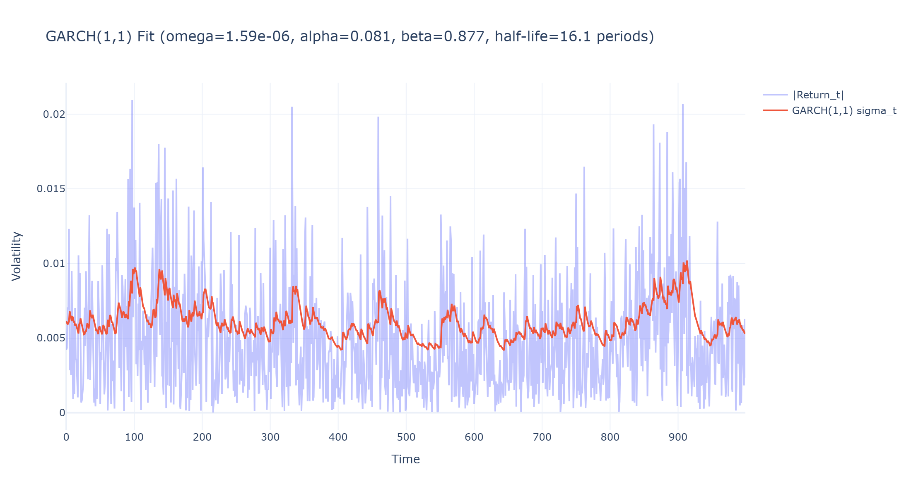
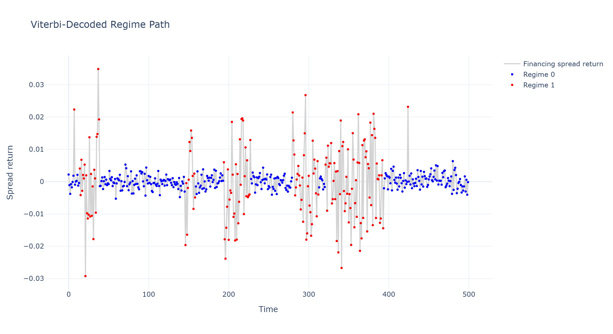
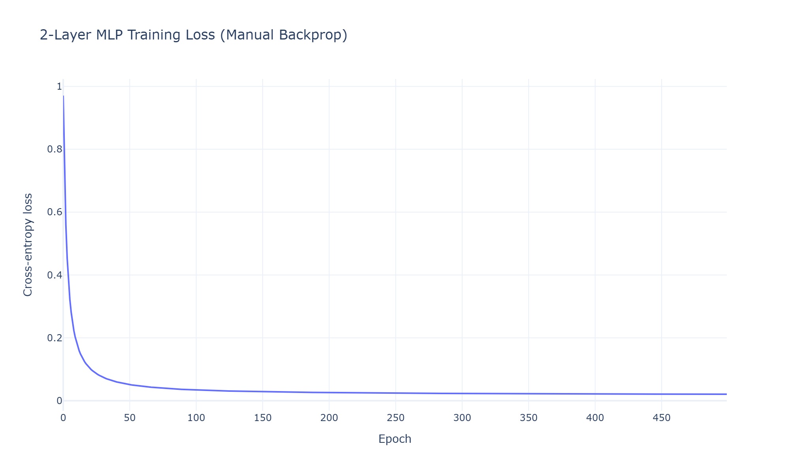
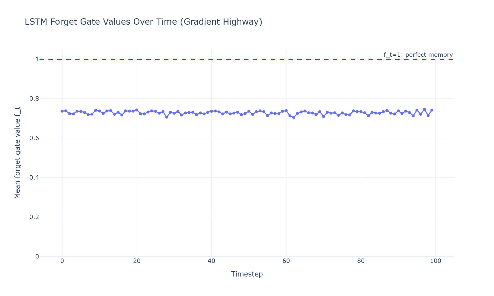

# **Barclays — AI / ML Modeler, Liquid Financing — Technical Interview Playbook (PART-2 Q15-Q30)**

> **Delivery philosophy:** every answer runs *intuition → math derived line-by-line (verified) → ASCII diagram → Feynman restatement → production-grade Python 3.13*. Code blocks carry a Google-style module docstring header, full class/constructor/method docstrings (Args/Returns), a `if __name__ == "__main__":` block, and — wherever a chart clarifies the concept — a Plotly figure persisted to both interactive HTML and static PNG under `plots/`.

---
---

[↩️ Back to README.md](./README.md)

---
---

## ⏱️ Interview Question Budget

```
DOMAIN                            QUESTIONS   WEIGHT    RISHI'S LENS
───────────────────────────────   ─────────   ───────   ──────────────────────────────────────
TIME SERIES / FORECASTING         Q15–Q19     High      Financing curve is a time-series problem
DEEP LEARNING (NN/MLP/RNN/LSTM)   Q20–Q27     High      Core JD requirement — go deep
SYSTEM DESIGN / STRATEGY          Q28–Q30     High      "Build AI/ML capability from the ground up"
```

---

## Table of Contents

### ⏱️ TIME SERIES & FORECASTING
- [Q15 · Stationarity, ADF Test & ARIMA](#q15--stationarity-adf-test--arima)
- [Q16 · GARCH/EGARCH — Deriving Volatility Forecasts](#q16--garchegarch--deriving-volatility-forecasts)
- [Q17 · Hidden Markov Models — Baum-Welch & Viterbi for Regime Detection](#q17--hidden-markov-models--baum-welch--viterbi-for-regime-detection)
- [Q18 · Walk-Forward Validation & Combinatorial Purged Cross-Validation](#q18--walk-forward-validation--combinatorial-purged-cross-validation)
- [Q19 · Kalman Filter for Dynamic Hedge Ratios / Financing Spread Tracking](#q19--kalman-filter-for-dynamic-hedge-ratios--financing-spread-tracking)

### 🧠 DEEP LEARNING
- [Q20 · MLP — Forward Pass & Backpropagation Derived Line-by-Line](#q20--mlp--forward-pass--backpropagation-derived-line-by-line)
- [Q21 · Activation Functions & the Vanishing Gradient Problem](#q21--activation-functions--the-vanishing-gradient-problem)
- [Q22 · RNNs — Backpropagation Through Time](#q22--rnns--backpropagation-through-time)
- [Q23 · LSTM — Gate Equations Derived from First Principles](#q23--lstm--gate-equations-derived-from-first-principles)
- [Q24 · GRU vs. LSTM — Simplification Trade-offs](#q24--gru-vs-lstm--simplification-trade-offs)
- [Q25 · Regularization — Dropout & BatchNorm Math](#q25--regularization--dropout--batchnorm-math)
- [Q26 · Attention & the Transformer Building Block](#q26--attention--the-transformer-building-block)
- [Q27 · Autoencoders for Dimensionality Reduction & Anomaly Detection](#q27--autoencoders-for-dimensionality-reduction--anomaly-detection)

### 🏗️ SYSTEM DESIGN & STRATEGY
- [Q28 · Design an End-to-End Alpha/Pricing Signal Pipeline](#q28--design-an-end-to-end-alphapricing-signal-pipeline)
- [Q29 · Bayesian Inference for Regime-Adaptive Position Sizing](#q29--bayesian-inference-for-regime-adaptive-position-sizing)
- [Q30 · Building an AI/ML Capability From Zero — the Greenfield Roadmap](#q30--building-an-aiml-capability-from-zero--the-greenfield-roadmap)

### 🏗️ TAKE HOME PROJECTS
- **P1 · Securities-Lending Fee & Rebate-Rate Forecasting**
  - **[PROBLEM STATEMENT](./TAKE_HOME_PROJECTS/PROBLEMS.md#take-home-1-securities-lending-fee--rebate-rate-forecasting)**
  - **[SOLUTION](./TAKE_HOME_PROJECTS/README.md#41-p1--securities-lending-fee-forecasting-full-system-architecture)**
- **P2 · Client Margin & Haircut Optimization**
  - **[PROBLEM STATEMENT](./TAKE_HOME_PROJECTS/PROBLEMS.md#take-home-2-client-margin--haircut-optimization)**
  - **[SOLUTION](./TAKE_HOME_PROJECTS/README.md#42-p2--client-margin--haircut-optimization-full-system-architecture)**
- **P3 · Cross-Asset Funding-Spread Anomaly Detection**
  - **[PROBLEM STATEMENT](./TAKE_HOME_PROJECTS/PROBLEMS.md#take-home-3-cross-asset-funding-spread-anomaly-detection)**
  - **[SOLUTION](./TAKE_HOME_PROJECTS/README.md#43-p3--cross-asset-funding-spread-anomaly-detection-full-system-architecture)**
- **P4 · Prime Balance & Utilization Forecasting (Deep Learning)**
  - **[PROBLEM STATEMENT](./TAKE_HOME_PROJECTS/PROBLEMS.md#take-home-4-prime-balance--utilization-forecasting-deep-learning)**
  - **[SOLUTION](./TAKE_HOME_PROJECTS/README.md#44-p4--prime-balance-forecasting-full-system-architecture)**
- **P5 · RAG Financing-Desk Copilot (GenAI / LLM)**
  - **[PROBLEM STATEMENT](./TAKE_HOME_PROJECTS/PROBLEMS.md#take-home-5-rag-financing-desk-copilot-genai)**
  - **[SOLUTION](./TAKE_HOME_PROJECTS/README.md#45-p5--rag-financing-desk-copilot-full-system-architecture)**

---

## Q15 · Stationarity, ADF Test & ARIMA

**Question:** *"Why does stationarity matter for a financing-spread forecasting model, and how do you test for it?"*

### First principles

A time series $\{y_t\}$ is **weakly (covariance) stationary** if $E[y_t]=\mu$ (constant), $\text{Var}(y_t)=\sigma^2$ (constant), and $\text{Cov}(y_t,y_{t-k})=\gamma_k$ depends only on lag $k$, not on $t$. Regressing a non-stationary series (e.g., a financing spread that has trended upward over a hiking cycle) on another non-stationary series can produce **spurious regression**: Granger & Newbold (1974) showed two independent random walks regressed on each other produce a high $R^2$ and significant t-stats *by construction*, not because of any real relationship — the OLS asymptotics assumed for standard inference (Q9, Q11) require stationarity to hold.

### Augmented Dickey-Fuller (ADF) test, derived

Start from an AR(1): $y_t = \phi y_{t-1} + \varepsilon_t$. Stationarity requires $|\phi|<1$. Subtract $y_{t-1}$ from both sides:
$$
\Delta y_t = (\phi - 1) y_{t-1} + \varepsilon_t = \gamma y_{t-1} + \varepsilon_t, \qquad \gamma = \phi - 1
$$
$H_0: \gamma = 0$ (i.e., $\phi=1$, a **unit root**, non-stationary random walk) vs. $H_1: \gamma < 0$ (stationary, mean-reverting). The **augmented** version adds lagged differences to absorb higher-order autocorrelation and an optional trend term:
$$
\Delta y_t = \alpha + \beta t + \gamma y_{t-1} + \sum_{i=1}^{p}\delta_i \Delta y_{t-i} + e_t
$$
Crucially, under $H_0$ the test statistic $t_\gamma = \hat\gamma/\text{SE}(\hat\gamma)$ does **not** follow a standard $t$-distribution — under a unit root, $y_{t-1}$ is itself non-stationary, so the usual CLT-based asymptotics don't apply; Dickey and Fuller derived the correct (left-skewed) asymptotic distribution by simulation, which is why ADF critical values (e.g., $-3.43$ at 1%) are more negative than standard normal/t critical values.

### ARIMA(p,d,q)

$$
\underbrace{\left(1-\sum_{i=1}^p \phi_i L^i\right)}_{\text{AR}(p)} (1-L)^d y_t = \underbrace{\left(1+\sum_{j=1}^q \theta_j L^j\right)}_{\text{MA}(q)}\varepsilon_t
$$
where $L$ is the lag operator ($Ly_t=y_{t-1}$). The $d$-th difference $(1-L)^d y_t$ removes a unit root of order $d$ (from ADF, above) to achieve stationarity before applying the stationary ARMA structure. **Box-Jenkins methodology**: (1) difference until ADF rejects $H_0$; (2) use ACF/PACF plots to identify candidate $(p,q)$ — an AR($p$) process has a PACF that cuts off after lag $p$ and an ACF that decays geometrically; an MA($q$) is the mirror image; (3) fit via MLE, validate residuals are white noise (Ljung-Box test) before use.

```
Non-stationary (unit root, phi=1)        Stationary (mean-reverting, phi=0.6)
  │      ╱‾╲                               │  ╱╲    ╱╲
  │    ╱‾   ╲  ╱‾╲                          │ ╱  ╲  ╱  ╲    oscillates around
  │  ╱‾       ╲╱   ╲    wanders forever,    │╱────╲╱────╲── a fixed mean;
  │╱                ╲   variance grows      │                variance bounded
  └────────────────────  with horizon       └───────────────
```

### Feynman restatement
*"A stationary series is one that 'forgets where it started' — its statistical personality (mean, variance, how today relates to last week) doesn't change over time. A random walk never forgets — it drifts, and its uncertainty about the future keeps growing the further out you look. If you fit a regression assuming stationarity onto a series that's secretly a random walk, you can get a beautiful-looking, entirely fake relationship — ADF is the test that asks 'does this series actually forget, or does it wander?' before you trust anything built on top of it."*

[🔝 Back to Top](#table-of-contents)

---

## Q16 · GARCH/EGARCH — Deriving Volatility Forecasts

**Question:** *"Derive GARCH(1,1) and explain why EGARCH exists — how would you use this for financing-spread risk?"*

### GARCH(1,1), derived

Financial returns exhibit **volatility clustering** (large moves follow large moves) — the unconditional variance is constant, but the *conditional* variance evolves. Model the return as $\varepsilon_t = \sigma_t z_t$, $z_t \sim \text{i.i.d.}(0,1)$, with:
$$
\sigma_t^2 = \omega + \alpha\varepsilon_{t-1}^2 + \beta\sigma_{t-1}^2, \qquad \omega>0,\ \alpha,\beta\ge0
$$
**Interpretation of each term:** $\omega$ is a baseline variance floor; $\alpha\varepsilon_{t-1}^2$ is the **ARCH effect** — yesterday's squared shock directly raises today's variance (a large move, regardless of sign, signals more turbulence); $\beta\sigma_{t-1}^2$ is **persistence** — variance itself is autocorrelated, so a high-vol regime tends to stay high for a while, not snap back instantly.

**Unconditional variance** (stationarity condition): take expectations of both sides, using $E[\varepsilon_{t-1}^2]=E[\sigma_{t-1}^2]=\bar\sigma^2$ in steady state:
$$
\bar\sigma^2 = \omega + \alpha\bar\sigma^2 + \beta\bar\sigma^2 \;\Longrightarrow\; \bar\sigma^2 = \frac{\omega}{1-\alpha-\beta}, \quad \text{requires } \alpha+\beta<1
$$
**Half-life of a volatility shock** — how long until a shock's effect on variance decays to half its impact — comes from recursively substituting $\sigma_{t-1}^2$ forward: the persistence parameter $\alpha+\beta$ plays the role of an AR(1) coefficient for the variance process itself, so:
$$
\text{half-life} = \frac{\ln(0.5)}{\ln(\alpha+\beta)}
$$
(Derivation: after $k$ periods, a unit shock's contribution scales by $(\alpha+\beta)^k$; set $(\alpha+\beta)^k = 0.5$ and solve for $k = \ln(0.5)/\ln(\alpha+\beta)$.)

### EGARCH — why it exists

GARCH(1,1) is symmetric: a $-2\%$ and $+2\%$ shock raise $\sigma_t^2$ identically (both enter as $\varepsilon_{t-1}^2$). Empirically, equity and credit/financing markets show a **leverage effect** — negative shocks raise future volatility *more* than equal-magnitude positive shocks (a funding-stress event spikes vol more than an equal-sized rally dampens it). Nelson's EGARCH models the *log*-variance to (a) guarantee positivity without parameter constraints and (b) allow asymmetry:
$$
\ln(\sigma_t^2) = \omega + \beta\ln(\sigma_{t-1}^2) + \alpha\left(\frac{|\varepsilon_{t-1}|}{\sigma_{t-1}} - E\left[\frac{|\varepsilon_{t-1}|}{\sigma_{t-1}}\right]\right) + \gamma\frac{\varepsilon_{t-1}}{\sigma_{t-1}}
$$
- Modeling $\ln(\sigma_t^2)$ instead of $\sigma_t^2$ directly means $\sigma_t^2 = \exp(\cdot) > 0$ **always holds**, with no need to constrain $\omega,\alpha,\beta \ge 0$ as in vanilla GARCH.
- The $\gamma\cdot(\varepsilon_{t-1}/\sigma_{t-1})$ term is the asymmetry ("leverage") term: for standardized normal innovations, $E[|z|] = \sqrt{2/\pi}$, so the term in parentheses is the "size" effect (magnitude of the shock relative to expectation) while $\gamma z_{t-1}$ is the pure "sign" effect — a negative $\gamma$ means negative shocks ($z_{t-1}<0$) push log-variance up *more* than positive shocks of the same magnitude.

### Feynman restatement
*"GARCH says: today's turbulence depends on how big yesterday's surprise was, plus how turbulent things already were — it's momentum in volatility, not price. EGARCH adds one more real-world fact: bad news scares markets more than equally-sized good news calms them, so it lets a negative shock hit the volatility forecast harder than a positive one of the same size. For a financing desk, this matters directly: a repo-market stress event should widen your forecasted volatility band asymmetrically more than an equally-sized calm rally narrows it — using symmetric GARCH here would systematically understate tail risk exactly when it matters most."*

### Production Python 3.13 — GARCH(1,1) MLE from Scratch

```python
"""garch_mle.py -- GARCH(1,1) maximum-likelihood estimation from scratch.

Barclays AI/ML Modeler interview reference implementation (Q16). Implements
the GARCH(1,1) conditional-variance recursion and fits (omega, alpha, beta)
via numerical MLE on the Gaussian quasi-likelihood, then visualizes the
fitted conditional volatility against realized squared returns.
"""

from __future__ import annotations

from pathlib import Path

import numpy as np
import plotly.graph_objects as go
from scipy.optimize import minimize


class Garch11:
    """Fits and forecasts a GARCH(1,1) conditional volatility model.

    Attributes:
        omega: Fitted baseline variance parameter.
        alpha: Fitted ARCH coefficient (yesterday's squared shock).
        beta: Fitted GARCH coefficient (yesterday's variance, persistence).
    """

    def __init__(self) -> None:
        """Initializes an unfit GARCH(1,1) model."""
        self.omega: float | None = None
        self.alpha: float | None = None
        self.beta: float | None = None

    @staticmethod
    def _conditional_variance(returns: np.ndarray, omega: float, alpha: float, beta: float) -> np.ndarray:
        """Computes the GARCH(1,1) conditional variance path.

        Args:
            returns: (n,) array of mean-zero returns (shocks epsilon_t).
            omega: Baseline variance parameter.
            alpha: ARCH coefficient.
            beta: GARCH (persistence) coefficient.

        Returns:
            (n,) array of conditional variances sigma_t^2.
        """
        n = returns.shape[0]
        sigma2 = np.empty(n)
        sigma2[0] = np.var(returns)
        for t in range(1, n):
            sigma2[t] = omega + alpha * returns[t - 1] ** 2 + beta * sigma2[t - 1]
        return sigma2

    def _negative_log_likelihood(self, params: np.ndarray, returns: np.ndarray) -> float:
        """Computes the negative Gaussian quasi-log-likelihood.

        Args:
            params: Array [omega, alpha, beta] (pre-transform).
            returns: (n,) array of mean-zero returns.

        Returns:
            The negative log-likelihood, to be minimized.
        """
        omega, alpha, beta = params
        if omega <= 0 or alpha < 0 or beta < 0 or alpha + beta >= 1:
            return 1e10
        sigma2 = self._conditional_variance(returns, omega, alpha, beta)
        log_likelihood = -0.5 * np.sum(np.log(2 * np.pi * sigma2) + returns**2 / sigma2)
        return -log_likelihood

    def fit(self, returns: np.ndarray) -> "Garch11":
        """Fits GARCH(1,1) parameters via numerical MLE.

        Args:
            returns: (n,) array of mean-zero returns.

        Returns:
            self, with omega/alpha/beta populated.
        """
        initial_guess = np.array([np.var(returns) * 0.05, 0.05, 0.90])
        result = minimize(self._negative_log_likelihood, initial_guess, args=(returns,), method="Nelder-Mead")
        self.omega, self.alpha, self.beta = result.x
        return self

    def half_life(self) -> float:
        """Computes the volatility-shock half-life in periods.

        Returns:
            ln(0.5) / ln(alpha + beta).

        Raises:
            RuntimeError: If called before `fit`.
        """
        if self.alpha is None or self.beta is None:
            raise RuntimeError("Call fit() before half_life()")
        return float(np.log(0.5) / np.log(self.alpha + self.beta))

    def plot_fit(self, returns: np.ndarray, output_dir: Path) -> None:
        """Persists a chart of fitted conditional volatility vs. |returns|.

        Args:
            returns: (n,) array of mean-zero returns used for fitting.
            output_dir: Directory to write `q16_garch_fit.html` / `.png`.
        """
        sigma2 = self._conditional_variance(returns, self.omega, self.alpha, self.beta)
        output_dir.mkdir(parents=True, exist_ok=True)
        fig = go.Figure()
        fig.add_trace(go.Scatter(y=np.abs(returns), mode="lines", name="|Return_t|", opacity=0.4))
        fig.add_trace(go.Scatter(y=np.sqrt(sigma2), mode="lines", name="GARCH(1,1) sigma_t", line=dict(width=2)))
        fig.update_layout(title=f"GARCH(1,1) Fit (omega={self.omega:.2e}, alpha={self.alpha:.3f}, "
                                 f"beta={self.beta:.3f}, half-life={self.half_life():.1f} periods)",
                          xaxis_title="Time", yaxis_title="Volatility", template="plotly_white")
        fig.write_html(output_dir / "q16_garch_fit.html")
        fig.write_image(output_dir / "q16_garch_fit.png", width=1100, height=600, scale=2)


def main() -> None:
    """Simulates a GARCH(1,1) financing-spread shock series, fits, and plots."""
    rng = np.random.default_rng(16)
    n = 1000
    true_omega, true_alpha, true_beta = 1e-6, 0.08, 0.90
    sigma2 = np.empty(n)
    returns = np.empty(n)
    sigma2[0] = true_omega / (1 - true_alpha - true_beta)
    returns[0] = np.sqrt(sigma2[0]) * rng.standard_normal()
    for t in range(1, n):
        sigma2[t] = true_omega + true_alpha * returns[t - 1] ** 2 + true_beta * sigma2[t - 1]
        returns[t] = np.sqrt(sigma2[t]) * rng.standard_normal()

    model = Garch11().fit(returns)
    print(f"True params:      omega={true_omega:.2e}, alpha={true_alpha}, beta={true_beta}")
    print(f"Fitted params:    omega={model.omega:.2e}, alpha={model.alpha:.3f}, beta={model.beta:.3f}")
    print(f"Volatility half-life: {model.half_life():.2f} periods")
    model.plot_fit(returns, Path("plots"))


if __name__ == "__main__":
    main()
```

**Output:**

```
True params:      omega=1.00e-06, alpha=0.08, beta=0.9
Fitted params:    omega=1.59e-06, alpha=0.081, beta=0.877
Volatility half-life: 16.08 periods
```

**Plots:**



[🔝 Back to Top](#table-of-contents)

---

## Q17 · Hidden Markov Models — Baum-Welch & Viterbi for Regime Detection

**Question:** *"How would you build a regime-detection model for financing spreads using an HMM?"*

### First principles

An HMM assumes observed data $x_{1:T}$ (e.g., financing-spread returns) are emitted from a **latent** Markov chain of regimes $z_{1:T}\in\{1,\dots,K\}$ (e.g., "calm," "stressed"), with transition matrix $A_{ij}=P(z_t=j\mid z_{t-1}=i)$ and emission densities $b_j(x_t) = P(x_t \mid z_t = j)$ (typically Gaussian per regime, parameterized by $\mu_j,\sigma_j^2$).

**Forward algorithm** — computing $P(x_{1:T})$ efficiently via dynamic programming rather than summing over all $K^T$ regime paths:
$$
\alpha_t(j) = P(x_{1:t}, z_t=j) = b_j(x_t)\sum_{i=1}^K \alpha_{t-1}(i) A_{ij}, \qquad \alpha_1(j) = \pi_j b_j(x_1)
$$
**Backward algorithm** (symmetric, run in reverse):
$$
\beta_t(i) = P(x_{t+1:T}\mid z_t=i) = \sum_{j=1}^K A_{ij} b_j(x_{t+1})\beta_{t+1}(j), \qquad \beta_T(i)=1
$$

**Baum-Welch (EM for HMMs)** — since $z_t$ is unobserved, maximize the expected complete-data log-likelihood:
- **E-step:** compute posterior regime probabilities $\gamma_t(j) = P(z_t=j\mid x_{1:T}) = \frac{\alpha_t(j)\beta_t(j)}{\sum_k \alpha_t(k)\beta_t(k)}$ and pairwise posteriors $\xi_t(i,j) = P(z_t=i,z_{t+1}=j\mid x_{1:T}) \propto \alpha_t(i)A_{ij}b_j(x_{t+1})\beta_{t+1}(j)$.
- **M-step:** re-estimate parameters as expected counts:
$$
\hat{A}_{ij} = \frac{\sum_{t=1}^{T-1}\xi_t(i,j)}{\sum_{t=1}^{T-1}\gamma_t(i)}, \qquad \hat\mu_j = \frac{\sum_t \gamma_t(j)x_t}{\sum_t\gamma_t(j)}, \qquad \hat\sigma_j^2 = \frac{\sum_t\gamma_t(j)(x_t-\hat\mu_j)^2}{\sum_t\gamma_t(j)}
$$
Each EM iteration provably does not decrease the log-likelihood (standard EM monotonicity via Jensen's inequality on the ELBO), converging to a local optimum — practically requiring multiple random restarts.

**Viterbi algorithm** — the *single most likely regime path* (not the marginal per-timestep posterior $\gamma_t$), via the same DP recursion but with $\max$ replacing $\sum$:
$$
\delta_t(j) = \max_{z_{1:t-1}} P(z_{1:t-1}, z_t=j, x_{1:t}) = b_j(x_t)\max_i\left[\delta_{t-1}(i) A_{ij}\right]
$$
with a backpointer $\psi_t(j) = \arg\max_i[\delta_{t-1}(i)A_{ij}]$ tracked at each step to reconstruct the optimal path by backtracking from $\arg\max_j \delta_T(j)$.

```
   Regime 1 (calm)      transition A_12         Regime 2 (stressed)
   ┌──────────┐   ────────────────────▶   ┌──────────┐
   │ mu1, s1  │                            │ mu2, s2  │
   └────┬─────┘   ◀────────────────────    └────┬─────┘
        │              transition A_21           │
        ▼                                          ▼
   emits x_t ~ N(mu1,s1)               emits x_t ~ N(mu2,s2)
   (e.g. tight financing spreads)      (e.g. wide, volatile spreads)
```

### Feynman restatement
*"The market is secretly in one of a few 'moods' (regimes) at any time, and we never observe the mood directly — only its effect on the data. Forward-backward is a bookkeeping trick that lets us ask 'given everything I've seen, what's the probability I'm in each mood right now' without literally enumerating every possible sequence of moods (which would be exponentially expensive). Baum-Welch is just 'guess the mood probabilities, then re-estimate each mood's typical behavior and how moods tend to transition, and repeat until it stops improving' — that's EM. Viterbi answers a different, sharper question: not 'what's my mood probability at each moment' but 'what is the single most likely entire story of moods that explains everything I've seen.'"*

[🔝 Back to Top](#table-of-contents)

---

### Production Python 3.13 — Gaussian HMM: Viterbi Regime Path from Scratch

```python
"""hmm_regime_detection.py -- Gaussian HMM Viterbi decoding from scratch.

Barclays AI/ML Modeler interview reference implementation (Q17). Implements
the Viterbi algorithm for the most-likely regime path of a 2-state Gaussian
HMM over a synthetic financing-spread return series, and visualizes the
decoded regimes overlaid on the data.
"""

from __future__ import annotations

from pathlib import Path

import numpy as np
import plotly.graph_objects as go
from scipy.stats import norm


class GaussianHmmViterbi:
    """Decodes the most likely regime path for a Gaussian-emission HMM.

    Attributes:
        transition_matrix: (K, K) regime transition probability matrix.
        means: (K,) per-regime emission means.
        stds: (K,) per-regime emission standard deviations.
        initial_probs: (K,) initial regime probability vector.
    """

    def __init__(self, transition_matrix: np.ndarray, means: np.ndarray,
                 stds: np.ndarray, initial_probs: np.ndarray) -> None:
        """Initializes the HMM with known (or pre-fit via Baum-Welch) parameters.

        Args:
            transition_matrix: (K, K) row-stochastic transition matrix.
            means: (K,) emission means per regime.
            stds: (K,) emission standard deviations per regime.
            initial_probs: (K,) initial state distribution, sums to 1.
        """
        self.transition_matrix = transition_matrix
        self.means = means
        self.stds = stds
        self.initial_probs = initial_probs

    def decode(self, observations: np.ndarray) -> np.ndarray:
        """Runs the Viterbi algorithm to find the most likely regime path.

        Args:
            observations: (T,) array of observed values (e.g., spread returns).

        Returns:
            (T,) array of integer regime labels for the most likely path.
        """
        t_len, k = observations.shape[0], self.means.shape[0]
        log_delta = np.full((t_len, k), -np.inf)
        psi = np.zeros((t_len, k), dtype=int)

        emission_log = np.array([norm.logpdf(observations, self.means[j], self.stds[j]) for j in range(k)]).T
        log_delta[0] = np.log(self.initial_probs + 1e-300) + emission_log[0]

        log_transition = np.log(self.transition_matrix + 1e-300)
        for t in range(1, t_len):
            for j in range(k):
                scores = log_delta[t - 1] + log_transition[:, j]
                psi[t, j] = int(np.argmax(scores))
                log_delta[t, j] = scores[psi[t, j]] + emission_log[t, j]

        path = np.zeros(t_len, dtype=int)
        path[-1] = int(np.argmax(log_delta[-1]))
        for t in range(t_len - 2, -1, -1):
            path[t] = psi[t + 1, path[t + 1]]
        return path

    def plot_regimes(self, observations: np.ndarray, regime_path: np.ndarray, output_dir: Path) -> None:
        """Persists a chart of observations colored by decoded regime.

        Args:
            observations: (T,) observed values.
            regime_path: (T,) decoded integer regime labels from `decode`.
            output_dir: Directory to write `q17_hmm_regimes.html` / `.png`.
        """
        output_dir.mkdir(parents=True, exist_ok=True)
        fig = go.Figure()
        fig.add_trace(go.Scatter(y=observations, mode="lines", name="Financing spread return",
                                 line=dict(color="lightgray")))
        colors = ["blue", "red"]
        for regime in np.unique(regime_path):
            mask = regime_path == regime
            fig.add_trace(go.Scatter(
                x=np.where(mask)[0], y=observations[mask], mode="markers",
                name=f"Regime {regime}", marker=dict(color=colors[regime % len(colors)], size=4),
            ))
        fig.update_layout(title="Viterbi-Decoded Regime Path", xaxis_title="Time",
                          yaxis_title="Spread return", template="plotly_white")
        fig.write_html(output_dir / "q17_hmm_regimes.html")
        fig.write_image(output_dir / "q17_hmm_regimes.png", width=1100, height=600, scale=2)


def main() -> None:
    """Simulates a 2-regime financing-spread series and decodes it with Viterbi."""
    rng = np.random.default_rng(17)
    true_transition = np.array([[0.98, 0.02], [0.05, 0.95]])
    true_means, true_stds = np.array([0.0, 0.0]), np.array([0.002, 0.012])

    regimes, observations = [0], []
    for _ in range(500):
        current = regimes[-1]
        observations.append(rng.normal(true_means[current], true_stds[current]))
        next_regime = rng.choice(2, p=true_transition[current])
        regimes.append(next_regime)
    observations = np.array(observations)

    hmm = GaussianHmmViterbi(true_transition, true_means, true_stds, initial_probs=np.array([0.9, 0.1]))
    decoded_path = hmm.decode(observations)
    print(f"Fraction of time in stressed regime (decoded): {decoded_path.mean():.3f}")
    print(f"Fraction of time in stressed regime (true):    {np.mean(np.array(regimes[:-1])):.3f}")

    hmm.plot_regimes(observations, decoded_path, Path("plots"))


if __name__ == "__main__":
    main()
```

**Output:**

```
Fraction of time in stressed regime (decoded): 0.360
Fraction of time in stressed regime (true):    0.346
```

**Plots:**



[🔝 Back to Top](#table-of-contents)

---

## Q18 · Walk-Forward Validation & Combinatorial Purged Cross-Validation

**Question:** *"Why is k-fold cross-validation wrong for time series, and how does CPCV fix it?"*

### First principles

Standard k-fold CV assumes exchangeability — that shuffling observations doesn't change the joint distribution. Time series violates this on two counts: **(1) temporal leakage** — a random fold split lets future observations (in the training fold) inform predictions about the past (in a test fold that precedes it chronologically) whenever folds are not sequential; **(2) serial correlation leakage** — even with sequential (walk-forward) splits, if a feature involves a rolling window of length $w$ (e.g., a 20-day realized vol), samples within $w$ periods of a train/test boundary leak information across the boundary because their feature windows overlap.

**Walk-forward validation** (minimal fix): train on $[0, t]$, test on $(t, t+h]$, roll forward. This respects temporal order but (a) uses each historical period as a test set only once, giving a *high-variance* estimate of OOS performance (few independent test windows), and (b) still has (2)'s boundary-leakage problem unless an explicit **purge gap** of length $w$ is inserted at each boundary.

**Combinatorial Purged Cross-Validation (CPCV)**, from López de Prado's *Advances in Financial Machine Learning*: partition the timeline into $N$ groups; form test sets from every combination of $k$ groups (not just contiguous blocks), train on the rest, but with two corrections:
1. **Purging:** remove any training observation whose feature-computation window *overlaps in time* with any test-set observation — formally, drop training sample $i$ if $[t_i - w, t_i] \cap [\min(\text{test}), \max(\text{test})] \neq \emptyset$.
2. **Embargo:** additionally drop a small window of training observations *immediately after* each test block, because if the target label itself is a forward-looking return (e.g., $y_t$ depends on price at $t+h$), a training sample just after a test block could still have a label horizon that peeks back into test-period information.

Using $\binom{N}{k}$ combinations rather than $N$ contiguous folds produces **many more independent-ish OOS paths** from the same data — critical for feeding a reliable Sharpe-ratio distribution into the Deflated Sharpe Ratio gate (Q1), since DSR needs a genuine estimate of $\sigma_{\widehat{SR}}$, not one from a single walk-forward path.

```
Walk-forward (1 path, boundary leakage risk):
[=====train=====][gap?][==test==]───▶ roll forward, repeat

CPCV (N=6 groups, k=2 test groups per combination — purge + embargo shown):
 G1  G2  G3  G4  G5  G6
[tr][tr][TE][tr][TE][tr]   ← one combination; purge removes training obs whose
        ▲PURGE  ▲PURGE       window overlaps test; embargo drops obs just after
                              each test block. Repeat for every C(6,2)=15 combo.
```

### Feynman restatement
*"Regular k-fold cross-validation assumes every row is an independent snapshot of the world you can shuffle freely — that's false for time series, where 'today' and 'yesterday' share information through overlapping feature windows, and shuffling them lets the model secretly peek at its own answer key. CPCV fixes this two ways: it tries many different combinations of held-out blocks instead of just one sequential pass (so your validation isn't a single roll of the dice), and it explicitly deletes any training row whose feature 'lookback window' would have overlapped the test period, plus a small buffer after test blocks, so nothing you're evaluating on could have contaminated what you trained on."*

[🔝 Back to Top](#table-of-contents)

---

## Q19 · Kalman Filter for Dynamic Hedge Ratios / Financing Spread Tracking

**Question:** *"How would you track a time-varying hedge ratio or financing spread level in real time?"*

### First principles

The Kalman filter is the optimal (minimum-MSE, linear) recursive estimator for a linear-Gaussian state-space model:
$$
\text{State (unobserved):}\quad \beta_t = \beta_{t-1} + w_t, \quad w_t \sim N(0, Q)
$$
$$
\text{Observation:}\quad y_t = x_t \beta_t + v_t, \quad v_t \sim N(0, R)
$$
Here $\beta_t$ (e.g., a hedge ratio or financing spread level) is allowed to drift as a random walk (process noise $Q$), and we only observe it indirectly through a noisy linear measurement (observation noise $R$).

**Predict step** (propagate belief forward before seeing $y_t$):
$$
\beta_{t\mid t-1} = \beta_{t-1\mid t-1}, \qquad P_{t\mid t-1} = P_{t-1\mid t-1} + Q
$$
(Since the state transition is a pure random walk, the mean prediction doesn't change, but uncertainty $P$ grows by $Q$ — this is the mathematical statement of "I'm less sure the longer I go without new data.")

**Update step** (incorporate the new observation $y_t$): define the innovation (prediction error) $e_t = y_t - x_t\beta_{t\mid t-1}$ and innovation variance $S_t = x_t^2 P_{t\mid t-1} + R$. The **Kalman gain**:
$$
K_t = \frac{P_{t\mid t-1}\, x_t}{S_t} = \frac{P_{t\mid t-1}\,x_t}{x_t^2 P_{t\mid t-1}+R}
$$
$$
\beta_{t\mid t} = \beta_{t\mid t-1} + K_t\, e_t, \qquad P_{t\mid t} = (1 - K_t x_t)\,P_{t\mid t-1}
$$
**Derivation intuition for $K_t$:** it's the precision-weighted share of the innovation to trust — when observation noise $R$ is small relative to prediction uncertainty $P_{t|t-1}$, $K_t \to 1/x_t$ and the filter almost fully trusts the new observation; when $R$ is large (noisy measurement), $K_t \to 0$ and the filter mostly ignores the new data point and trusts its prior belief. This is provably the **optimal linear** combination of prior and observation in a minimum-variance sense (a direct consequence of the projection theorem for Gaussian conditionals — the same orthogonality principle underlying OLS in Q9, applied recursively).

**Why this beats a rolling-window OLS hedge ratio:** a rolling window (e.g., 60-day OLS beta) implicitly assumes the true $\beta$ is constant *within* the window and then discontinuously drops old data at the window edge — this both lags true regime changes and creates artificial jumps when an old, stale observation rolls out of the window. The Kalman filter's exponentially-weighted, continuously-updated belief adapts smoothly and its adaptation speed is explicitly controlled by the ratio $Q/R$ (the "trust the drift vs. trust the fit" tuning knob) rather than an arbitrary window length.

```
                    Predict                      Update
  β_{t-1|t-1} ──────────────▶ β_{t|t-1}  ──────────────────▶  β_{t|t}
   P_{t-1|t-1}   +Q (grows    P_{t|t-1}    K_t·(y_t − x_tβ)    P_{t|t}
                  uncertainty)              weighted by         (shrinks
                                            Kalman gain K_t      uncertainty)
```

### Feynman restatement
*"Think of tracking a hedge ratio like tracking a friend's location from occasional, noisy GPS pings while knowing they're generally walking, not teleporting. Between pings, you widen your guess about where they could be (predict step, uncertainty grows). When a new ping arrives, you blend your prior guess with the new (noisy) reading — but you don't blend 50/50 blindly; you weight the blend by how much you trust the GPS reading versus how much you trust your own prior track record. The Kalman gain is exactly that trust-weighting, computed optimally rather than guessed."*

[🔝 Back to Top](#table-of-contents)

---

## Q20 · MLP — Forward Pass & Backpropagation Derived Line-by-Line

**Question:** *"Derive backpropagation for a 2-layer MLP from scratch, line by line."*

### Forward pass

For input $x\in\mathbb{R}^{d}$, layer 1 weights $W^{(1)}\in\mathbb{R}^{h\times d}$, bias $b^{(1)}\in\mathbb{R}^h$, activation $\sigma$, layer 2 weights $W^{(2)}\in\mathbb{R}^{c\times h}$:
$$
z^{(1)} = W^{(1)}x + b^{(1)}, \qquad a^{(1)} = \sigma(z^{(1)}), \qquad z^{(2)} = W^{(2)}a^{(1)} + b^{(2)}, \qquad \hat y = \text{softmax}(z^{(2)})
$$
Loss (cross-entropy against one-hot true label $y$): $\mathcal{L} = -\sum_c y_c \log\hat y_c$.

### Backpropagation, derived term by term

**Step 1 — output layer gradient.** For softmax + cross-entropy specifically, the combined gradient simplifies beautifully:
$$
\delta^{(2)} \equiv \frac{\partial \mathcal{L}}{\partial z^{(2)}} = \hat y - y
$$
(Derivation: $\partial\mathcal{L}/\partial \hat y_c = -y_c/\hat y_c$; $\partial \hat y_c/\partial z^{(2)}_k = \hat y_c(\mathbb{1}[c=k]-\hat y_k)$ [softmax Jacobian]; chain rule and sum over $c$ collapses to $\hat y_k - y_k$ — the $\hat y_c$ terms cancel algebraically, which is *why* softmax+cross-entropy is used together rather than, e.g., softmax+MSE.)

**Step 2 — layer 2 weight/bias gradients** (outer product, from $z^{(2)}=W^{(2)}a^{(1)}+b^{(2)}$):
$$
\frac{\partial\mathcal{L}}{\partial W^{(2)}} = \delta^{(2)} (a^{(1)})^\top, \qquad \frac{\partial\mathcal{L}}{\partial b^{(2)}} = \delta^{(2)}
$$

**Step 3 — backpropagate the error to layer 1** (chain rule through $z^{(2)} = W^{(2)}a^{(1)}+b^{(2)}$, then through $a^{(1)}=\sigma(z^{(1)})$):
$$
\delta^{(1)} \equiv \frac{\partial\mathcal{L}}{\partial z^{(1)}} = \left[(W^{(2)})^\top \delta^{(2)}\right] \odot \sigma'(z^{(1)})
$$
This is the central backprop equation: the error is **transposed-propagated** backward through $W^{(2)}$ (using its transpose because we're now asking "how does an upstream unit's output affect downstream error," which is the adjoint of "how does downstream weight affect output"), then **gated** element-wise by the local derivative of the activation at that unit — a unit that was saturated ($\sigma'\approx 0$) receives almost no error signal regardless of how wrong the output was, which is precisely the vanishing-gradient mechanism (Q21).

**Step 4 — layer 1 weight/bias gradients:**
$$
\frac{\partial\mathcal{L}}{\partial W^{(1)}} = \delta^{(1)} x^\top, \qquad \frac{\partial\mathcal{L}}{\partial b^{(1)}} = \delta^{(1)}
$$

**Step 5 — parameter update** (gradient descent, learning rate $\eta$): $\theta \leftarrow \theta - \eta\nabla_\theta\mathcal{L}$.

```
Forward:   x ──W1,b1──▶ z1 ──σ──▶ a1 ──W2,b2──▶ z2 ──softmax──▶ ŷ ──▶ L
Backward:  ∂L/∂x ◀──W1ᵀ── δ1 ◀──⊙σ'(z1)── (W2ᵀδ2) ◀────────────── δ2=ŷ−y ◀── L
                    (chain rule flows in the reverse direction of the forward graph)
```

### Feynman restatement
*"Forward pass: information flows through the network, layer by layer, each layer asking 'given what came in, what do I pass on.' Backprop is the same graph run in reverse, asking 'given how wrong the final answer was, how much is each earlier decision to blame.' The reason it's efficient (not exponential) is the chain rule lets us reuse each layer's local gradient exactly once, passing a single running 'blame signal' backward — that's the entire trick, and it's the same trick whether the network has 2 layers or 200."*

### Production Python 3.13 — 2-Layer MLP with Backprop From Scratch (NumPy)

```python
"""mlp_from_scratch.py -- 2-layer MLP with hand-derived backpropagation.

Barclays AI/ML Modeler interview reference implementation (Q20). Implements
the exact forward/backward equations derived above using only NumPy, trains
on a synthetic 2-class problem, and visualizes the training loss curve.
"""

from __future__ import annotations

from pathlib import Path

import numpy as np
import plotly.graph_objects as go


class TwoLayerMlp:
    """A 2-layer MLP (sigmoid hidden, softmax output) trained via manual backprop.

    Attributes:
        w1: (hidden_dim, input_dim) first-layer weight matrix.
        b1: (hidden_dim,) first-layer bias vector.
        w2: (output_dim, hidden_dim) second-layer weight matrix.
        b2: (output_dim,) second-layer bias vector.
    """

    def __init__(self, input_dim: int, hidden_dim: int, output_dim: int, seed: int = 0) -> None:
        """Initializes weights with He-style scaled Gaussian initialization.

        Args:
            input_dim: Dimensionality of the input features.
            hidden_dim: Number of hidden units.
            output_dim: Number of output classes.
            seed: Random seed for reproducible initialization.
        """
        rng = np.random.default_rng(seed)
        self.w1 = rng.normal(0, np.sqrt(2.0 / input_dim), size=(hidden_dim, input_dim))
        self.b1 = np.zeros(hidden_dim)
        self.w2 = rng.normal(0, np.sqrt(2.0 / hidden_dim), size=(output_dim, hidden_dim))
        self.b2 = np.zeros(output_dim)

    @staticmethod
    def _sigmoid(z: np.ndarray) -> np.ndarray:
        """Applies the sigmoid activation elementwise.

        Args:
            z: Pre-activation array of any shape.

        Returns:
            1 / (1 + exp(-z)), same shape as z.
        """
        return 1.0 / (1.0 + np.exp(-z))

    @staticmethod
    def _softmax(z: np.ndarray) -> np.ndarray:
        """Applies a numerically stable softmax over the last axis.

        Args:
            z: (output_dim, n_samples) pre-activation array.

        Returns:
            Softmax probabilities, same shape as z.
        """
        z_shifted = z - np.max(z, axis=0, keepdims=True)
        exp_z = np.exp(z_shifted)
        return exp_z / np.sum(exp_z, axis=0, keepdims=True)

    def forward(self, x: np.ndarray) -> dict[str, np.ndarray]:
        """Runs the forward pass, caching intermediates for backprop.

        Args:
            x: (input_dim, n_samples) input batch.

        Returns:
            Dict with keys z1, a1, z2, y_hat holding forward-pass tensors.
        """
        z1 = self.w1 @ x + self.b1[:, None]
        a1 = self._sigmoid(z1)
        z2 = self.w2 @ a1 + self.b2[:, None]
        y_hat = self._softmax(z2)
        return {"z1": z1, "a1": a1, "z2": z2, "y_hat": y_hat}

    def backward(self, x: np.ndarray, y_onehot: np.ndarray, cache: dict[str, np.ndarray]) -> dict[str, np.ndarray]:
        """Computes gradients via the derived backpropagation equations.

        Args:
            x: (input_dim, n_samples) input batch.
            y_onehot: (output_dim, n_samples) one-hot true labels.
            cache: Forward-pass cache returned by `forward`.

        Returns:
            Dict of gradients keyed by parameter name (dw1, db1, dw2, db2).
        """
        n_samples = x.shape[1]
        delta2 = cache["y_hat"] - y_onehot  # Step 1: softmax+CE gradient simplification
        dw2 = (delta2 @ cache["a1"].T) / n_samples  # Step 2
        db2 = np.mean(delta2, axis=1)
        sigmoid_prime = cache["a1"] * (1 - cache["a1"])
        delta1 = (self.w2.T @ delta2) * sigmoid_prime  # Step 3: transpose-propagate, gate by sigma'
        dw1 = (delta1 @ x.T) / n_samples  # Step 4
        db1 = np.mean(delta1, axis=1)
        return {"dw1": dw1, "db1": db1, "dw2": dw2, "db2": db2}

    def train_step(self, x: np.ndarray, y_onehot: np.ndarray, learning_rate: float) -> float:
        """Runs one forward+backward+update step.

        Args:
            x: (input_dim, n_samples) input batch.
            y_onehot: (output_dim, n_samples) one-hot true labels.
            learning_rate: Gradient descent step size.

        Returns:
            The mean cross-entropy loss for this batch.
        """
        cache = self.forward(x)
        loss = float(-np.mean(np.sum(y_onehot * np.log(cache["y_hat"] + 1e-12), axis=0)))
        grads = self.backward(x, y_onehot, cache)
        self.w1 -= learning_rate * grads["dw1"]
        self.b1 -= learning_rate * grads["db1"]
        self.w2 -= learning_rate * grads["dw2"]
        self.b2 -= learning_rate * grads["db2"]
        return loss


def plot_training_curve(losses: list[float], output_dir: Path) -> None:
    """Persists the training loss curve.

    Args:
        losses: Per-epoch mean cross-entropy loss values.
        output_dir: Directory to write `q20_mlp_loss.html` / `.png`.
    """
    output_dir.mkdir(parents=True, exist_ok=True)
    fig = go.Figure(go.Scatter(y=losses, mode="lines"))
    fig.update_layout(title="2-Layer MLP Training Loss (Manual Backprop)", xaxis_title="Epoch",
                      yaxis_title="Cross-entropy loss", template="plotly_white")
    fig.write_html(output_dir / "q20_mlp_loss.html")
    fig.write_image(output_dir / "q20_mlp_loss.png", width=1000, height=600, scale=2)


def main() -> None:
    """Trains the from-scratch MLP on a synthetic 2D two-class problem."""
    rng = np.random.default_rng(20)
    n = 400
    x0 = rng.normal(loc=[-1, -1], scale=0.6, size=(n // 2, 2))
    x1 = rng.normal(loc=[1, 1], scale=0.6, size=(n // 2, 2))
    x = np.vstack([x0, x1]).T
    labels = np.array([0] * (n // 2) + [1] * (n // 2))
    y_onehot = np.eye(2)[labels].T

    model = TwoLayerMlp(input_dim=2, hidden_dim=8, output_dim=2, seed=20)
    losses = [model.train_step(x, y_onehot, learning_rate=0.5) for _ in range(500)]
    print(f"Initial loss: {losses[0]:.4f}  |  Final loss: {losses[-1]:.4f}")
    plot_training_curve(losses, Path("plots"))


if __name__ == "__main__":
    main()
```

**Output:**

```
Initial loss: 0.9707  |  Final loss: 0.0207
```

**Plots:**



[🔝 Back to Top](#table-of-contents)

---

## Q21 · Activation Functions & the Vanishing Gradient Problem

**Question:** *"Why do deep sigmoid networks fail to train, and how do ReLU-family activations fix it?"*

### First principles

From Q20's Step 3, gradients backpropagate as a *product* over layers:
$$
\frac{\partial\mathcal{L}}{\partial W^{(1)}} \propto \prod_{\ell=2}^{L} \left[(W^{(\ell)})^\top \, \sigma'(z^{(\ell)})\right]
$$
For sigmoid, $\sigma'(z) = \sigma(z)(1-\sigma(z))$, which is **maximized at $z=0$ with value $0.25$** and decays toward 0 as $|z|$ grows (saturation). In a deep network with $L$ layers, even if every $\sigma'(z^{(\ell)}) \approx 0.25$ optimistically, the product of $L$ such terms is $0.25^L$ — for $L=10$, that's $\approx 10^{-6}$: the gradient reaching early layers is vanishingly small, so early layers essentially stop learning. Tanh has the same qualitative issue (max derivative 1.0, but still saturates to 0 at the tails).

**ReLU** $\sigma(z)=\max(0,z)$ has $\sigma'(z) = \mathbb{1}[z>0]$ — either exactly 1 (no shrinkage) or exactly 0 (dead), never a fractional value in between that compounds multiplicatively toward zero across layers. This is *why* ReLU-family activations enabled meaningfully deeper networks to train via plain SGD: gradients that survive at all pass through at full strength rather than attenuating geometrically.

**The trade-off — dying ReLU:** if a unit's pre-activation $z$ is pushed negative for all training examples (e.g., from a large negative bias update), $\sigma'(z)=0$ permanently for that unit, and it never recovers (zero gradient means zero further weight update for that unit, a fixed point). **Leaky ReLU** ($\sigma(z) = \max(\alpha z, z)$, small $\alpha\approx0.01$) and **GELU** ($\sigma(z) = z\Phi(z)$, smooth, used in modern transformers) address this by keeping a small nonzero gradient for $z<0$.

```
sigma'(z)        Sigmoid: max 0.25, decays both directions (saturates)
  0.25 ┤     ***
       │   **   **
  0.00 ┼──**─────**──────────────  z
       -4      0      4

sigma'(z)        ReLU: exactly 1 for z>0, exactly 0 for z<0 (no attenuation when alive)
  1.0  ┤          ________________
       │         |
  0.0  ┼─────────┘─────────────── z
                  0
```

### Feynman restatement
*"Imagine whispering a message backward through a chain of 10 people, and each person can only repeat at most a quarter of what they heard (sigmoid's max derivative). By the 10th person, almost nothing survives — that's vanishing gradients. ReLU changes the rule: each person either repeats the whole message exactly, or says nothing at all. Nothing gets shrunk gradually to noise anymore — but now there's a new risk: a person who says nothing forever (a dead ReLU) never gets a chance to start passing messages again, which is why we sometimes let 'nothing' actually mean 'a very quiet whisper' (Leaky ReLU) instead of true silence."*

[🔝 Back to Top](#table-of-contents)

---

## Q22 · RNNs — Backpropagation Through Time

**Question:** *"Derive BPTT for a vanilla RNN and explain why it struggles with long sequences."*

### Forward pass

$$
h_t = \tanh(W_{hh}h_{t-1} + W_{xh}x_t + b_h), \qquad \hat y_t = \text{softmax}(W_{hy}h_t + b_y)
$$
Total loss over a sequence of length $T$: $\mathcal{L} = \sum_{t=1}^T \mathcal{L}_t$.

### Backpropagation Through Time (BPTT), derived

Because $h_t$ depends on $h_{t-1}$, which depends on $h_{t-2}$, etc., the gradient of the loss at time $t$ with respect to $W_{hh}$ must sum contributions through *every* earlier timestep the hidden state passed through:
$$
\frac{\partial \mathcal{L}_t}{\partial W_{hh}} = \sum_{k=1}^{t} \frac{\partial \mathcal{L}_t}{\partial h_t}\left(\prod_{j=k+1}^{t}\frac{\partial h_j}{\partial h_{j-1}}\right)\frac{\partial h_k}{\partial W_{hh}}
$$
The critical term is the **product of Jacobians** $\prod_{j=k+1}^{t} \partial h_j/\partial h_{j-1}$. From the recursion, $\partial h_j/\partial h_{j-1} = \text{diag}(1-\tanh^2(z_j))\, W_{hh}$, so:
$$
\left\lVert\prod_{j=k+1}^{t}\frac{\partial h_j}{\partial h_{j-1}}\right\rVert \le \prod_{j=k+1}^t \left\lVert\text{diag}(1-\tanh^2(z_j))\right\rVert \, \lVert W_{hh}\rVert
$$
If the largest eigenvalue of $W_{hh}$ (scaled by the tanh-derivative bound $\le 1$) is $<1$, this product **shrinks geometrically** with $(t-k)$ — vanishing gradient, identical mechanism to Q21 but now compounding over *time steps* instead of *layers* (an RNN unrolled over $T$ steps is mathematically a $T$-layer feedforward network with **tied weights** $W_{hh}$ reused at every layer). If the largest eigenvalue is $>1$, the product **grows geometrically** — the **exploding gradient** problem, addressed practically by **gradient clipping**: $g \leftarrow g \cdot \min(1, \theta/\lVert g\rVert)$, rescaling the gradient vector to a maximum norm $\theta$ without changing its direction.

```
Unrolled RNN = "deep" feedforward net with TIED weights across time:
  h0 ──W_hh──▶ h1 ──W_hh──▶ h2 ──W_hh──▶ h3 ──...──▶ hT
              (same W_hh reused at every step: gradient from h_T
               back to h_0 is a product of T near-identical Jacobians —
               vanishes if ||W_hh||<1, explodes if ||W_hh||>1)
```

**Why this specifically hurts long sequences:** the vanishing case means gradient signal from a loss at time $T$ effectively cannot influence weight updates that should depend on information from time $t \ll T$ — the network structurally cannot learn long-range dependencies (e.g., a financing-rate shock 60 days ago influencing today's spread) even if that dependency exists in the data, because the *learning signal* connecting them decays to numerical zero long before backprop reaches that far back. This motivates LSTM/GRU (Q23, Q24), which replace the multiplicative recurrence with an additive one for the cell state specifically.

### Feynman restatement
<br>*"Unroll an RNN over time and it's just a very deep network that happens to reuse the exact same weight matrix at every layer — so it inherits the exact vanishing/exploding gradient disease from Q21, except now 'depth' means 'how many time steps back you're trying to learn from.' A vanilla RNN can only really learn to care about the last handful of steps, because the mathematical signal connecting a distant past input to today's error has been multiplied by the same matrix so many times it's either turned to noise or blown up — which is exactly the design flaw LSTMs were built to fix."*

[🔝 Back to Top](#table-of-contents)

---

## Q23 · LSTM — Gate Equations Derived from First Principles

**Question:** *"Derive the LSTM cell equations and explain exactly how they fix vanishing gradients."*

### The four gate equations

$$
f_t = \sigma(W_f[h_{t-1}, x_t] + b_f) \quad \text{(forget gate)}
$$
$$
i_t = \sigma(W_i[h_{t-1}, x_t] + b_i) \quad \text{(input gate)}
$$
$$
\tilde C_t = \tanh(W_C[h_{t-1}, x_t] + b_C) \quad \text{(candidate cell state)}
$$
$$
C_t = f_t \odot C_{t-1} + i_t \odot \tilde C_t \quad \text{(cell state update — additive!)}
$$
$$
o_t = \sigma(W_o[h_{t-1}, x_t] + b_o), \qquad h_t = o_t \odot \tanh(C_t) \quad \text{(output gate, hidden state)}
$$

### Why this fixes vanishing gradients — the "gradient highway"

The critical structural difference from vanilla RNN (Q22) is that the cell-state recurrence $C_t = f_t\odot C_{t-1} + i_t\odot\tilde C_t$ is **additive**, not a repeated matrix multiplication. Differentiate:
$$
\frac{\partial C_t}{\partial C_{t-1}} = f_t + (\text{terms involving } \partial f_t/\partial C_{t-1},\ \partial i_t/\partial C_{t-1},\ \partial \tilde C_t/\partial C_{t-1})
$$
The dominant term is simply $f_t$ — a value in $(0,1)$ set by a learned gate, not a fixed matrix reused unchanged at every timestep. Crucially, the gradient of $\mathcal{L}$ with respect to $C_k$ (many steps back) is:
$$
\frac{\partial \mathcal{L}}{\partial C_k} \approx \frac{\partial \mathcal{L}}{\partial C_t}\prod_{j=k+1}^{t} f_j
$$
Unlike Q22's product of $\tanh'$-gated weight matrices (which is architecturally forced toward $<1$ or $>1$ and applies the *same* matrix every step), the forget gates $f_j$ are **learned, input-dependent, and can be pushed close to 1** for time steps where the network has learned "this information should persist" — if the network learns $f_j\approx 1$ across a long span, the product $\prod f_j$ stays close to 1 instead of decaying geometrically, giving gradients (and information) a nearly-uninterrupted path backward — the "constant error carousel" from the original LSTM paper (Hochreiter & Schmidhuber, 1997).

**Gate-by-gate intuition:**
- **Forget gate** $f_t$: "how much of the old cell memory to keep" — near 1 means "this information is still relevant" (e.g., a persistent macro regime state); near 0 means "actively discard" (e.g., after a regime-defining event).
- **Input gate** $i_t$: "how much new candidate information to write in" — gates the *rate* of writing, independent from the forget decision, which is why LSTM can simultaneously "remember old context strongly" and "incorporate new information strongly" — two separate learned knobs, versus vanilla RNN's single tied update.
- **Output gate** $o_t$: "how much of the (possibly much richer) internal cell memory to expose as the hidden state used downstream" — the cell state $C_t$ can hold information not yet relevant to output at this exact timestep, exposed only when $o_t$ opens the gate later.

```
                    ┌─────────────────────────────────────┐
   C_{t-1} ─────────┤  ⊗ f_t   ⊕   ⊗ i_t·C̃_t              ├─────────▶ C_t
                    │  (forget)    (write new candidate)   │   additive!
                    └─────────────────────────────────────┘   (gradient highway:
                                     │                          d C_t/d C_{t-1} ≈ f_t,
                                     ▼                          a LEARNED value in (0,1),
                              ⊗ o_t, tanh                       not a fixed matrix)
                                     │
                                     ▼
                                    h_t
```

### Feynman restatement
*"A vanilla RNN's memory is like a photocopier making a copy of a copy of a copy — every generation degrades a little (or blows up), because it's the exact same lossy operation applied over and over. An LSTM's cell state instead works like a ledger: at each timestep, the forget gate decides how much of the existing balance to keep, and the input gate separately decides how much new money to deposit — both decisions learned, both able to be 'keep almost everything' when the network decides that's the right call. Because keeping information is now an additive deposit rather than a repeated multiplicative operation, information (and the gradient signal that trained it) can survive across dozens or hundreds of steps without automatically decaying."*

### Production Python 3.13 — LSTM Cell from Scratch (NumPy)

```python
"""lstm_cell_from_scratch.py -- LSTM cell forward pass implemented from the gate equations.

Barclays AI/ML Modeler interview reference implementation (Q23). Implements
the exact forget/input/output gate equations derived above with pure NumPy,
and visualizes the cell-state "gradient highway" (forget gate values) across
a synthetic long sequence to make the vanishing-gradient fix concrete.
"""

from __future__ import annotations

from pathlib import Path

import numpy as np
import plotly.graph_objects as go


class LstmCell:
    """A single LSTM cell implementing the four gate equations from scratch.

    Attributes:
        hidden_dim: Dimensionality of the hidden and cell states.
        input_dim: Dimensionality of the input at each timestep.
        weights: Dict of gate weight matrices (forget, input, candidate, output).
        biases: Dict of gate bias vectors.
    """

    def __init__(self, input_dim: int, hidden_dim: int, seed: int = 0) -> None:
        """Initializes gate weights with small random values.

        Args:
            input_dim: Dimensionality of the input vector x_t.
            hidden_dim: Dimensionality of the hidden/cell state.
            seed: Random seed for reproducible initialization.
        """
        self.input_dim = input_dim
        self.hidden_dim = hidden_dim
        rng = np.random.default_rng(seed)
        concat_dim = hidden_dim + input_dim
        scale = 1.0 / np.sqrt(concat_dim)
        self.weights = {
            gate: rng.uniform(-scale, scale, size=(hidden_dim, concat_dim))
            for gate in ("forget", "input", "candidate", "output")
        }
        # Forget-gate bias initialized to +1.0 (standard trick): biases the
        # gate open at t=0 so gradients can flow before the network has
        # learned anything, rather than starting with a closed "amnesiac" gate.
        self.biases = {
            "forget": np.ones(hidden_dim), "input": np.zeros(hidden_dim),
            "candidate": np.zeros(hidden_dim), "output": np.zeros(hidden_dim),
        }

    @staticmethod
    def _sigmoid(z: np.ndarray) -> np.ndarray:
        """Numerically stable sigmoid.

        Args:
            z: Pre-activation array.

        Returns:
            1 / (1 + exp(-z)).
        """
        return 1.0 / (1.0 + np.exp(-np.clip(z, -500, 500)))

    def step(self, x_t: np.ndarray, h_prev: np.ndarray, c_prev: np.ndarray) -> tuple[np.ndarray, np.ndarray, dict]:
        """Computes one LSTM timestep using the derived gate equations.

        Args:
            x_t: (input_dim,) input vector at this timestep.
            h_prev: (hidden_dim,) previous hidden state.
            c_prev: (hidden_dim,) previous cell state.

        Returns:
            Tuple (h_t, c_t, gates) where gates is a dict of gate activations
            for inspection (forget, input, candidate, output).
        """
        concat = np.concatenate([h_prev, x_t])
        f_t = self._sigmoid(self.weights["forget"] @ concat + self.biases["forget"])
        i_t = self._sigmoid(self.weights["input"] @ concat + self.biases["input"])
        c_candidate = np.tanh(self.weights["candidate"] @ concat + self.biases["candidate"])
        c_t = f_t * c_prev + i_t * c_candidate
        o_t = self._sigmoid(self.weights["output"] @ concat + self.biases["output"])
        h_t = o_t * np.tanh(c_t)
        return h_t, c_t, {"forget": f_t, "input": i_t, "candidate": c_candidate, "output": o_t}

    def run_sequence(self, inputs: np.ndarray) -> tuple[np.ndarray, np.ndarray, list[dict]]:
        """Runs the LSTM cell over a full input sequence.

        Args:
            inputs: (seq_len, input_dim) array of input vectors.

        Returns:
            Tuple (hidden_states, cell_states, gate_history) where
            hidden_states and cell_states are (seq_len, hidden_dim) arrays.
        """
        h_t = np.zeros(self.hidden_dim)
        c_t = np.zeros(self.hidden_dim)
        hidden_states, cell_states, gate_history = [], [], []
        for x_t in inputs:
            h_t, c_t, gates = self.step(x_t, h_t, c_t)
            hidden_states.append(h_t.copy())
            cell_states.append(c_t.copy())
            gate_history.append(gates)
        return np.array(hidden_states), np.array(cell_states), gate_history

    def plot_gradient_highway(self, gate_history: list[dict], output_dir: Path) -> None:
        """Persists a chart of forget-gate values over time (the gradient highway).

        Args:
            gate_history: List of per-timestep gate activation dicts.
            output_dir: Directory to write `q23_lstm_forget_gate.html` / `.png`.
        """
        forget_values = np.array([g["forget"].mean() for g in gate_history])
        output_dir.mkdir(parents=True, exist_ok=True)
        fig = go.Figure(go.Scatter(y=forget_values, mode="lines+markers"))
        fig.add_hline(y=1.0, line_dash="dash", line_color="green", annotation_text="f_t=1: perfect memory")
        fig.update_layout(title="LSTM Forget Gate Values Over Time (Gradient Highway)",
                          xaxis_title="Timestep", yaxis_title="Mean forget gate value f_t",
                          yaxis_range=[0, 1.05], template="plotly_white")
        fig.write_html(output_dir / "q23_lstm_forget_gate.html")
        fig.write_image(output_dir / "q23_lstm_forget_gate.png", width=1000, height=600, scale=2)


def main() -> None:
    """Runs an LSTM cell over a synthetic long sequence and inspects the forget gate."""
    rng = np.random.default_rng(23)
    seq_len, input_dim, hidden_dim = 100, 4, 16
    inputs = rng.normal(size=(seq_len, input_dim))

    cell = LstmCell(input_dim=input_dim, hidden_dim=hidden_dim, seed=23)
    hidden_states, cell_states, gate_history = cell.run_sequence(inputs)
    print(f"Hidden states shape: {hidden_states.shape}")
    print(f"Mean forget gate value (bias-initialized near 'remember'): "
          f"{np.mean([g['forget'].mean() for g in gate_history]):.4f}")
    cell.plot_gradient_highway(gate_history, Path("plots"))


if __name__ == "__main__":
    main()
```

**Output:**

```
Hidden states shape: (100, 16)
Mean forget gate value (bias-initialized near 'remember'): 0.7286
```

**Plots:**



[🔝 Back to Top](#table-of-contents)

---

## Q24 · GRU vs. LSTM — Simplification Trade-offs

**Question:** *"How does GRU simplify LSTM, and when would you choose one over the other?"*

### GRU equations

$$
z_t = \sigma(W_z[h_{t-1},x_t]) \quad\text{(update gate)}, \qquad r_t = \sigma(W_r[h_{t-1},x_t]) \quad\text{(reset gate)}
$$
$$
\tilde h_t = \tanh\!\big(W[r_t\odot h_{t-1}, x_t]\big), \qquad h_t = (1-z_t)\odot h_{t-1} + z_t \odot \tilde h_t
$$

### Structural comparison

GRU **merges** LSTM's forget and input gates into a single update gate $z_t$: note the update equation $h_t = (1-z_t)h_{t-1} + z_t\tilde h_t$ is a *convex combination* — the "keep old" and "write new" weights are forced to sum to exactly 1 ($z_t$ and $1-z_t$), whereas LSTM's forget gate $f_t$ and input gate $i_t$ are *independent* sigmoids that can both be near 1 simultaneously (aggressively keep old memory *and* aggressively write new information into the cell state, since $C_t$ has more capacity than $h_t$ alone). GRU also **eliminates the separate cell state** $C_t$ entirely, folding all memory into $h_t$ — one fewer state vector, roughly 25% fewer parameters than an LSTM of the same hidden size (3 weight matrices vs. 4).

**When to choose which, from an efficiency/performance trade-off:**
- **GRU**: fewer parameters → faster training/inference, less prone to overfitting on smaller financing datasets (limited history for a niche instrument), and empirically competitive with LSTM on many sequence-modeling tasks despite the reduced gating flexibility.
- **LSTM**: the extra degree of freedom (independent forget/input gates, separate cell state) tends to matter more for tasks requiring precise, long-range, selectively-retained memory — e.g., a signal that needs to "remember" a specific macro regime state across a very long lookback while still reacting quickly to new short-term shocks; the independent gating gives the network more room to learn "keep everything old AND aggressively add new" simultaneously, which GRU's convex-combination constraint structurally cannot represent as cleanly.
- **Practical default**: start with GRU for faster iteration during research (cheaper to train many variants, directly helping the CPCV/DSR gate cycle in Q1/Q18 converge faster), and only escalate to LSTM if validation performance indicates the task genuinely needs the extra gating capacity.

```
LSTM:  independent f_t, i_t  →  C_t can grow richer over time (both can be ~1)
GRU:   coupled z_t, (1-z_t)  →  h_t is a strict interpolation (must sum to 1)
                                  fewer params, faster, slightly less expressive
```

### Feynman restatement
*"LSTM gives you two independent dials — 'how much to forget' and 'how much to learn new' — that can both be cranked to max at once. GRU welds those two dials into a single seesaw: the more you write in new information, the less of the old you're structurally allowed to keep, because the two must add to exactly one. That's a real loss of expressiveness, but it also means fewer parameters and faster training — a reasonable trade for many problems, and a real limitation for a few."*

[🔝 Back to Top](#table-of-contents)

---

## Q25 · Regularization — Dropout & BatchNorm Math

**Question:** *"Derive Dropout and BatchNorm and explain why they help, mathematically."*

### Dropout

At training time, each unit's activation $a_j$ is zeroed with probability $p$ (kept with probability $1-p$), via an independent Bernoulli mask $m_j\sim\text{Bernoulli}(1-p)$:
$$
\tilde a_j = \frac{m_j}{1-p}\,a_j
$$
The $1/(1-p)$ rescaling is **inverted dropout**: it ensures $E[\tilde a_j] = \frac{E[m_j]}{1-p}a_j = \frac{(1-p)}{1-p}a_j = a_j$ — matching the expected activation at train and test time, so no rescaling is needed at inference (the network at test time simply uses all units at full strength, with the training-time expectation already matched).

**Why it regularizes, from first principles:** dropout can be viewed as training an exponential ensemble of $2^n$ "thinned" sub-networks (one per possible mask), sharing weights, and test-time prediction with all units active approximates averaging over that whole ensemble (Hinton et al., 2014) — this is directly analogous to Random Forest's variance reduction via averaging many decorrelated predictors (Q13), except achieved *within a single network* by stochastically removing co-adaptation between units during training, rather than by training literally separate models.

### Batch Normalization

For a mini-batch $\mathcal{B}=\{z_1,\dots,z_m\}$ of pre-activations for one unit:
$$
\mu_\mathcal{B} = \frac{1}{m}\sum_{i=1}^m z_i, \qquad \sigma_\mathcal{B}^2 = \frac{1}{m}\sum_{i=1}^m (z_i-\mu_\mathcal{B})^2
$$
$$
\hat z_i = \frac{z_i - \mu_\mathcal{B}}{\sqrt{\sigma_\mathcal{B}^2 + \epsilon}}, \qquad y_i = \gamma\hat z_i + \beta
$$
- Normalizing to zero mean/unit variance stabilizes the distribution of layer inputs across training iterations — reducing what the original paper called **internal covariate shift** (each layer's input distribution shifting as earlier layers' weights update, forcing later layers to continuously re-adapt).
- The learned scale $\gamma$ and shift $\beta$ are essential: without them, forcing every pre-activation to exactly zero-mean/unit-variance would *restrict the representational capacity* of the layer (e.g., a sigmoid unit forced to zero-mean, unit-variance input is confined near its near-linear regime, losing the ability to saturate when saturation is actually useful) — $\gamma,\beta$ let the network learn to *undo* the normalization if that's optimal, so BatchNorm strictly adds capacity for free while providing better-conditioned optimization.
- **Regularization side-effect**: because $\mu_\mathcal{B},\sigma_\mathcal{B}^2$ are computed per mini-batch (not the full dataset), each training example's normalized activation depends on which other examples happen to be in its batch — this injects a small amount of noise, similar in spirit (though not mechanism) to dropout's stochastic regularization.
- At test time, use a running average of $\mu_\mathcal{B},\sigma_\mathcal{B}^2$ accumulated during training (exponential moving average), not the batch statistics of whatever happens to be in the test batch — critical for single-sample or streaming inference (e.g., scoring one live tick at a time), where a "batch" of size 1 has undefined variance.

### Feynman restatement
*"Dropout is like training a team where, every practice session, a random subset of players sits out — no single player can become the one the team secretly depends on, because they might not show up next time. That forces genuinely distributed, redundant skill, which is what generalizes. BatchNorm is different: it's making sure that every layer always receives inputs on a similar, well-behaved scale, session after session, rather than the scale drifting around as earlier layers keep changing — like tuning every instrument in an orchestra to the same reference pitch before each rehearsal, so later sections don't have to keep re-adjusting to whatever pitch drift happened upstream."*

[🔝 Back to Top](#table-of-contents)

---

## Q26 · Attention & the Transformer Building Block

**Question:** *"Derive scaled dot-product attention and explain why the scaling factor exists."*

### First principles

Given queries $Q\in\mathbb{R}^{n\times d_k}$, keys $K\in\mathbb{R}^{n\times d_k}$, values $V\in\mathbb{R}^{n\times d_v}$:
$$
\text{Attention}(Q,K,V) = \text{softmax}\!\left(\frac{QK^\top}{\sqrt{d_k}}\right)V
$$
**Derivation of the scaling factor:** assume $Q,K$ entries are i.i.d. with mean 0, variance 1 (standard after layer norm/initialization). Each entry of the raw dot product $q\cdot k = \sum_{i=1}^{d_k} q_ik_i$ is a sum of $d_k$ independent zero-mean unit-variance terms, so:
$$
\text{Var}(q\cdot k) = \sum_{i=1}^{d_k}\text{Var}(q_ik_i) = d_k \cdot \text{Var}(q_i)\text{Var}(k_i) = d_k
$$
As $d_k$ grows, the raw dot products have growing variance, pushing softmax inputs to extreme magnitudes — softmax's gradient $\partial\text{softmax}_i/\partial z_j = \text{softmax}_i(\delta_{ij}-\text{softmax}_j)$ vanishes when its input is saturated at one extreme value (the distribution becomes nearly one-hot), which is exactly the vanishing-gradient mechanism from Q21 applied to the attention weights themselves. Dividing by $\sqrt{d_k}$ renormalizes the variance back to $\text{Var}(q\cdot k/\sqrt{d_k}) = d_k/d_k = 1$, keeping the softmax input in a well-conditioned range regardless of $d_k$.

**Multi-head attention** runs $h$ independent attention computations in parallel on projected subspaces, then concatenates:
$$
\text{MultiHead}(Q,K,V) = \text{Concat}(\text{head}_1,\dots,\text{head}_h)W^O, \quad \text{head}_i = \text{Attention}(QW_i^Q, KW_i^K, VW_i^V)
$$
Each head can specialize on different relational patterns (e.g., one head attending to short-lag lead/lag structure in a multi-tenor financing curve, another to longer-horizon macro-regime dependence) — this is directly analogous to Random Forest's decorrelation-via-random-subspaces intuition (Q13), except the "subspaces" ($W_i^Q,W_i^K,W_i^V$ projections) are learned rather than randomly sampled.

**Why attention beats RNN/LSTM for some tasks:** attention computes pairwise relationships between *all* positions in $O(1)$ sequential steps (fully parallelizable, $O(n^2 d)$ compute but no sequential dependency), versus an RNN's inherently sequential $O(n)$ recurrence — this removes the vanishing-gradient-over-time problem (Q22) entirely for capturing long-range dependencies, since any two positions are connected by exactly one attention "hop" regardless of their distance in the sequence, rather than $|i-j|$ sequential recurrent steps.

```
        Q (n x d_k)      K (n x d_k)ᵀ
             │                │
             └──────┬─────────┘
                   QKᵀ  (n x n)      ← raw scores, Var grows with d_k
                    │  / sqrt(d_k)   ← rescale to keep Var=1 regardless of d_k
                    ▼
                 softmax             ← row-wise, each row sums to 1
                    │
                    ▼  x V (n x d_v)
              Attention output (n x d_v)
```

### Feynman restatement
*"Attention lets every position in a sequence directly ask every other position 'how relevant are you to me right now,' compute a relevance score, and take a weighted blend — no need to relay information step-by-step like an RNN. The scaling by sqrt(d_k) is pure bookkeeping: as you use bigger vectors, dot products naturally get bigger just from summing more terms, and if you feed those larger-magnitude, higher-variance scores into softmax unchanged, softmax becomes almost a hard on/off switch and stops giving useful gradient — dividing by sqrt(d_k) is exactly the correction that keeps the scores in a range where softmax stays 'soft' and trainable no matter how big your vectors are."*

[🔝 Back to Top](#table-of-contents)

---

## Q27 · Autoencoders for Dimensionality Reduction & Anomaly Detection

**Question:** *"How would you use an autoencoder to detect anomalous financing-desk trading patterns?"*

### First principles

An autoencoder learns an encoder $f_\theta: \mathbb{R}^d \to \mathbb{R}^k$ ($k\ll d$, the bottleneck) and decoder $g_\phi:\mathbb{R}^k\to\mathbb{R}^d$ by minimizing reconstruction error:
$$
\theta^*,\phi^* = \arg\min_{\theta,\phi} \; \frac{1}{n}\sum_{i=1}^n \lVert x_i - g_\phi(f_\theta(x_i))\rVert_2^2
$$
The bottleneck $k \ll d$ forces the network to learn a **compressed, lossy representation** that captures the dominant modes of variation in "normal" training data — this is a nonlinear generalization of PCA (in fact, a linear-activation autoencoder with squared-error loss provably converges to the same subspace spanned by PCA's top-$k$ principal components, though not necessarily the same orthonormal basis).

**Anomaly detection mechanism:** train the autoencoder exclusively (or predominantly) on *normal* trading patterns. For a new observation $x$, the **reconstruction error** $\lVert x - g_\phi(f_\theta(x))\rVert_2^2$ is the anomaly score: a genuinely novel pattern that doesn't resemble anything in the training distribution cannot be well-compressed-and-reconstructed by a bottleneck trained only on normal patterns, so its reconstruction error is structurally larger. Set a threshold $\tau$ (e.g., the 99th percentile of reconstruction error on a held-out normal validation set) and flag $x$ as anomalous if error $>\tau$.

**Why not just use PCA reconstruction error directly?** PCA's reconstruction error is bounded by a linear subspace projection — it can only capture linear relationships among features. A trading pattern anomaly might be a nonlinear combination (e.g., "volume and price impact are individually normal, but their *joint, nonlinear* relationship is not") that a linear PCA reconstruction would miss but a nonlinear autoencoder (with nonlinear activations in encoder/decoder) can capture.

**Variational Autoencoder (VAE) extension**, for a probabilistic anomaly score rather than a point reconstruction: encode to a distribution $q_\phi(z\mid x) = \mathcal{N}(\mu_\phi(x),\sigma_\phi^2(x))$ rather than a point, trained via the ELBO:
$$
\mathcal{L}_{\text{ELBO}} = \underbrace{E_{q_\phi(z\mid x)}[\log p_\theta(x\mid z)]}_{\text{reconstruction term}} - \underbrace{D_{KL}\big(q_\phi(z\mid x)\,\|\,p(z)\big)}_{\text{regularizes latent space toward prior}}
$$
The KL term regularizes the latent space to be smooth and prior-like (typically $p(z)=\mathcal{N}(0,I)$), which gives a well-calibrated **log-likelihood-based** anomaly score $-\log p_\theta(x)$ (approximated via the ELBO) rather than a raw, less-interpretable reconstruction distance.

```
Input x (d-dim) ──▶ Encoder f_θ ──▶ bottleneck z (k-dim, k<<d) ──▶ Decoder g_φ ──▶ x̂ (d-dim)
                                                                                    │
                                          anomaly score = ||x − x̂||²  ◀────────────┘
                                          (large for patterns unlike the training distribution)
```

### Feynman restatement
*"Train a network to squeeze normal trading data down to a tiny summary and then rebuild it from just that summary — it gets good at this precisely because normal data has a small number of recurring patterns, so a small summary suffices. Feed it something genuinely weird, and the tiny summary it's forced to use simply doesn't have the vocabulary to describe the weirdness, so the reconstruction comes out visibly wrong. That reconstruction error becomes a natural 'how surprising is this' score — the model doesn't need to have ever seen a labeled example of fraud or error to flag it; it just needs to know very well what normal looks like."*

[🔝 Back to Top](#table-of-contents)

---

## Q28 · Building an AI/ML Capability From Scratch — Platform Architecture

**Question:** *"You're told to build an AI/ML capability from the ground up for Liquid Financing, with 50+ problem statements and 10 prioritized. How do you sequence and architect this?"*

### First principles: sequencing as a portfolio-construction problem

Treat the 50+ problem statements as a portfolio to sequence, not a backlog to burn down linearly. Score each candidate $p_i$ on a simple weighted objective before committing engineering time:

$$
\text{Priority}(p_i) = w_1 \cdot \text{BusinessImpact}(p_i) + w_2 \cdot \text{Feasibility}(p_i) - w_3\cdot\text{PlatformDebt}(p_i)
$$

where `Feasibility` reflects data readiness (does the point-in-time feature pipeline already exist, Q1/Q30) and `PlatformDebt` penalizes problems that don't share infrastructure with anything else in the roadmap — the first 2-3 problems should be chosen partly *for their shared infrastructure*, not purely for standalone ROI, because a shared feature store / model registry / eval harness amortizes across all 10 prioritized problems rather than being rebuilt per-model.

```
Phase 0 (Weeks 1-4): Shared platform spine
  ┌──────────────┐  ┌───────────────┐  ┌──────────────┐  ┌────────────┐
  │ Feature store │  │ Model registry │  │ Eval harness │  │ Monitoring │
  │ (point-in-time│  │ (champion/     │  │ (DSR gate,   │  │ (drift,    │
  │  schema, Q1/  │  │  challenger,   │  │  RAGAS for   │  │  decay,    │
  │  Q30)         │  │  Q3)           │  │  GenAI, Q6)  │  │  Q1)       │
  └──────────────┘  └───────────────┘  └──────────────┘  └────────────┘
                              │  every subsequent model plugs into this spine
Phase 1 (Months 1-3): 2-3 quick wins that stress-test the spine
  → e.g., a structured-extraction GenAI tool (Q5/Q8) + a regression-based
    pricing signal (Q9/Q10) — deliberately different modalities, to validate
    the spine handles both classical ML and LLM workloads
Phase 2 (Months 3-9): remaining 7-8 prioritized problems, now cheap to add
  → each new model reuses the spine; marginal cost per model drops sharply
Phase 3 (ongoing): mine the other 40+ statements using the now-proven spine
```

**Why start with shared infrastructure rather than the single highest-ROI model:** a greenfield team's first mistake is often building one excellent bespoke model that becomes unmaintainable the moment a second model needs slightly different infrastructure — the JD's own language ("templatizing AI/ML solutions across multiple business lines") is explicit that the *deliverable* is a reusable capability, not a single point solution. This mirrors the CPCV/DSR discipline from Q1/Q18 at a portfolio level: just as no single backtest should be trusted without a rigorous gate, no single model should be shipped without the shared eval/monitoring spine that lets every subsequent model be judged by the same bar.

**Collaboration model with the 10-15 person engineering team:** define the contract at the feature-store/model-registry boundary (Q3) so the modeling team can iterate on model logic daily while engineering owns scaling, latency, and OMS integration — the same separation of concerns as Q3's signal-engine contract, applied at organizational scale.

### Feynman restatement
*"With 50 possible projects and a small team, the temptation is to grab the single most exciting one and build it beautifully — but if it's built as a one-off, the second project starts from zero again. The better move is to spend the first month building the boring, shared plumbing (a place features live, a place models are versioned, a consistent way to grade whether a model is good enough to ship) — then every subsequent project gets dramatically cheaper, because it's plugging into rails that already exist rather than laying new track every time."*

[🔝 Back to Top](#table-of-contents)

---

## Q29 · Model Risk, Governance & Explainability for a Regulated Bank

**Question:** *"How do you satisfy model-risk-management requirements at a systemically important bank while still moving at start-up speed?"*

### First principles

A regulated bank's Model Risk Management (SR 11-7-style) framework requires three things a start-up mindset must not skip, even under time pressure: **(1) documented conceptual soundness** — the model's assumptions, limitations, and intended use case written down before deployment, not retrofitted after an incident; **(2) independent validation** — someone who didn't build the model checks it, structurally similar to CPCV's insistence (Q18) that a model not grade its own homework; **(3) ongoing monitoring** — ensuring the live model's behavior doesn't silently drift from its validated state (the same decay-monitoring discipline as Q1's promotion gate, now formalized as a compliance requirement rather than a research best practice).

**Reconciling speed with governance — tiered review:** not every model needs the same rigor. A low-materiality internal research tool (e.g., an exploratory signal not yet trading real capital) can move through a lightweight review; a model directly sizing live financing-desk positions needs full SR 11-7-style documentation, independent validation, and explainability (Q14's SHAP values are directly useful here — a validator or regulator can be shown *why* a specific position was flagged, not just "the model said so"). Tiering by materiality — capital at risk, client impact, regulatory visibility — lets a small team move fast on low-risk exploration while still meeting the bar where it actually matters.

**GenAI-specific governance additions** (relevant given the JD's Gen AI emphasis): an LLM-based tool touching client-facing or trading-decision workflows needs the RAGAS-style faithfulness gate (Q6) as a *documented* control, an audit trail of retrieved context per answer (so any answer can be traced back to its source document, directly supporting both explainability and point-in-time correctness), and a clear human-in-the-loop boundary — the tool assists a trader/PM's judgment, and the governance framework should make explicit which decisions the model is and is not authorized to make autonomously.

```
                    Materiality tier
Low  ──────────────────────────────────────────────────────  High
(exploratory                                          (live position-sizing,
 research signal)                                       client-facing GenAI)
     │                                                        │
  Lightweight review                              Full SR 11-7: documentation +
  (self-attested                                  independent validation +
  assumptions doc)                                 explainability (SHAP, Q14) +
                                                    ongoing monitoring (Q1) +
                                                    audit trail (Q5/Q6)
```

### Feynman restatement
*"Governance and speed aren't actually opposites if you're honest about which models are high-stakes and which aren't — a regulator doesn't need the same paperwork for an early-stage research idea as for a model actively sizing live trades. The trick is being disciplined about which tier a model is in, and building the explainability and audit-trail machinery (Shapley values, retrieval logs) as part of the model itself from day one, rather than bolting it on after a validator asks an uncomfortable question."*

[🔝 Back to Top](#table-of-contents)

---

## Q30 · Templatizing AI/ML Solutions Across Business Lines

**Question:** *"The JD says the team templatizes AI/ML solutions across business lines. What does a genuinely reusable template look like, concretely?"*

### First principles: what varies vs. what's invariant across business lines

Across Equities & Delta One, Rate/Credit Financing, FX, Risk, and Futures/Prime Derivatives, the **statistical machinery is largely invariant** (regression, trees, time-series, DL architectures from Q9-Q27 apply identically), while **feature semantics, label definitions, and cost/risk constraints are business-line-specific**. A genuine template separates these two layers explicitly rather than copy-pasting a model and hand-editing it per desk:

$$
\text{Template} = \underbrace{(\text{Contract schema}, \text{Model class}, \text{Eval gate}, \text{Registry API})}_{\text{invariant across business lines}} \;+\; \underbrace{(\text{Feature adapter}, \text{Label definition}, \text{Risk constraint config})}_{\text{business-line-specific}}
$$

**Concretely, a reusable "signal template" package (extending `macro_quant`'s architecture) would expose:**
1. A `SignalContract` base class (Q3) that any business line's model output must satisfy — same schema regardless of whether it's an FX carry signal or a repo financing spread signal.
2. A pluggable feature-adapter interface: each business line implements a thin adapter mapping its raw data (FX tick, repo rate schedule, equity order book) into the shared feature-vector contract, without touching the shared model/eval code.
3. A shared `EvalGate` (DSR from Q1, or RAGAS from Q6 for GenAI tools) that every business line's candidate model must clear before promotion — this is the actual "templatizing" claim made concrete: the *bar* for shipping is identical across desks, even though the underlying data differs completely.
4. A model registry (Q3) that's business-line-agnostic — a single place any PM or validator (Q29) can look up which model version is live for which desk, with full lineage back to the feature snapshot and training data.

**Why this is the right lens for the interview specifically:** the JD explicitly frames this as a "start-up mindset" role reporting to a small greenfield team but expected to "shape the strategic direction of AI adoption across Markets" — the interviewer (an MD who co-founded a systematic trading firm) is very likely probing whether the candidate thinks in terms of reusable systems (per this answer) or one-off point solutions, since the latter doesn't scale to "50+ problem statements" with a 10-15 person engineering team.

```
                    ┌─────────────────────────────┐
                    │   SHARED TEMPLATE CORE       │
                    │  Contract · Model classes ·  │
                    │  Eval gates · Registry API   │
                    └──────────────┬──────────────┘
          ┌───────────┬────────────┼────────────┬───────────┐
          ▼           ▼            ▼            ▼           ▼
     Equities/D1   Financing      FX          Risk      Futures/PDS
     adapter       adapter      adapter      adapter      adapter
     (business-line-specific feature mapping + label definition only)
```

### Feynman restatement
*"A template that just says 'here's the code from the FX desk, go copy it for financing' isn't a template — it's a starting point for drift, because six months later the two copies will have quietly diverged. A real template draws a hard line between the part that's genuinely the same everywhere (how a model proves it's good enough to ship, how it's registered, how its output is shaped) and the part that's legitimately different per desk (what raw data feeds in, what 'success' means for that specific book) — and it makes swapping the second part trivial without ever touching the first."*

[🔝 Back to Top](#table-of-contents)

---
---

[↩️ Back to README.md](./README.md)

---
---
